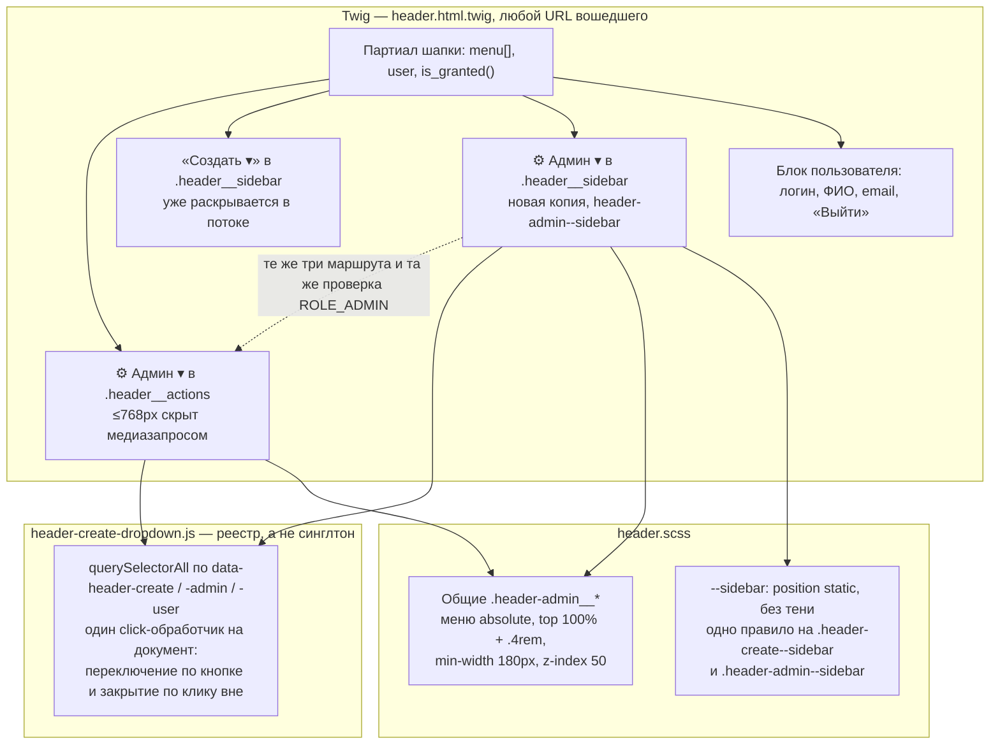

# Design: the admin block in the mobile sidebar

## Context

See proposal.md — Why. This change starts from the state the change
`menu-header-footer` left behind: `templates/components/header.html.twig`
renders the entire header in one partial, `assets/scss/components/header.scss`
owns its styles, and `assets/js/header-create-dropdown.js` owns both the
dropdowns and the slide-in panel. The admin block is not a special case in any
of those three files — it is one more `data-header-admin` root styled by rules
it shares with «Создать» and «Профиль».

Three properties of that state are load-bearing for the approach:

- At `bp('md')` (768px) the media query sets `.header__nav` and
  `.header__actions` to `display: none`. On a phone the whole right-hand side of
  the header disappears, the admin block included, so that content has to be
  reachable from the panel.
- The panel re-declares its contents instead of sharing them. The entire
  «Создать» dropdown is already repeated there verbatim, role branches
  included (`is_granted('ROLE_MANAGER')` → «Группу», `is_granted('ROLE_ADMIN')`
  → «Пользователя»). Markup duplication is the established convention of this
  partial, not an accident of the first implementation.
- The JS is a registry, not a singleton. `dropdownConfigs.forEach` collects
  every `[data-header-create]`, `[data-header-admin]` and `[data-header-user]` in
  the document, and one document-level click listener toggles and closes all of
  them. A second root carrying the same attributes registers itself.

What the diagram says, and what it deliberately does not:

- **Boundary.** One partial, one stylesheet, one script. No controller, no
  service, no new file: the block is markup that already exists twice over in
  the top row, plus a modifier class.
- **Responsibility split.** Twig decides *whether* the block is rendered and
  which routes it links to; the registry in JS decides only *how* it opens and
  closes; SCSS decides *where* the menu sits once open. Adding a second copy
  therefore touches the first two of those only.
- **Key relationship.** The panel's job is to repeat the right-hand side of the
  header, so the panel now holds all four things that side holds. The admin
  block is the fourth; the other three were already there.
- **Assumption.** Both copies exist in the DOM at every viewport — the panel is
  hidden with `visibility: hidden` and a transform, never removed. That is why
  a bare `[data-header-admin-toggle]` selector is now ambiguous even on a
  desktop screen.
- **Not shown.** No container, deployment or system-context level: there is one
  deployable unit and one store, and neither is touched.

## Goals / Non-Goals

**Goals:**
- Reach «Пользователи», «Скрытые организации» and «Импорт организаций» from a
  screen ≤768px, for `ROLE_ADMIN` only
- Make the panel a faithful repetition of the header's right-hand side, so the
  next block added there does not silently go missing on a phone
- Reuse the mechanism the «Создать» copy already uses, so the panel keeps a
  single dropdown behaviour instead of a second one
- Say in the requirement that the panel repeats the header, rather than leaving
  its contents as an itemised list that can fall behind the implementation

**Non-Goals:**
- Changing any route, controller, permission or role model. `ROLE_ADMIN` is read
  by `is_granted()` in the same partial as before
- Refactoring the header partial into reusable dropdown macros or includes. The
  duplication is pre-existing and load-bearing for the sidebar's own layout (D1)
- Any JavaScript change. The registry already handles a second root (D3)
- Keyboard navigation, focus trapping in the panel, or any other accessibility
  work beyond what the create copy already has
- Changing the desktop header, the panel's width, its overlay or its animation

## Decisions

### D1: A second copy of the markup in the panel, matching the create block

**Choice:** the admin block is repeated inside `header__sidebar` with the same
three `path()` calls and the same `is_granted('ROLE_ADMIN')` guard, plus a
`header-admin--sidebar` modifier on the root. No partial, macro or include is
introduced.

**Rationale:** the panel already duplicates the whole «Создать» dropdown,
role branches included, and that copy is what the `--sidebar` flow-expansion
rule and `HeaderTest`'s sidebar assertions are written against. Extracting a
shared partial would mean touching the shipped create markup to add one block —
and the modifier that makes the panel behave differently sits on the *same
element* as the dropdown root, so a shared partial would have to grow a
parameter purely to carry a class. The duplication is three lines of role guard
plus three routes, and it is the same duplication the neighbouring block already
made.

**Alternatives considered:**
- *A Twig macro/partial for the dropdown.* Removes the duplication, but makes
  the panel's markup indirect and forces the create block through the same
  refactor for no behaviour gain. Rejected as a refactor smuggled into a
  one-block change.
- *Move `.header__actions` itself into the panel at ≤768px.* Would need the
  media query to stop hiding the container and instead re-parent it — a CSS
  change to a shipped rule, plus the logo and hamburger would have to stay
  behind. Rejected: it moves the problem into a rule that currently works.
- *One dropdown that relocates its menu with CSS on a phone.* No markup change,
  but the menu would have to leave the header subtree to sit inside the panel,
  which CSS alone cannot do.

### D2: The panel's admin menu opens in the flow, added to the existing rule

**Choice:** `.header-admin--sidebar .header-admin__menu` joins
`.header-create--sidebar .header-create__menu` as a second selector in one
rule (`position: static`, no shadow, no `min-width`).

**Rationale:** the shared `.header-admin__menu` rule positions the menu
absolutely with `min-width: 180px` and `z-index: 50`. Inside a panel that is
`position: fixed`, 280px wide and `overflow-y: auto`, an absolutely positioned
menu is clipped by the panel's own overflow and floats over the items below it
instead of pushing them down — a dropdown that hides the rest of the panel is
the failure the create block's rule was written to prevent. One selector list
rather than a second copy of the declarations: the two dropdowns must not drift
apart, and a `--sidebar` variant per dropdown is how they would.

**Alternatives considered:**
- *`[data-header-sidebar] .header-admin__menu`.* Couples the stylesheet to the
  container instead of to the block, and would also catch any dropdown a future
  change nests inside the panel. The modifier is the existing convention.
- *`overflow: visible` on the panel.* Keeps the menu floating and gives up the
  panel's scrolling, which matters as soon as the panel's contents exceed a
  short viewport.

### D3: No JS change — the registry already owns every `[data-header-admin]`

**Choice:** `header-create-dropdown.js` is untouched.

**Rationale:** `dropdownConfigs` lists the three attribute triples and
`document.querySelectorAll` collects every root for each, so the sidebar's
block is picked up at load with no registration. `closeAll()` — called both on
a toggle and by `setSidebarOpen()` — keeps the two instances mutually exclusive,
so opening the panel closes a dropdown left open in the top row, and opening one
dropdown closes the other. This is the reason D1 can stay a markup change: the
convention the JS was written against is "every instance", and this change
follows it rather than working around it.

**Consequence:** the one single-instance selector left in the file is
`[data-header-hamburger]`, and there is still exactly one hamburger.

### D4: Container-scoped selectors, in tests as well as in CSS

**Choice:** the panel's block is addressed through its modifier class in tests
rather than through the bare `data-header-admin-toggle`.

**Rationale:** the second copy is in the DOM at every viewport (see the
assumption above), so a bare `[data-header-admin-toggle]` resolves to two
elements and Playwright's strict mode rejects it. `HeaderTest` already scoped
every admin assertion to `.header__actions`, so it survives the change
untouched; the two e2e tests that used the bare selector are narrowed to
`.header__actions ...` for the same reason. Naming the instance is also what
makes the two-instance fact visible instead of papering over it with
`.first()`.

The assertions added afterwards to close the coverage gap follow the same rule
rather than a new one: `testAdminHeader` counts
`.header__sidebar .header-admin__menu .header-admin__item` and `testManagerHeader`
denies `.header__sidebar .header-admin`, both addressed through the panel rather
than by position in the document.

**Alternatives considered:**
- *`.first()` in the e2e tests.* Fewer characters, and it hides the ambiguity —
  a later test would silently keep passing against the top-row block when it
  meant the panel's.
- *A `data-` attribute per instance (`data-header-instance="sidebar"`).* More
  machine-readable than a style hook, but adds an attribute the CSS does not
  need; the modifier already exists and is what the stylesheet keys on.

## Risks / Trade-offs

- [The markup now says the same thing twice] → The routes and the role guard
  exist in two places, so adding a fourth admin route means editing both. This
  is the accepted cost of D1, and the mitigation is the requirement itself:
  it now states that the panel *repeats* the header, so the two are expected to
  move together and a reviewer looks for both.
- [The sidebar's admin block was untested] → Resolved while applying, and the
  resolution is what a reviewer should expect to find.
  `HeaderTest::testAdminHeader` asserts `.header__sidebar .header-admin__menu
  .header-admin__item` counts 3 and the toggle starts closed;
  `HeaderTest::testManagerHeader` asserts `.header__sidebar .header-admin` is
  absent; `e2e/tests/design-mobile.spec.ts` drives the panel at 576px and pins
  `position: static` plus the user block moving below the menu. That last
  assertion was mutation-checked: dropping `.header-admin--sidebar` from the
  flow-expansion rule turns `position` into `absolute` and fails the test.
- [Two elements match the admin toggle in the DOM] → Any future locator, in e2e
  or elsewhere, must be container-scoped; an unscoped one fails in strict mode
  rather than passing quietly. `HeaderTest` is already scoped this way, so the
  suite is the reason this risk is a test-authoring rule and not a breakage.
- [The panel grows taller] → Three more rows in a 280px, `overflow-y: auto`
  panel. It scrolls, and the in-flow expansion (D2) means an open dropdown
  pushes the content below it rather than covering it — but on a short viewport
  the user block at the bottom can end up below the fold.
- [A third copy is now thinkable] → With the panel duplicating the top row, a
  future block could be added to one and forgotten in the other. The requirement
  wording is the guard; no mechanical check enforces it.

## Migration Plan

None. Server-rendered markup and CSS in one partial and one stylesheet: no
migration, no rebuild of persisted data, no deploy ordering between
environments.

**Rollback:** revert `templates/components/header.html.twig`,
`assets/scss/components/header.scss` and
`tests/Functional/Controller/HeaderTest.php`; drop the «боковая панель: «⚙ Админ
▾» раскрывается в потоке» test from `e2e/tests/design-mobile.spec.ts`; and
re-widen the two locators in `e2e/tests/users-access.spec.ts` and
`e2e/tests/organization-hiding-registry.spec.ts` back to the bare
`[data-header-admin-toggle]`. Nothing to restore.