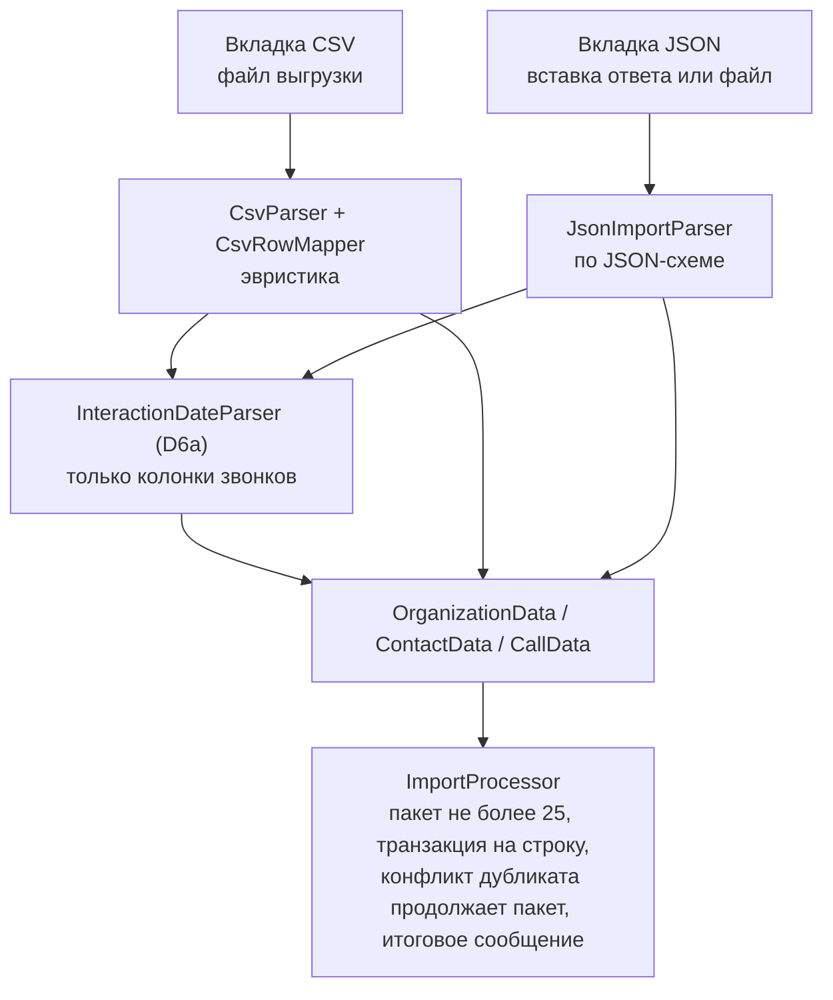
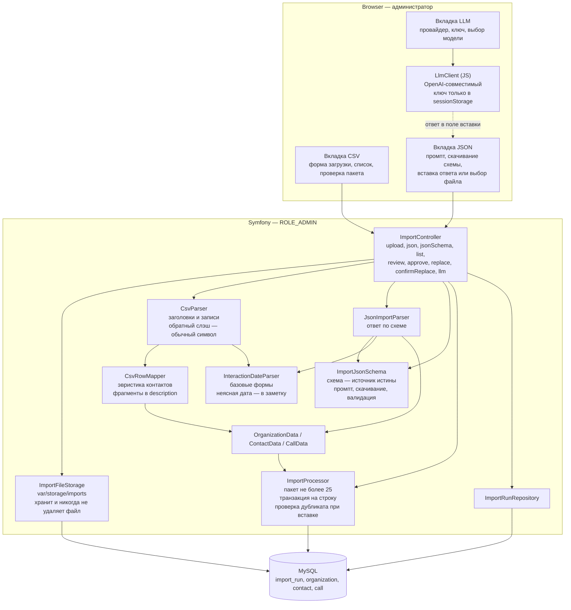
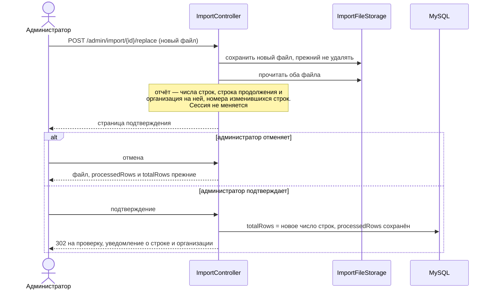

# Design: CSV + JSON Import

## Context

The CRM needs a one-time bulk import of ~400 organizations from a legacy CSV
export. The input format is declared normatively in the `organizations-import`
spec («Формат CSV-файла»); the observed export contains 398 records
(386 non-empty), 9 named columns plus a trailing empty field, multiline cells
in every column, and ~4 650 dated interaction entries. Contact data is
unstructured and interaction logs span multiple years. The import is
admin-only and requires interactive review of parsed data before persistence.
Two properties of that file drove decisions below and are easy to miss: it
contains backslashes, three of them immediately before a closing quote inside a
quoted cell, which PHP's default CSV escape handling misreads (D6); and its
inventory figures are only reproducible when the CSV is read as RFC 4180.

The export is also the wrong shape for a database. 4 670 interaction entries sit
inside a single cell per organization, contacts are free-form text, 24% of names
carry a parenthetical, and 58 values of «Составление плана на год» are website
addresses. A second path is therefore added: the same data arrives as JSON
produced by a language model working from the export or from a plain list of
company names, with contacts, calls and organization fields already separated
and with `industry`, `website` and `city` filled in (D12–D16). The JSON path
exists because the heuristics below are the fragile part, and a model does that
separation better than a regex — while a human still confirms the result.

Existing patterns used: `CampaignAttachmentStorage` for file storage,
`CampaignSendProcessor` for batch logic, `#[IsGranted]` for access control,
AJAX polling for progress (campaigns). Messenger is sync-only; import uses
controller-driven chunk processing.

## Goals / Non-Goals

**Goals:**
- Interactive wizard: upload or submit → parse → review/approve chunks of 25 → persist
- Two front-ends, one back-end: a CSV tab for the legacy export and a JSON tab
  for a model-produced answer, merging at the DTO layer (D12)
- Heuristic parsing of unstructured CSV columns (contacts, interactions)
- LLM-assisted enrichment of `industry`, `website` and `city`, with the provider
  called from the browser and no key on the server (D15)
- User can edit, add and remove contacts and calls before approving each chunk
- Duplicate detection with merge/create-new choice
- Track import progress in DB; resume across runs
- Abort at any point without losing previously saved data

**Non-Goals:**
- Background/async processing. There is no worker, no scheduler tick and no
  polling endpoint: the user advances the import by approving a chunk.
- Auto-group assignment for imported organizations
- Import of non-CSV formats other than the JSON defined in «Формат
  JSON-данных» (XLSX, Excel uploads and Google Sheets links are not read)
- Bulk update of existing organizations (only create/merge)
- Server-side calls to an LLM provider, and any persistence of an API key
  (D15)
- Automatic recognition that two rows describe the same company. The merge
  dialog (D10) is the mechanism, and no field stores alternative names
  (ADR-0015)
- Storing the sample export in the repository. `База.csv` is real client data:
  it is never committed, and no test depends on it — small purpose-built
  fixtures live in `tests/fixtures/import/`. The format is declared in the spec
  instead.
- Detecting whether a replacement source is older than what was already imported.
  A browser upload carries no client timestamp and no fetched source is
  supported, so there is no reliable value to compare. The replacement report
  therefore states row counts, the resume row and the differing rows, and says
  nothing about recency.

## Decisions

### D1: Controller-driven chunk processing (not Messenger)

**Choice:** Each chunk is processed via a POST endpoint triggered by the user.
No background worker.

**Rationale:** The user wants interactive control — review, edit, approve each
chunk before the next is loaded. This is inherently synchronous from the user's
perspective. Messenger with sync transport would add complexity without benefit.

**Alternatives considered:**
- Messenger + database transport: more robust for fire-and-forget imports, but
  the user needs to review each chunk interactively.
- Scheduler recurring: would process chunks on a timer, not on user approval.
- Polling a progress endpoint: the campaigns feature has a polling precedent,
  but a progress bar driven by polling has no source to poll here — nothing runs
  between two user actions. The progress indicator on the review page is
  rendered directly from `processedRows` / `totalRows` at render time, so there
  is nothing to poll. The proposal's polling wording is withdrawn (see
  «Границы скоупа»).

### D2: ImportRun entity for progress tracking

**Choice:** A dedicated `ImportRun` entity stores filename, storageKey,
sourceFormat (`csv` | `json`, defaulting to `csv`), totalRows, processedRows,
createdBy, `createdAt` and `lastProcessedAt`. There is no status field and no
second counter.

**"Import run" is this database record, never a PHP session.** No state
travels between requests on the server: the run's identifier arrives in the
URL, and the format of its source, its progress and its stored file are read
from the record itself. The `sourceFormat` column is created by the first
migration, so the second source format does not need one.

**Rationale:** Matches existing patterns (Campaign entity tracks progress).
The only state that matters is how far processing got: `processedRows`
against `totalRows`. Resuming is available while `processedRows < totalRows`
and unavailable once they are equal; a user pause and a chunk failure are
indistinguishable and need no persisted status. The error message is shown
when it occurs and is not stored on the run.

Three consequences of the simplification:

- **`processedRows` counts saved rows.** There is no `savedRows` and no skip
  action. A row that cannot be saved must be corrected in the review table
  first; an empty name blocks approval of that row rather than advancing the
  counter. This keeps the completion flash honest — `X` is literally the number
  of organizations created — and removes the invariant that two counters must
  stay in step.
- **The chunk is derived, not addressed.** The reviewed chunk is
  `[processedRows + 1 … min(processedRows + 25, totalRows)]`, computed at
  render time from the run's own progress. The review page therefore takes
  no chunk position as input, and a position supplied by the client is
  ignored: the address `/admin/import/{id}` is a bookmark that always renders
  the same chunk, reloading it is idempotent, and there is nothing for a link
  generator to get wrong. This is the same reason there is no PHP session
  state — the run record is the progress state, not a carrier of
  per-request state, and it is now the *only* source of the chunk position.
  Two consequences follow for free. A duplicate submission of a stale approval
  form is not blocked (see D9 — the user is warned instead), and when a chunk
  stops midway the re-displayed chunk starts exactly at the row that was not
  saved, so the "resume from the last inserted row" property is a consequence
  of the rule rather than a rule of its own.
- **`sourceFormat` is recorded but never displayed.** `/admin/import/{id}`
  cannot know which parser to run without it, and a run reached from the
  unified list carries no tab. It is an internal discriminator with no column
  in the import list, and it is written once when the run is created.

### D3: Heuristic contact parsing with user verification

**Choice:** Parse contacts using regex for phones and emails, guess names from
remaining text. Show parsed results in editable form for user correction.

**Rationale:** The CSV contact column is completely unstructured — names,
positions, phones, emails mixed freely. No reliable automatic parsing is
possible. The interactive review step is the safety net.

### D4: Chunk size of 25 rows

**Choice:** Process up to 25 rows per chunk. Each chunk is a full page with
editable fields for all rows in the chunk.

**Rationale:** 25 is the agreed maximum for one review page, while keeping the
review burden manageable. The chunk is a review batch only, not a transaction
boundary (see D7). The last chunk may be smaller (e.g., 5 rows for a 400-row
file).

### D5: File storage in `var/storage/imports/`

**Choice:** Store every import payload with random hex keys, same pattern as
`CampaignAttachmentStorage`, in `var/storage/imports/`.

**Rationale:** Consistent with existing storage approach. Files are never
deleted by the import flow: they are kept for reference after completion and
for resuming after a stop or an error. The directory is named `imports`, not
`csv-imports`, because the JSON path stores its payload here too — pasted text
is written to disk exactly as an uploaded file is, which is what makes the
replacement flow (D8) identical on both tabs.

### D6: Input format declared in the spec, quirks observed from the export

**Choice:** The file contract (encoding, quoting, backslash handling, header,
column mapping, date grammar, limits, ignored columns) is declared as a
requirement in `specs/organizations-import/spec.md`; the sample export is not
stored in the repository.

**Rationale:** The import is fed through the upload form at runtime; tests and
future work must not depend on a 1.1 MB sample file. The declaration accounts for
the observed quirks:

- the header ends with a trailing comma (empty 10th field) and
  «Текущее состояние » carries a trailing space — header cells are trimmed
  and trailing empty fields ignored;
- 378 of 398 records contain embedded line breaks; 255 doubled quotes;
- 386 non-empty records, of which 353 have a non-empty «Взаимодействия» cell
  yielding 4 670 interaction entries;
- LF and CRLF line endings are mixed, including inside quoted cells;
- 12 records are fully empty and 2 have an empty `Компания` — empty records
  are skipped, empty names surface in the review table and block approval;
- one `Компания` value is 280 characters, over the 255 column limit;
- the file contains 8 backslashes, three of them immediately before a closing
  quote inside a quoted cell.

**Backslashes are not escapes, and this is not a detail.** PHP's `fgetcsv()` has
a fifth parameter, `$escape`, which defaults to `\\`. That parameter is a
proprietary extension to CSV, not part of RFC 4180: inside a quoted field it
makes `\"` an escaped quote, so the closing quote disappears and the field keeps
swallowing text until the *next* real quote. On the actual export the
difference is not a rounding error:

| | `fgetcsv($h)` | `fgetcsv($h, 0, ',', '"', '')` |
| --- | --- | --- |
| records | 421 | **398** |
| records with 10 fields | 394 | **398** (all) |
| fully empty records | 12 | 12 |
| non-empty records | 409 | **386** |

The first divergence is data record 5. The 23 extra "records" are fragments of
rows whose quotes were swallowed, and they are presented as organizations with
names like `(05.11.2025) Направила КП для плана все` and `crm@e-s.by`. Every
inventory figure in this design — 398, 386, 4 670 — is only reproducible with
escape processing disabled, so the parser SHALL call `fgetcsv()` with an empty
`$escape`.

**The remaining five backslashes are typos, not escapes**, and are the reason
byte-deletion was rejected: `свя\заться` and `зая\вкам` are words split by a
stray backslash in the source, plus one before a space and one before a newline.
Stripping every backslash would silently repair two of them, leave the other
three, and produce an unexplainable half-repaired result. With escape processing
disabled the backslash survives as an ordinary character and the user sees the
cell exactly as it is in the spreadsheet.

**Consequence for fixtures (D6a follow-up):** a hand-written fixture parses
identically under both settings, so a test suite built from such fixtures would
pass while the importer silently corrupts the real file. The fixture for the
parser SHALL therefore contain a quoted cell ending in `\"` followed by more
records, and the parser test SHALL assert the exact record count.

### D6a: A base grammar, and unclear dates become notes

Enumerating every parenthesised date-like group in the export shows twelve
distinct shapes, of which a base grammar covers the overwhelming majority:

| Shape | Count | Base grammar |
| --- | --- | --- |
| `DD.DD.DDDD` | 4 597 | yes |
| `DD/DD/DDDD` | 21 | yes |
| `DD.DD.DD` | 17 | yes (`20YY`) |
| `D.DD.DDDD` | 12 | yes |
| `DD,DD.DDDD` | 2 | yes (comma separator) |
| `DD.DD.DDDD_` | 1 | yes (trailing underscore ignored) |
| `DD.DD` (no year) | 7 | no |
| `DD.DD.DDDDD` (5-digit year) | 7 | no |
| `DD.DD.DDDD-DD.DD.DDDD` (range) | 7 | no |
| `DD.DD.DDD` (3-digit year) | 2 | no |
| `DD.DD.DDDD_ DD.DD.DDDD` (triple range) | 2 | no |
| unclosed paren before a date | 2 | no |

**Choice:** the grammar is the base six shapes and nothing more. A group is read
as a date **only when its day, month and year are all unambiguous**. Anything
else — no year, a three-digit year, a five-digit year — is not a date token, and
its text stays in the surrounding notes, which the spec already defines as an
entry without a date. A group that starts with a date and continues with more
text (a range) is one entry dated with the first date; the rest is notes, which
needs no rule beyond the base match.

**Rationale:** every rejected shape previously required a *recovery* rule, and
each recovery rule invented data. `(09.04.202)` resolved to the year 202, and
`(09.04)` inherited a year from whatever entry happened to precede it — a value
nobody verified, attached to a call that then appears in the call history as if
it were real. Roughly 30 of ~4 670 tokens fall outside the base grammar, and the
user can see every one of them in the notes of the call, which is strictly more
information than a guessed year. The mechanism already exists: the spec's
"entry without a date" rule is exactly what a non-date token produces, so no new
concept is introduced.

**The grammar is scoped to the call-producing columns** — «Взаимодействия» and
«Следующий контакт». It is not applied elsewhere, so the ~1 000 parenthesised
groups in «Контакты» (phone formats, `(отдел кадров)`) are never scanned for
dates at all.

**What is given up:** an entry like `(2.5)` no longer produces a call and no
longer leaves any trace that a date was dropped — the text simply stays in the
notes. This is deliberate: a visible, editable text note beats an invisible
fabricated date, and the user reviews every row before it is saved.

### D7: One transaction per row, resume after failure

**Choice:** Each approved row is persisted in its own Doctrine transaction
(`wrapInTransaction`), incrementing `processedRows` per saved row. On a row
failure only that row's transaction rolls back; rows already saved in the same
chunk stay, processing stops, the error is shown with a resume notice, and the
import continues from `processedRows`.

**Rationale:** A row is the atomic unit of import; rolling back an entire
chunk would discard rows that saved without issues. A chunk is only the
review batch. The stored file is never deleted, so after an error the user
can replace the file and continue from `processedRows`.

### D8: Replacing the file is a confirmed resume from a fixed row

**Trusted state: row numbers and the retained previous file. Nothing else.**

`processedRows` is a row count, and D5 keeps every file that was ever stored
(`storageKey` is never deleted), so the previous content is always readable.
Those two facts are the entire basis for a replacement. `Organization.createdAt`
and `Organization.updatedAt` are deliberately **not** used: merged rows create no
organization, so database position is not row number, and a timestamp window
cannot reconstruct which row produced which organization.

**Choice:** a replacement never mutates the run directly. It builds a report
and waits for confirmation.

1. Store the new file; validate it against the format declared for the
   run's own source — the run's `sourceFormat` decides which contract
   applies — and count its non-empty records.
2. Read the retained previous file and the new file.
3. Build the replacement report:
   - record count before and after;
   - the resume row, `processedRows + 1`;
   - the organization name at the resume row in the new file;
   - the row numbers within `1..processedRows` whose content differs between the
     two files;
   - a warning when the new record count is below `processedRows`.
4. Render a **confirmation page** with that report and the actions
   «Продолжить с строки N» and «Отмена». The run is untouched until the
   admin confirms.
5. On confirm: `totalRows` is set to the new record count, `processedRows` is
   kept, and the admin lands on the review page for the first chunk of the
   remaining rows. A flash states the resume position positively — «Импорт
   продолжен с строки N: «Название организации»» — rather than reporting that
   nothing changed, which is the fact the admin needs.

**"Row N" means the Nth record of the run's source.** The replacement
therefore takes whatever the format of that source is, and the mechanism does
not change with it: a second source format is stored as a file exactly like an
uploaded one (D5), and "row N" is whatever its Nth organization is. D8's
single-active-run check (D9) must **not** apply to a replacement: the
run it belongs to is itself the active one, so applying that check would
reject every replacement.

**The comparison is defined by the source format, not by the file's text.** A
row's content is compared as the format defines a row: for CSV that is a record,
compared as text; a format whose row is a structured object compares the
organization field by field, so that a difference in key order or in the
payload's formatting is not reported as a changed row. Comparing the payload's
text instead would report every line as changed when nothing changed in the
data.

**Rationale:** the export may be corrected while an import is paused, and the
reviewed prefix must not be re-inserted. Reporting the differing row numbers
before anything is written turns the previously silent freeze into a decision the
admin makes, and it is the only way to see that a reordered file shifted the
resume point. A positive resume notice is what the admin acts on; "nothing
changed" is a non-event that only raises doubt.

**Completion becomes `processedRows >= totalRows`, not `==`.** A replacement file
shorter than `processedRows` warns and then completes the run. Under the
previous `==` rule such a run would sit at `processedRows > totalRows`
forever and, because D9 keys the single-active-run check on
`processedRows < totalRows`, it would neither look finished nor block a new
import.

### D9: Single active run enforced on upload, and the approval form is one-shot

**Choice:** A new upload SHALL be rejected while any `ImportRun` has
`processedRows < totalRows`. Completion is therefore `processedRows >= totalRows`
(D8), so a run can never sit above its own total and block every future
import. Completing or abandoning a run is out of band; the check is a simple
existence query at upload time.

The same condition is applied on a **read**, more gently: opening the review
page of a run while a *different* run is unfinished redirects to that
unfinished import (the most recently created one) instead of showing a package
of the other run. A rejection is right for a submission that would create
state; a redirect is right for a page that only shows state.

**The approval form is not idempotent, and the user is told so.** Submitting
the same form twice inserts its rows again. This is accepted rather than
prevented: the review page states that the form is submitted once, and the
progress indicator exists so the admin can see where the import stands before
submitting. A guard that ignores rows already below `processedRows` would make
the form idempotent at the cost of a rule that is invisible in the UI — it
would silently do nothing on a re-submit instead of reporting the duplicates it
had just created, and it would mask a genuine mistake where a form was prepared
against the wrong file. The corruption is a visible duplicate name in the
organizations table, which the duplicate dialog (D10) then handles like any
other.

**Rationale:** The proposal promises at most one active import. UI-only
coordination fails with two tabs or two admins; a reject-on-upload rule is
cheap and covers the practical case without a status field or DB lock. The
cost is that the import is a single-admin, single-tab activity, which the user
accepts for a one-shot migration.

**Alternatives considered:**
- UI-only limitation: documented, but not enforced.
- Drop the single-run claim: contradicts the proposal.
- Idempotent approval (skip rows below `processedRows`): rejected for the
  reasons above; it hides a mistake instead of surfacing it.

### D10: Duplicate check runs at insert time, and the choice continues the chunk

**Choice:** Name uniqueness is checked when each row is persisted, not only
when the chunk is rendered for review. The check matches against the database
at that moment, so it catches pre-existing organizations and names inserted
earlier in the same chunk or run. On conflict, persistence stops before the
row, the rows already saved in the chunk stay, and the package is re-displayed
starting from the conflicting row — with the values the user entered preserved
and the conflict marked on that row. The row offers *merge* or *create new*,
and the choice is submitted with the same approval form. When it is submitted,
the conflicting row is saved accordingly and the remaining rows of the chunk
are persisted **in the same request**, without the package being re-opened
first.

```
  POST /approve
       |
       |  rows 1..12 saved, processedRows = 12
       v
  row 13 = "Нафтан" already exists
       |
       +-- re-render package [13..25], conflict marked on row 13
       |     (entered values of 13..25 kept; 1..12 are gone from the form
       |      because they are already below processedRows)
       |
       +-- POST /approve again, with the choice on row 13
             |
             +-- merge      -> contacts + calls appended to the existing org
             +-- create new -> a second "Нафтан" is created
             |
             v
           rows 14..25 persisted in the same request -> chunk done
```

**Rationale:** Review-time checking misses within-file duplicates (the first
row inserts «Нафтан» before the second is saved). Insert-time checking puts
duplicates on the same stop path as other insert failures, and the re-display
rule of D2 makes the resumed package start at exactly the row that needs a
decision. Continuing the chunk in the same request is what makes the choice
cheap: the alternative — persisting the row and stopping — forces the admin
through a second review cycle for rows 14–25 that they had already reviewed.
Date and other field errors stay review-time edits only — they never pause
insert.

**No separate dialog page and no separate endpoint.** The conflict lives in the
review form and posts to `/approve` with a resolution field. There is
deliberately no hard "abort" action, and the reason is D9: a run with
`processedRows < totalRows` blocks every future upload, and the import flow
has no way to abandon a run, so an aborted conflict would wedge the
feature. Declining both options and changing the name is the escape, and it is
the same edit the review form exists for. Adding an abandon action later is a
separate decision.

### D11: Completion flash with run and cumulative counts

**Choice:** When `processedRows` reaches or exceeds `totalRows`, the system
flashes «Импортировано в этом прогоне: X, импортировано всего: Y», where X is
this `ImportRun`'s `processedRows` and Y is the sum of `processedRows` across
all import runs. No summary page and no per-entity breakdown.

**Rationale:** Enough signal for a one-shot migration without a second counter or
a summary view. Because there is no skip action (D2), `processedRows` is
literally the number of organizations created, so `X` needs no qualification and
the two counters of the earlier design are not needed to tell a saved row from a
skipped one.

### D12: The JSON path shares every stage after parsing

**Choice:** the import has two front-ends and one back-end.



Both front-ends produce the same DTOs, so review, editing, persistence, the
duplicate dialog, per-row transactions and the completion flash are written
once. The only difference is how a row is produced: the CSV tab parses cells
with heuristics, the JSON tab receives already-structured objects.

**Rationale:** the value of the JSON path is not a second import — it is that
contacts, calls and organization fields arrive already split, so the fragile
heuristics of D3 are not on that path at all. Splitting the two paths after
parsing would duplicate the hardest and least stable part of the flow.

**Consequence:** «Следующий контакт» becomes a *planned* `Call`
(`scheduledAt` set, `madeAt` null) on both paths. 314 dates in the export,
260 of them already past, become overdue rows in the «Просроченные звонки»
dashboard section on day one. This is accepted deliberately: the data is real
and dropping it loses information, while the dashboard count is a number the
user can read past.

### D13: One JSON Schema file is the source of truth for three consumers

**Choice:** a single JSON Schema (draft 2020-12) document is stored in the
repository and drives all three of:

1. the field dictionary rendered inside the prompt shown on the JSON tab;
2. the file served by «Скачать JSON-схему» (`Content-Disposition: attachment`);
3. server-side validation of a pasted response.

**Rationale:** the failure this prevents is the prompt and the importer
disagreeing — the prompt tells the model a field is optional while the
validator rejects it, or the prompt documents a limit the validator does not
enforce. Deriving all three from one document makes that class of bug
impossible rather than merely unlikely. `justinrainbow/json-schema` is already
present in `composer.lock` as a transitive dependency and is promoted to a
direct requirement; no new package is introduced.

**Shape** — one object per organization, nested. The model's natural output
shape and the database's shape coincide, so no assembly step is needed:

```json
{
  "organizations": [
    {
      "name": "АбесТрейд",
      "industry": "ИТ-дистрибьютор",
      "city": "Минск",
      "website": "https://abeslab.by",
      "description": "Сертифицированный дистрибьютор ПО.",
      "coursesAttended": "",
      "contacts": [
        { "name": "Вячеслав", "position": "начальник отдела обучения",
          "phone": "+375339027636", "email": "V.Zakrevsky@naftan.by" }
      ],
      "calls": [
        { "date": "29.05.2026", "notes": "Направила КП по всем лагерям" }
      ],
      "nextContact": { "date": "08.06.2026", "purpose": "созвониться по КП" }
    }
  ]
}
```

`unp` is deliberately absent: a model invents those numbers and a wrong one is
worse than a missing one (ADR-0015). `is_main` is deliberately absent: the
export does not distinguish a primary contact, and
`MailingService::effectiveMainContact()` falls back to the lowest-ID contact.
`annualPlan` is deliberately absent for the same reason the CSV path does not
populate it: the import has no use for it, and a model asked for a plan
statement invents one.
Call `date` values are carried **verbatim** — the JSON path reuses
`InteractionDateParser` (D6a) and does not impose ISO 8601, because the source
dates are not ISO and reformatting them is a lossy guess. A `date` without an
unambiguous year stays in the entry's notes rather than becoming a dated call.

### D14: One payload per run, from a paste or a file, chunked by the application

**Choice:** the JSON tab accepts a response containing any number of
organizations, supplied either as pasted text or as an uploaded file. The two
are the same thing from that point on: the application counts the
`organizations` array, writes the payload to the run's stored file, sets
`totalRows` to the array length, and then presents the same 25-organization
review chunks as the CSV tab. `processedRows` therefore counts organizations, not
CSV records, on both paths.

**Rationale:** the user should not have to split a 386-organization response
into 20 pieces by hand. `totalRows` keeps its meaning — organizations — so the
progress indicator, the "Продолжить" link and the completion flash behave
identically on both tabs, and `ImportRun` needs no second notion of row
count.

Accepting a file as well as a paste costs one form field and buys three things:
a response produced earlier can be re-imported without being re-copied through
the clipboard; the payload is a file like any other, so the replacement flow
(D8) is available on the JSON tab with no extra mechanism; and the LLM response
path has somewhere to put a large body of text other than a textarea.

**Cost:** one bad character invalidates the whole payload, so the validator
reports the offending organization by index and field rather than failing
silently. This is accepted: a per-chunk submission protocol moves the failure
handling burden onto the user for every chunk instead of once.

### D15: The LLM call is made by the browser, the key never reaches the server

**Choice:** a small JavaScript client calls the provider directly from the
page. Both supported providers are OpenAI-compatible, so one client with a
`{ baseUrl, apiKey, model }` configuration serves both:

| | OpenRouter | Ollama |
| --- | --- | --- |
| Endpoint | `POST https://openrouter.ai/api/v1/chat/completions` | `POST http://<host>:11434/v1/chat/completions` |
| Auth | `Authorization: Bearer <key>`, plus `HTTP-Referer` / `X-OpenRouter-Title` for attribution | any value, ignored |
| Model list | `GET /api/v1/models` | `GET /api/tags` |
| Structured output | `response_format: { type: "json_schema", json_schema: { … } }` | supported through the OpenAI-compatible route |

The key is held in a JavaScript variable backed by `sessionStorage`, never
`localStorage`, with an explicit «Забыть ключ» action. The response is written
into the JSON tab's textarea and validated by the same schema as a manual
paste.

**Rationale:** keeping the key client-side removes the entire class of concerns
a server-side integration carries — no new entity, no secrets in the vault, no
key in backups, no audit log to leak, and no dependency on
`symfony/http-client`. The loss is a server-side record of what was sent, which
matters little here because the import is still reviewed organization by
organization and recorded through `ImportRun`.

Two consequences the specification must state:

- an Ollama host must set `OLLAMA_ORIGINS` to the CRM's origin, or the browser
  blocks the request; this is a deployment prerequisite, not an application
  setting;
- a browser-held key is exposed to XSS and to anyone with access to the
  workstation. This is why the key is session-scoped rather than persisted and
  why it is never written to a form field the server can read.

**Alternatives considered:**

- Server-side provider calls: would allow audit and rate limiting, but needs
  key storage, a new dependency and a new surface for a secret. Rejected for a
  one-shot migration tool.
- Copy-paste into the user's own chat application: already supported by D14 —
  the tab works with no key at all. The built-in client exists for convenience
  and for `response_format`, which makes a malformed response impossible.

### D16: LLM output that cannot be trusted is still reviewed

**Choice:** the JSON path reuses the chunk review form unchanged. Every
organization arrives in an editable form where the administrator can correct
fields, add or remove contacts and calls, and skip a row. `response_format`
reduces malformed JSON; it does not make the *content* correct.

**Rationale:** a model filling `industry` and `website` from public sources
will occasionally produce a plausible wrong value, and a 386-row import is not
a thing the user wants to reverse afterwards. The review form is the same
safety net the CSV path already relies on for heuristic mis-parsing (D3), which
is why the two paths were merged at the DTO layer in the first place.

## Architecture

### Component Diagram

*Assumptions:* purpose = design for an existing monolith; format = plain Mermaid `flowchart`; rigor = lightweight C4-inspired (container + key components only). `totalRows` counts organizations on both tabs (D14).



### Import Flow (Dynamic)

Upload and first chunk; later chunks repeat the tail. The stop/resume and
duplicate-conflict paths are described in D7 and D10.

```mermaid
sequenceDiagram
    actor Admin as Администратор
    participant IC as ImportController
    participant ST as ImportFileStorage
    participant P as CsvParser
    participant IP as ImportProcessor
    participant DB as MySQL

    Admin->>IC: POST /admin/import (файл CSV)
    IC->>ST: store(file)
    ST->>DB: запись файла в var/storage/imports
    IC->>P: validateHeaders и countRecords
    P-->>IC: 9 колонок, N записей
    IC->>DB: INSERT import_run (sourceFormat = csv,<br/>totalRows = N, processedRows = 0)
    IC-->>Admin: 302 на /admin/import/{id}

    Admin->>IC: GET /admin/import/{id}
    IC->>IP: processChunk() — строки processedRows+1 … min(+25, totalRows)
    IP->>P: записи этого пакета
    P->>IP: InteractionDateParser, CsvRowMapper, DTO
    IP-->>IC: не более 25 редактируемых строк
    IC-->>Admin: таблица пакета, прогресс, предупреждение об однократной отправке

    Admin->>IC: POST /admin/import/{id}/approve
    loop для каждой строки пакета
        IC->>IP: persistRows — своя транзакция на строку
        IP->>DB: проверка дубликата по имени
        alt найден дубликат
            IP-->>IC: конфликт на этой строке
            IC-->>Admin: тот же пакет с этой строки, выбор «слить»/«создать»
            Admin->>IC: утверждение с выбором
            IC->>IP: persistRows — строка и остаток пакета
        else дубликата нет
            IP->>DB: INSERT organization, contacts, calls
            IP->>DB: processedRows + 1
        end
    end
    alt обработаны все строки
        IC-->>Admin: 302 в список с итоговым сообщением
    else остались строки
        IC-->>Admin: 302 на следующий пакет
    end

    Note over IP,DB: сбой на строке — откат только этой строки,<br/>
    предыдущие остаются, пакет отображается с этой строки,<br/>
    введённые значения сохраняются
```

### Replacement Flow (Dynamic)

Available on both tabs; the payload is a CSV file, a pasted response or an
uploaded response, and the previous file is always retained (D8).



## Risks / Trade-offs

- **Heuristic parsing may misclassify contacts** → Mitigated by the review
  table; user can correct any field before approval.
- **Large multiline cells may exceed PHP memory** → CSV is read row-by-row
  with `fgetcsv()`, not loaded entirely into memory. Chunk size of 25 limits
  per-request memory.
- **PHP's default `$escape` silently corrupts the real export** → 421 records
  instead of 398, with 23 fragments presented as organizations named after
  interaction text and email addresses (D6). Mitigated by parsing with escape
  processing disabled, and — because a hand-written fixture passes either way —
  by a required fixture containing a `\"` sequence with an asserted record
  count.
- **Duplicate detection is name-only** → No other unique identifier in the CSV.
  The merge dialog gives the user full control. The same company listed under
  two different names is not detected as a duplicate at all: the two real pairs
  in the export become four organizations, and resolving them is a manual
  merge (ADR-0015).
- **Importing 260 past next-contact dates floods the overdue-calls dashboard**
  → Accepted deliberately (D12). The information is real, and the resulting
  count is readable rather than silently lost. The alternative — dropping
  already-past dates — discards 83% of the column.
- **A browser-held API key is exposed to XSS and to a shared workstation**
  → Mitigated by scope, not removed: the key lives in `sessionStorage` only,
  `localStorage` is not used, it is never written into a field the server can
  read, and «Забыть ключ» clears it. The user is told this in the UI.
- **Ollama may refuse browser requests** → A deployment prerequisite: the
  Ollama host needs `OLLAMA_ORIGINS` set to the CRM origin. Not detectable from
  application code, so it is stated in the requirement and the setup notes.
- **One bad character invalidates a whole JSON paste** → Accepted (D14). The
  validator names the offending organization by index and field, so the user
  fixes one character rather than re-splitting 20 chunks.
- **No rollback on stop** → By design. Previously saved data persists, the
  stored file is kept, and the import can be resumed. The proposal explicitly
  states this.
- **A failure stops the chunk midway** → By design: rows saved before the
  failure stay, `processedRows` points at the last saved row, and the package is
  re-displayed from that row with the values entered for the rest, so the
  import resumes from the last inserted row.
- **A duplicate stops the chunk, and the choice finishes it** → The package is
  re-displayed from the conflicting row with the entered values preserved; the
  merge/create choice is submitted with the same form and the rest of the chunk
  is persisted in the same request (D10). There is no hard abort, because D9
  gives a run no way to be abandoned — see D10.
- **The approval form is not idempotent** → Accepted (D9): a second submission
  of the same form inserts its rows again. The page states that the form is
  submitted once, and a duplicate submission produces duplicate names, which
  the duplicate dialog then handles. No guard silently swallows a re-submit.
- **A replacement can shift the resume point** → A reordered file moves the
  boundary. D8 makes this visible before anything is written: the confirmation
  page lists the row numbers whose content differs within the already-processed
  prefix. The report informs, it does not block — content that changed inside the
  prefix stays as originally inserted, and correcting it is a manual edit.
- **Single active import run** → Enforced on upload (D9): a new upload or
  submission is rejected while any run has `processedRows < totalRows`.
  Opening the review page of a run while another is unfinished redirects
  to that unfinished import. The check must be skipped for a run's own
  replacement (D8). Two admins interleaving actions on the one active run
  are not prevented, and a repeated submission of the same form duplicates rows
  (D9).
- **No skip action** → A row that cannot be saved (empty name, unresolvable
  duplicate the admin declines to resolve) blocks approval of that row rather
  than advancing past it. This is a deliberate simplification: with
  `processedRows` counting saved rows only, the completion flash reports
  organizations actually created. The cost is that a chunk cannot be finished
  by discarding its problem rows.
