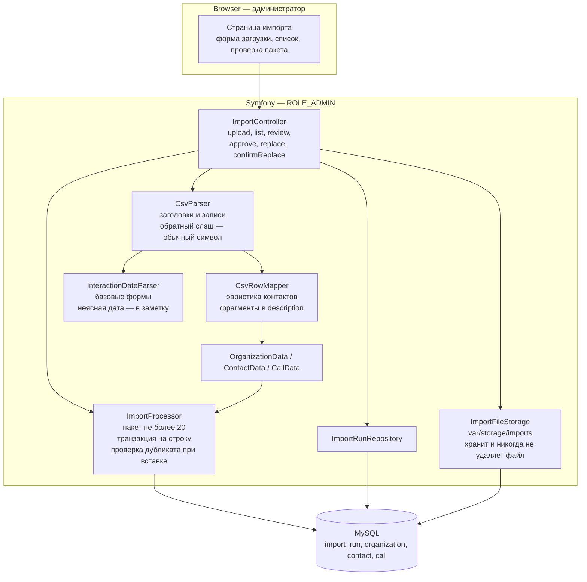
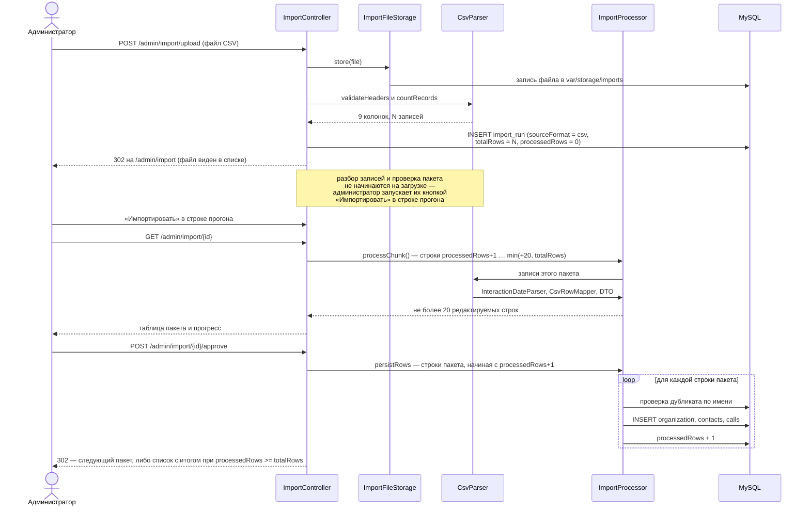
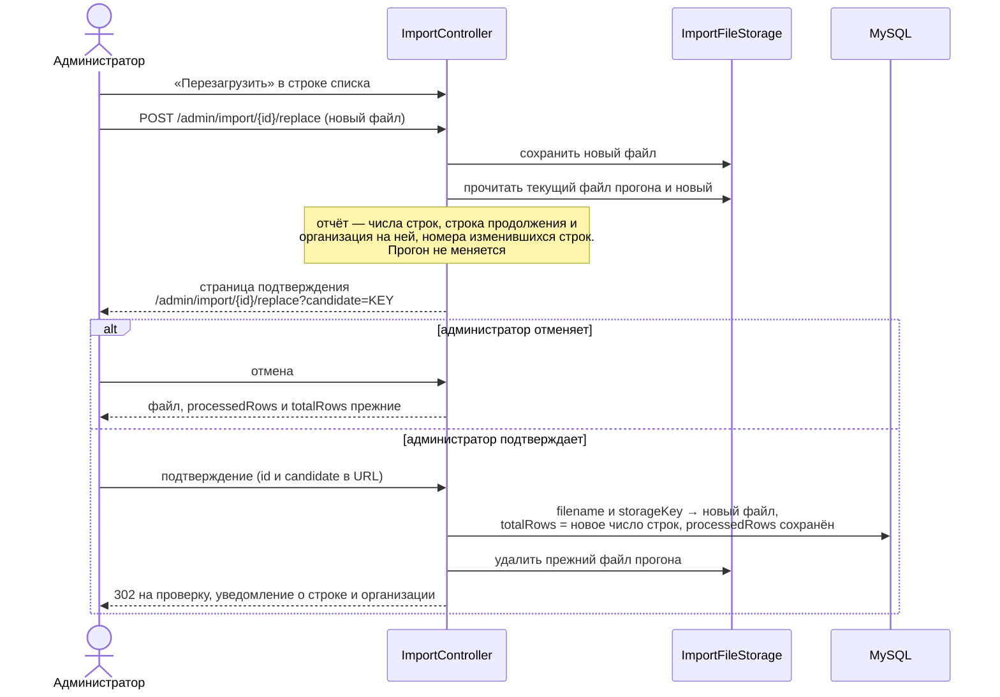

# Design: CSV import

## Context

The CRM needs a one-time bulk import of ~400 organizations from a legacy CSV
export. The input format is declared normatively in the `organizations-import`
spec («Формат CSV-файла»); the observed export contains 398 records
(386 non-empty), 9 named columns plus a trailing empty field, multiline cells
in every column, and ~4 650 dated interaction entries. Contact data is
unstructured and interaction logs span multiple years. The import is
admin-only and requires interactive review of parsed data before persistence.
Two properties of that file drove decisions below and are easy to miss: it
contains backslashes, three of them immediately before a closing quote inside a
quoted cell, which PHP's default CSV escape handling misreads (D6); and its
inventory figures are only reproducible when the CSV is read as RFC 4180.

The export is also the wrong shape for a database. 4 670 interaction entries sit
inside a single cell per organization, contacts are free-form text, 24% of names
carry a parenthetical, and 58 values of «Составление плана на год» are website
addresses. That shape is also why a second, model-produced source format and a
browser-side LLM client exist: they are the whole subject of the follow-up
change `add-organizations-json-import`, which extends this design rather than
replacing it. Nothing in this document depends on that change, and that change
depends on everything here.

Existing patterns used: `CampaignAttachmentStorage` for file storage,
`CampaignSendProcessor` for batch logic, `#[IsGranted]` for access control,
AJAX polling for progress (campaigns). Messenger is sync-only; import uses
controller-driven chunk processing.

## Goals / Non-Goals

**Goals:**
- Interactive wizard: upload → parse → review/approve packages of 20 → persist
- Heuristic parsing of unstructured CSV columns (contacts, interactions)
- User can edit, add and remove contacts and calls before approving each package
- Duplicate detection with merge/create-new choice
- Track import progress in DB; resume across runs
- Abort at any point without losing previously saved data

**Non-Goals:**
- Background/async processing. There is no worker, no scheduler tick and no
  polling endpoint: the user advances the import by approving a chunk.
- Auto-group assignment for imported organizations
- Any second source format, any LLM component, and any browser-side outbound
  request. `sourceFormat` is created here so that the follow-up change needs no
  migration, but this change only ever writes `csv`. XLSX, Excel uploads and
  Google Sheets links are not read either.
- Bulk update of existing organizations (only create/merge)
- Automatic recognition that two rows describe the same company. The merge
  dialog (D10) is the mechanism, and no field stores alternative names
  (ADR-0015)
- Storing the sample export in the repository. `База.csv` is real client data:
  it is never committed, and no test depends on it — small purpose-built
  fixtures live in `tests/fixtures/import/`. The format is declared in the spec
  instead.
- Detecting whether a replacement source is older than what was already imported.
  A browser upload carries no client timestamp and no fetched source is
  supported, so there is no reliable value to compare. The replacement report
  therefore states row counts, the resume row and the differing rows, and says
  nothing about recency.

## Decisions

### D1: Controller-driven chunk processing (not Messenger)

**Choice:** Each chunk is processed via a POST endpoint triggered by the user.
No background worker.

**Rationale:** The user wants interactive control — review, edit, approve each
chunk before the next is loaded. This is inherently synchronous from the user's
perspective. Messenger with sync transport would add complexity without benefit.

**Alternatives considered:**
- Messenger + database transport: more robust for fire-and-forget imports, but
  the user needs to review each chunk interactively.
- Scheduler recurring: would process chunks on a timer, not on user approval.
- Polling a progress endpoint: the campaigns feature has a polling precedent,
  but a progress bar driven by polling has no source to poll here — nothing runs
  between two user actions. The progress indicator on the review page is
  rendered directly from `processedRows` / `totalRows` at render time, so there
  is nothing to poll. The proposal's polling wording is withdrawn (see
  «Границы скоупа»).

### D2: ImportRun entity for progress tracking

**Choice:** A dedicated `ImportRun` entity stores filename, storageKey,
sourceFormat (`csv` | `json`, defaulting to `csv`), totalRows, processedRows,
createdBy, `createdAt` and `lastProcessedAt`. There is no status field and no
second counter.

**"Import run" is this database record, never a PHP session.** No state
travels between requests on the server: the run's identifier arrives in the
URL, and the format of its source, its progress and its stored file are read
from the record itself. The `sourceFormat` column is created by the first
migration, so the second source format does not need one.

**Rationale:** Matches existing patterns (Campaign entity tracks progress).
The only state that matters is how far processing got: `processedRows`
against `totalRows`. Resuming is available while `processedRows < totalRows`
and unavailable once they are equal; a user pause and a chunk failure are
indistinguishable and need no persisted status. The error message is shown
when it occurs and is not stored on the run.

Three consequences of the simplification:

- **`processedRows` counts decided rows: saved or skipped.** There is no
  `savedRows` and no second counter. A row that cannot be saved must be corrected
  in the review table first: an empty name, or a conflict the admin declined to
  resolve, blocks approval of that row rather than advancing the counter.
  There is exactly one kind of skip — a record carrying nothing at all (no name
  and no contacts). A call does not count towards it: a call belongs to an
  organization, so on a row that has none it has nowhere to be stored, and the
  «Актуальный курс» fragment in the description does not stand in for a name.
  The row is advanced past with its own notice, because there is nothing in it to
  correct: the row would otherwise sit at the head of every package forever,
  since a package always starts at `processedRows + 1`. The
  consequence for reporting: `X` in the completion flash is the number of source
  rows that became an organization **or** were skipped, so the flash counts
  processed rows and the skip count is reported separately, when it happens.
- **The chunk is derived, not addressed.** The reviewed chunk is
  `[processedRows + 1 … min(processedRows + 20, totalRows)]`, computed at
  render time from the run's own progress. The review page therefore takes
  no chunk position as input, and a position supplied by the client is
  ignored: the address `/admin/import/{id}` is a bookmark that always renders
  the same chunk, reloading it is idempotent, and there is nothing for a link
  generator to get wrong. This is the same reason there is no PHP session
  state — the run record is the progress state, not a carrier of
  per-request state, and it is now the *only* source of the chunk position.
  Two consequences follow for free. A stale approval form is harmless: its rows
  at or below `processedRows` are simply skipped, because the server starts from
  `processedRows + 1` no matter what the request carries (see D9). And when a
  chunk stops midway the re-displayed chunk starts exactly at the row that was
  not saved, so the "resume from the last inserted row" property is a
  consequence of the rule rather than a rule of its own.
- **`sourceFormat` is recorded but never displayed.** `/admin/import/{id}`
  cannot know which parser to run without it, and a run reached from the
  unified list carries no tab. It is an internal discriminator with no column
  in the import list, and it is written once when the run is created.
  `lastProcessedAt` is the opposite: it has no behaviour attached to it, so it
  is rendered as a column of the import list instead, where "when did this run
  last make progress" is exactly the question the admin has when picking a run
  to continue.

### D3: Heuristic contact parsing with user verification

**Choice:** Parse contacts using regex for phones and emails, guess names from
remaining text. Show parsed results in editable form for user correction.

**Rationale:** The CSV contact column is completely unstructured — names,
positions, phones, emails mixed freely. No reliable automatic parsing is
possible. The interactive review step is the safety net.

### D4: Chunk size of 20 rows

**Choice:** Process up to 20 rows per chunk. Each chunk is a full page with
editable fields for all rows in the chunk.

**Rationale:** 20 is the agreed maximum for one review page, while keeping the
review burden manageable. The chunk is a review batch only, not a transaction
boundary (see D7). The last chunk may be smaller (e.g., 5 rows for a 400-row
file).

### D5: File storage in `var/storage/imports/`

**Choice:** Store every import payload with random hex keys, same pattern as
`CampaignAttachmentStorage`, in `var/storage/imports/`. `ImportRun` holds the
`filename` shown to the admin and the `storageKey` of the file actually parsed;
both belong to the run's *current* source.

**Rationale:** Consistent with existing storage approach. The run's current file
is never deleted by the import flow: it is kept for reference after completion
and for resuming after a stop or an error. The one exception is a confirmed
replacement (D8), which swaps the run to the new payload and removes the file it
replaces — the replaced file is what the admin has already decided to discard,
and keeping it would leave the storage growing with every correction of the
export. The directory is named `imports`, not `csv-imports`, because a stored
payload is not bound to the format that produced it: pasted text is written to
disk exactly as an uploaded file is. D8's replacement flow depends on that — a
run's previous payload is always readable whatever it was written from.

### D6: Input format declared in the spec, quirks observed from the export

**Choice:** The file contract (encoding, quoting, backslash handling, header,
column mapping, date grammar, limits, ignored columns) is declared as a
requirement in `specs/organizations-import/spec.md`; the sample export is not
stored in the repository.

**Rationale:** The import is fed through the upload form at runtime; tests and
future work must not depend on a 1.1 MB sample file. The declaration accounts for
the observed quirks:

- the header ends with a trailing comma (empty 10th field) and
  «Текущее состояние » carries a trailing space — header cells are trimmed
  and trailing empty fields ignored;
- 378 of 398 records contain embedded line breaks; 255 doubled quotes;
- 386 non-empty records, of which 353 have a non-empty «Взаимодействия» cell
  yielding 4 670 interaction entries;
- LF and CRLF line endings are mixed, including inside quoted cells;
- 12 records are fully empty and 2 have an empty `Компания` — empty records
  are skipped, empty names surface in the review table and block approval;
- one `Компания` value is 280 characters, over the 255 column limit;
- the file contains 8 backslashes, three of them immediately before a closing
  quote inside a quoted cell.

**Backslashes are not escapes, and this is not a detail.** PHP's `fgetcsv()` has
a fifth parameter, `$escape`, which defaults to `\\`. That parameter is a
proprietary extension to CSV, not part of RFC 4180: inside a quoted field it
makes `\"` an escaped quote, so the closing quote disappears and the field keeps
swallowing text until the *next* real quote. On the actual export the
difference is not a rounding error:

| | `fgetcsv($h)` | `fgetcsv($h, 0, ',', '"', '')` |
| --- | --- | --- |
| records | 421 | **398** |
| records with 10 fields | 394 | **398** (all) |
| fully empty records | 12 | 12 |
| non-empty records | 409 | **386** |

The first divergence is data record 5. The 23 extra "records" are fragments of
rows whose quotes were swallowed, and they are presented as organizations with
names like `(05.11.2025) Направила КП для плана все` and `crm@e-s.by`. Every
inventory figure in this design — 398, 386, 4 670 — is only reproducible with
escape processing disabled, so the parser SHALL call `fgetcsv()` with an empty
`$escape`.

**The remaining five backslashes are typos, not escapes**, and are the reason
byte-deletion was rejected: `свя\заться` and `зая\вкам` are words split by a
stray backslash in the source, plus one before a space and one before a newline.
Stripping every backslash would silently repair two of them, leave the other
three, and produce an unexplainable half-repaired result. With escape processing
disabled the backslash survives as an ordinary character and the user sees the
cell exactly as it is in the spreadsheet.

**Consequence for fixtures (D6a follow-up):** a hand-written fixture parses
identically under both settings, so a test suite built from such fixtures would
pass while the importer silently corrupts the real file. The fixture for the
parser SHALL therefore contain a quoted cell ending in `\"` followed by more
records, and the parser test SHALL assert the exact record count.

### D6a: A base grammar, and unclear dates become notes

Enumerating every parenthesised date-like group in the export shows twelve
distinct shapes, of which a base grammar covers the overwhelming majority:

| Shape | Count | Base grammar |
| --- | --- | --- |
| `DD.DD.DDDD` | 4 597 | yes |
| `DD/DD/DDDD` | 21 | yes |
| `DD.DD.DD` | 17 | yes (`20YY`) |
| `D.DD.DDDD` | 12 | yes |
| `DD,DD.DDDD` | 2 | yes (comma separator) |
| `DD.DD.DDDD_` | 1 | yes (trailing underscore ignored) |
| `DD.DD` (no year) | 7 | no |
| `DD.DD.DDDDD` (5-digit year) | 7 | no |
| `DD.DD.DDDD-DD.DD.DDDD` (range) | 7 | no |
| `DD.DD.DDD` (3-digit year) | 2 | no |
| `DD.DD.DDDD_ DD.DD.DDDD` (triple range) | 2 | no |
| unclosed paren before a date | 2 | no |

**Choice:** the grammar is the base six shapes and nothing more. A group is read
as a date **only when its day, month and year are all unambiguous**. Anything
else — no year, a three-digit year, a five-digit year — is not a date token, and
its text stays in the surrounding notes, which the spec already defines as an
entry without a date. A group that starts with a date and continues with more
text (a range) is one entry dated with the first date; the rest is notes, which
needs no rule beyond the base match.

**Rationale:** every rejected shape previously required a *recovery* rule, and
each recovery rule invented data. `(09.04.202)` resolved to the year 202, and
`(09.04)` inherited a year from whatever entry happened to precede it — a value
nobody verified, attached to a call that then appears in the call history as if
it were real. Roughly 30 of ~4 670 tokens fall outside the base grammar, and the
user can see every one of them in the notes of the call, which is strictly more
information than a guessed year. The mechanism already exists: the spec's
"entry without a date" rule is exactly what a non-date token produces, so no new
concept is introduced.

**The grammar is scoped to the call-producing columns** — «Взаимодействия» and
«Следующий контакт». It is not applied elsewhere, so the ~1 000 parenthesised
groups in «Контакты» (phone formats, `(отдел кадров)`) are never scanned for
dates at all.

**What is given up:** an entry like `(2.5)` no longer produces a call and no
longer leaves any trace that a date was dropped — the text simply stays in the
notes. This is deliberate: a visible, editable text note beats an invisible
fabricated date, and the user reviews every row before it is saved.

### D7: One transaction per row, resume after failure

**Choice:** Each approved row is persisted in its own Doctrine transaction
(`wrapInTransaction`), incrementing `processedRows` per saved row. On a row
failure only that row's transaction rolls back; rows already saved in the same
chunk stay, processing stops, the error is shown with a resume notice, and the
import continues from `processedRows`.

**Rationale:** A row is the atomic unit of import; rolling back an entire
chunk would discard rows that saved without issues. A chunk is only the
review batch. The stored file is never deleted, so after an error the user
can replace the file and continue from `processedRows`.

**A stop is a stop: the report names the file row.** Whatever the cause — an
empty name, a value the database rejects — the run
halts at that row, the error message states the row number in the source file
and what is wrong with it, and the row is presented for correction in place
inside the re-displayed package. There is no partial acceptance of the rest
of the chunk: rows after the stopped one are not saved, because `processedRows`
counts saved rows and a row that was not reviewed as saved has no business
advancing the counter. The admin either fixes the value in the table and
re-approves, or fixes the source file and replaces it (D8) — both land on the
same continuation, the first unprocessed row.

**A nested contact or a nested call is not a stop.** D3 makes the review table
the safety net for the unstructured contact column, and the review table
offers no control for removing a nested contact or call — only fields. That
makes clearing a field the only way an admin can say «this is not a contact»,
so a stop there would trap the admin in a form with no exit: they cannot delete
the row, only empty it, and an emptied row would keep refusing to save. The
decision is therefore taken when the row is saved rather than by stopping:

- a contact with no filled field is not created;
- a call with no parsed date, no notes and no «Планируемый» mark is not created;
- a contact with a phone, an email or a position but no name is created under
  the constant anonymous name — the admin cleared the name and kept the values
  on purpose, so dropping it would discard data without a word.

Nothing is reported about what was dropped: the package already shows which
fields are filled, so the drop is the admin's own edit made in front of them,
not a surprise. An empty **organization** name still stops the import, because
that row has no identity to save at all. The reader is untouched: this is a
decision about what to save, not about how the source is understood.

### D8: Replacing the file is a confirmed resume from a fixed row

**Trusted state: row numbers and the current file. Nothing else.**

`processedRows` is a row count, and the run's current file is always readable
(D5 keeps it, `storageKey` points at it), so the previous content is available
for the comparison. Those two facts are the entire basis for a replacement.
`Organization.createdAt` and `Organization.updatedAt` are deliberately **not**
used: merged rows create no organization, so database position is not row
number, and a timestamp window cannot reconstruct which row produced which
organization.

**Choice:** a replacement never mutates the run directly. It builds a report
and waits for confirmation.

1. Store the new file; validate it against the format declared for the
   run's own source — the run's `sourceFormat` decides which contract
   applies — and count its non-empty records.
2. Read the run's current file and the new file.
3. Build the replacement report:
   - record count before and after;
   - the resume row, `processedRows + 1`;
   - the organization name at the resume row in the new file;
   - the row numbers within `1..processedRows` whose content differs between the
     two files;
   - a warning when the new record count is below `processedRows`.
4. Render a **confirmation page** with that report and the actions
   «Продолжить с строки N» and «Отмена». The run is untouched until the
   admin confirms. The page addresses the run and the candidate file by URL:
   `/admin/import/{id}/replace?candidate=<storageKey>`, so that the report is a
   bookmark and a reloaded or re-shared page resolves to the same run and the
   same candidate without a server session.
5. On confirm: the run switches to the new payload — `filename` and
   `storageKey` are replaced, and the file the run pointed at before is
   deleted — `totalRows` is set to the new record count, `processedRows` is
   kept, and the admin lands on the review page for the first chunk of the
   remaining rows. A flash states the resume position positively — «Импорт
   продолжен с строки N: «Название организации»» — rather than reporting that
   nothing changed, which is the fact the admin needs.

**The run's identity travels in the URL, never in a session.** Every step of the
replacement names the run (`/admin/import/{id}/replace`) and, from the report
on, the candidate payload; nothing about the pending replacement is held on the
server between the two requests. This is the same rule as D2: the run record is
the only state, and a link must be enough to resume.

**"Row N" means the Nth record of the run's source.** The replacement
therefore takes whatever the format of that source is, and the mechanism does
not change with it: a second source format is stored as a file exactly like an
uploaded one (D5), and "row N" is whatever its Nth organization is. D8's
single-active-run check (D9) must **not** apply to a replacement: the
run it belongs to is itself the active one, so applying that check would
reject every replacement.

**The comparison is defined by the source format, not by the file's text.** A
row's content is compared as the format defines a row: for CSV that is a record,
compared as text; a format whose row is a structured object compares the
organization field by field, so that a difference in key order or in the
payload's formatting is not reported as a changed row. Comparing the payload's
text instead would report every line as changed when nothing changed in the
data.

**Rationale:** the export may be corrected while an import is paused, and the
reviewed prefix must not be re-inserted. Reporting the differing row numbers
before anything is written turns the previously silent freeze into a decision the
admin makes, and it is the only way to see that a reordered file shifted the
resume point. A positive resume notice is what the admin acts on; "nothing
changed" is a non-event that only raises doubt.

**Completion becomes `processedRows >= totalRows`, not `==`.** A replacement file
shorter than `processedRows` warns and then completes the run. Under the
previous `==` rule such a run would sit at `processedRows > totalRows`
forever and, because D9 keys the single-active-run check on
`processedRows < totalRows`, it would neither look finished nor block a new
import.

### D9: Single active run enforced on upload, and the approval form is idempotent

**Choice:** A new upload SHALL be rejected while any `ImportRun` has
`processedRows < totalRows`. Completion is therefore `processedRows >= totalRows`
(D8), so a run can never sit above its own total and block every future
import. Completing or abandoning a run is out of band; the check is a simple
existence query at upload time.

The same condition is applied on a **read**, more gently: opening the review
page of a run while a *different* run is unfinished redirects to that
unfinished import (the most recently created one) instead of showing a package
of the other run. A rejection is right for a submission that would create
state; a redirect is right for a page that only shows state.

**The approval form is idempotent, and it is idempotent for free.** Submitting
the same form twice inserts nothing the second time, because the server persists
starting from `processedRows + 1` and ignores any submitted row that lies at or
below it (D2). Rows 1..20 of a chunk that already saved row 13 are not
"re-inserted": rows 1..13 are below the counter and are skipped, and 14..20 —
if the stop happened there — are saved once. A re-submission of a stale form
therefore resumes exactly where the run stands, which is the same behaviour as
reopening the review page and pressing the button again. No idempotency key, no
token, no warning on the page about submitting once: the counter is the guard,
and the guard is the thing the admin can see on the progress indicator.

**Rationale:** The proposal promises at most one active import. UI-only
coordination fails with two tabs or two admins; a reject-on-upload rule is
cheap and covers the practical case without a status field or DB lock. The
cost is that the import is a single-admin, single-tab activity, which the user
accepts for a one-shot migration.

**Alternatives considered:**
- UI-only limitation: documented, but not enforced.
- Drop the single-run claim: contradicts the proposal.
- A separate idempotency token on the form: rejected. It duplicates state that
  `processedRows` already holds, and it would have to be invalidated, stored and
  expired — three ways to get wrong in exchange for guarding against a
  re-submission that is already harmless.

### D10: Duplicate check runs at insert time, and the choice continues the chunk

**Choice:** Name uniqueness is checked when each row is persisted, not only
when the chunk is rendered for review. The check matches against the database
at that moment, so it catches pre-existing organizations and names inserted
earlier in the same chunk or run. On conflict, persistence stops before the
row, the rows already saved in the chunk stay, and the package is re-displayed
starting from the conflicting row — with the values the user entered preserved
and the conflict marked on that row. The row offers *merge* or *create new*,
and the choice is submitted with the same approval form. When it is submitted,
the conflicting row is saved accordingly and the remaining rows of the chunk
are persisted **in the same request**, without the package being re-opened
first.

```
  POST /approve
       |
       |  rows 1..12 saved, processedRows = 12
       v
  row 13 = "Нафтан" already exists
       |
       +-- re-render package [13..20], conflict marked on row 13
       |     (entered values of 13..20 kept; 1..12 are gone from the form
       |      because they are already below processedRows)
       |
       +-- POST /approve again, with the choice on row 13
             |
             +-- merge      -> contacts + calls appended to the existing org
             +-- create new -> a second "Нафтан" is created
             |
             v
           rows 14..20 persisted in the same request -> chunk done
```

**Rationale:** Review-time checking misses within-file duplicates (the first
row inserts «Нафтан» before the second is saved). Insert-time checking puts
duplicates on the same stop path as other insert failures, and the re-display
rule of D2 makes the resumed package start at exactly the row that needs a
decision. Continuing the chunk in the same request is what makes the choice
cheap: the alternative — persisting the row and stopping — forces the admin
through a second review cycle for rows 14–20 that they had already reviewed.
Date and other field errors stay review-time edits only — they never pause
insert.

**No separate dialog page and no separate endpoint.** The conflict lives in the
review form and posts to `/approve` with a resolution field. There is
deliberately no hard "abort" action, and the reason is D9: a run with
`processedRows < totalRows` blocks every future upload, and the import flow
has no way to abandon a run, so an aborted conflict would wedge the
feature. Declining both options and changing the name is the escape, and it is
the same edit the review form exists for. Adding an abandon action later is a
separate decision.

### D11: Completion flash with run and cumulative counts

**Choice:** When `processedRows` reaches or exceeds `totalRows`, the system
flashes «Обработано строк в этом прогоне: X, обработано всего: Y», where X is
this `ImportRun`'s `processedRows` and Y is the sum of `processedRows` across
all import runs. No summary page and no per-entity breakdown. The wording counts
rows rather than organizations, because `X` is decided rows, not created ones —
saying «Импортировано» would misreport every skipped row as an organization.

**Rationale:** Enough signal for a one-shot migration without a second counter or
a summary view. Because empty records are skipped rather than saved (D2), `X` is
the number of source rows that became a persisted organization — created or
merged into one — **or** were skipped as carrying nothing, so the flash counts
processed rows and the skips are reported in their own notice at the moment they
occur. One counter still tells a decided row from an undecided one, which is all
the resume logic needs.

## Architecture

### Component Diagram

*Assumptions:* purpose = design for an existing monolith; format = plain Mermaid `flowchart`; rigor = lightweight C4-inspired (container + key components only). The second source format and the browser-side LLM client are not in this diagram: they are the whole subject of `add-organizations-json-import`, which extends this design.



### Import Flow (Dynamic)

Upload and first chunk; later chunks repeat the tail. A stop — a row the
database rejects or a duplicate name — ends the request at that row and the
admin re-approves, so the loop below is a straight line: it never branches on a
condition that needs the admin in the middle of a chunk.



Стоп-путь (строка с пустым именем, отказ базы или конфликт по имени) обрывает
этот цикл: `persistRows` доходит до строки, останавливается и возвращает её, а
контроллер перерисовывает пакет **с этой строки**, с сохранёнными введёнными
значениями и описанием проблемы (D7, D10). Повторное утверждение этой формы
сохраняет строку и остаток пакета; строки, уже учтённые в `processedRows`,
пропускаются (D9).

### Replacement Flow (Dynamic)

The payload is a CSV file, the run's current file stays readable until the
confirmation, and the run is addressed by URL at every step (D8).



## Risks / Trade-offs

- **Heuristic parsing may misclassify contacts** → Mitigated by the review
  table; user can correct any field before approval.
- **Large multiline cells may exceed PHP memory** → CSV is read row-by-row
  with `fgetcsv()`, not loaded entirely into memory. Chunk size of 20 limits
  per-request memory.
- **PHP's default `$escape` silently corrupts the real export** → 421 records
  instead of 398, with 23 fragments presented as organizations named after
  interaction text and email addresses (D6). Mitigated by parsing with escape
  processing disabled, and — because a hand-written fixture passes either way —
  by a required fixture containing a `\"` sequence with an asserted record
  count.
- **Duplicate detection is name-only** → No other unique identifier in the CSV.
  The merge dialog gives the user full control. The same company listed under
  two different names is not detected as a duplicate at all: the two real pairs
  in the export become four organizations, and resolving them is a manual
  merge (ADR-0015).
- **Importing 260 past next-contact dates** → Accepted deliberately. The
  information is real, and dropping the already-past dates would discard 83% of
  the column. Note what it actually costs: the dashboard's overdue figures
  (`CallRepository::statistics`) count `scheduled_at` only for yesterday, the
  last 7 and the last 30 days, so old dates do not inflate the figures — they
  surface as `nextCall` being null on the panel row and in the call history,
  not as a spike on the dashboard. The rows that do land in a figure are the
  recent ones, and those were genuinely missed calls.
- **No rollback on stop** → By design. Previously saved data persists, the
  stored file is kept, and the import can be resumed. The proposal explicitly
  states this.
- **A failure stops the chunk midway** → By design: rows saved before the
  failure stay, `processedRows` points at the last saved row, the message names
  the source row and what is wrong with it, and the package is re-displayed
  from that row with the values entered for the rest, editable in place, so the
  import resumes from the last inserted row (D7).
- **A duplicate stops the chunk, and the choice finishes it** → The package is
  re-displayed from the conflicting row with the entered values preserved; the
  merge/create choice is submitted with the same form and the rest of the chunk
  is persisted in the same request (D10). There is no hard abort, because D9
  gives a run no way to be abandoned — see D10.
- **The approval form is idempotent** → By construction (D9): the server
  persists from `processedRows + 1`, so a re-submitted stale form saves nothing
  a second time and skips no file row. No token, no warning, nothing to expire.
- **A replacement can shift the resume point** → A reordered file moves the
  boundary. D8 makes this visible before anything is written: the confirmation
  page lists the row numbers whose content differs within the already-processed
  prefix. The report informs, it does not block — content that changed inside the
  prefix stays as originally inserted, and correcting it is a manual edit.
- **A replacement deletes the file it replaces** → Deliberate (D5, D8). The run
  switches to the new payload and the superseded file is removed, so repeated
  corrections of the export do not accumulate. The file survives only until the
  admin confirms, which is all the report needs it for.
- **Single active import run** → Enforced on upload (D9): a new upload or
  submission is rejected while any run has `processedRows < totalRows`.
  Opening the review page of a run while another is unfinished redirects
  to that unfinished import. The check must be skipped for a run's own
  replacement (D8). Two admins interleaving actions on the one active run
  are not prevented; their writes still serialise on `processedRows`, and the
  duplicate dialog catches the interleaving they cause.
- **Skipping is limited to records that carry nothing** → A row that cannot be
  saved (empty name, unresolvable duplicate the admin declines to resolve) still
  stops the run at that row rather than advancing past it, because the admin can
  fix it in the review table. Only a record with no name and no contacts is
  skipped, with its own notice; a call on such a row does not keep it, since a
  call without an organization has nowhere to be stored. The cost is that a chunk
  cannot be finished by discarding a row that merely looks wrong — and, in
  exchange, a genuinely empty record cannot wedge the import permanently.
