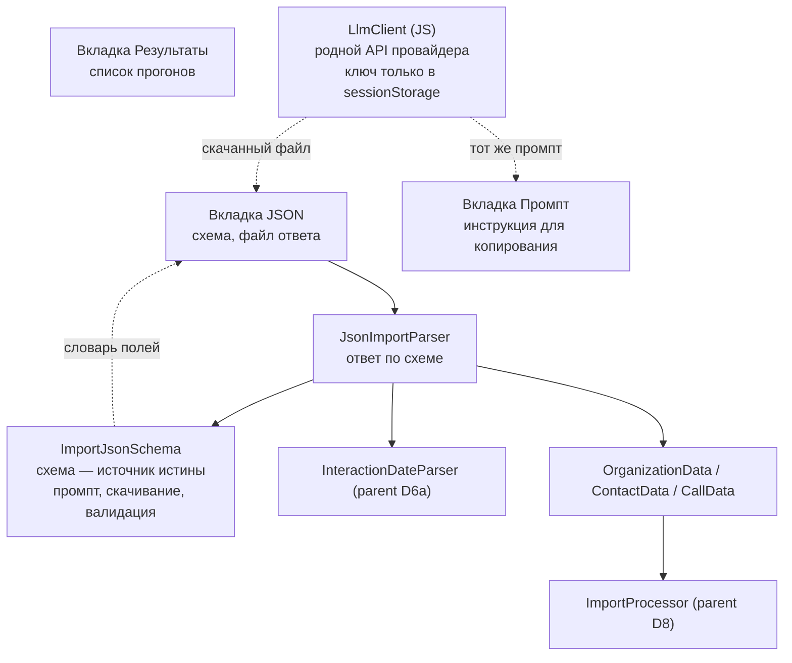
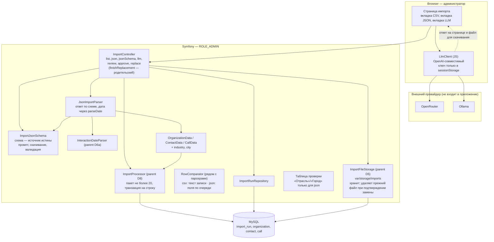
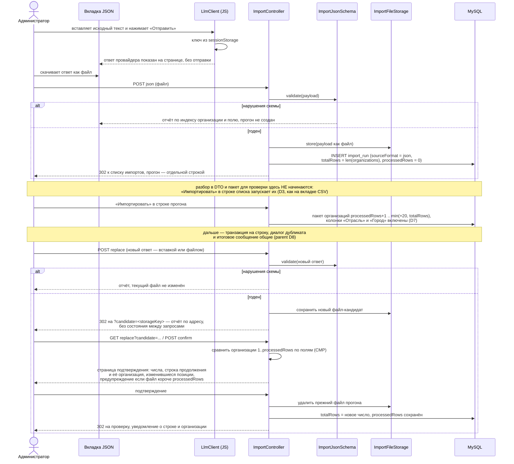

# Design: JSON import path with a browser-side LLM client

## Context

See proposal.md — Why. This change starts from the state the parent change
`add-organizations-csv-import` leaves behind: an import page with a CSV upload
form, an import run record, a file store under `var/storage/imports/`, a
20-organization review table, a per-row transaction, a duplicate choice and a
completion notice. Everything below assumes that machinery exists; the
decisions D1–D11 of the parent design apply unchanged unless a JSON source
forces a difference, and each such difference is called out explicitly.

Two properties of the parent design are load-bearing here. The run's stored
payload is **a file**, whatever produced it, and the run records the format of
its source, so a second format is a new parser and a new value rather than a
new pipeline. And the review package is derived from the run's own progress, so
a second source needs no second notion of a position.

The fragile part of the CSV path is exactly what this change addresses: one
unstructured cell per organization holds names, positions, phones, emails and
a multi-year interaction log, and separating them is heuristic. A language
model returns the same data already separated, and additionally supplies
`industry`, `website` and `city`, which the export does not contain at all.

That last sentence is also where this design parts company with the parent in
exactly one place. The CSV format carries no city, so the parent hides the field
and its scenario asserts `city` stays null; here the city arrives pre-filled and
a human is asked to confirm it. Filling a field the reviewer cannot see is not
review, so the parent's prohibition is made format-conditional (D7) rather than
inherited wholesale. Everywhere else the parent's rules stand as written.

## Goals / Non-Goals

**Goals:**
- A second source format on the existing import page, sharing every stage after
  parsing
- One published contract driving the prompt, the download and the validation
- Accepting a model answer as a file, the same way as any other response file
- Filling `industry`, `website` and `city` from the model, with the key and the
  request never reaching the server
- Keeping the human in the loop: a model answer is reviewed package by package
  like any other, and the two fields the model invents most are among the ones
  the review actually shows
- Strictness declared in the contract rather than applied downstream: a payload
  that does not satisfy the schema is refused whole, before it becomes a run, and
  nothing on this path repairs, infers or carries over a value

**Non-Goals:**
- Server-side calls to any provider, and any persistence of an API key
- Automatic submission of a model answer: the answer is shown, downloaded and
  uploaded by the administrator, never sent on its own
- A field for pasting a response into the JSON tab
- Automatic start of the import on submission — like the CSV tab, the run appears
  in the import list and «Импортировать» starts it (D3)
- A second progress model: `totalRows` counts organizations on both paths, so
  the review package, the progress indicator and the completion flash are the
  same code
- Any change to the duplicate dialog, the per-row transaction, the completion
  rule or the derived-chunk rule — these are format-neutral by construction and
  are not re-specified here
- Any heuristic on this path. There is no note-continuation, no year inference
  and no length repair, because there is nothing to repair: a model answer that
  needs repair is the wrong answer
- Storing alternative organization names to detect "same company, two rows"
  (ADR-0015 — the merge choice is the mechanism)
- Loading an answer from a URL, or detecting that a replacement answer is older
  than the one already imported

## Decisions

### D1: Two front-ends, one back-end

**Choice:** the import has four front-ends and one back-end, merging at the DTO
layer: «CSV», «JSON», «LLM» and «Промпт» differ in how a row is obtained, and the
list of runs is a fifth tab rather than a block repeated on each of them — a run
is state, not format, and the same table on four screens told the administrator
nothing about the tab they were on.



The JSON tab and the LLM tab converge before the server is involved: the LLM
client shows the answer and writes it to a file the administrator downloads, and
that file is uploaded on the JSON tab like any other. The server therefore has
exactly one entry point for this path and never learns where the answer came
from.

**Rationale:** the value of the JSON path is not a second import — it is that
contacts, calls and organization fields arrive already split, so the fragile
heuristics of the parent change (its D3) are not on this path at all. Splitting
the two paths after parsing would duplicate the hardest and least stable part of
the flow.

**Consequence:** «Следующий контакт» becomes a *planned* `Call` on this path
too, and the model's own reading of an already-past date is stored unchanged.
`response_format` reduces malformed JSON; it does not make the *content* correct,
so the package review stays the safety net (D5).

### D2: One JSON Schema document is the source of truth for three consumers

**Choice:** a single JSON Schema (draft 2019-09) document is stored in the
repository and drives all three of:

1. the field dictionary rendered inside the prompt shown on the «Промпт» tab;
2. the file served by «Скачать JSON-схему» (`Content-Disposition: attachment`);
3. server-side validation of an uploaded response.

The schema sent to a provider is a reduced copy of the same document: the
keywords a structured-output engine cannot parse (`$ref`, `$id`, `$schema`,
`pattern`, `maxLength`, `additionalProperties`) are stripped, the field names,
types and required fields are kept. The reduced copy exists because a provider
rejects the whole request on an unknown keyword — with it gone, the answer comes
back structured instead of the request failing.

The copy is taken from the **root** of the document, not from
`properties.organizations`. Projecting the property alone yields the array's
schema, and an engine asked for an array produces an array: the answer came back
as `[{…}, {…}]`, which validation rejects at the very first step. Reduction is
about removing keywords an engine cannot read; what is sent is the whole
contract, one level down from the file being downloaded.

**Rationale:** the failure this prevents is the prompt and the importer
disagreeing — the prompt tells the model a field is optional while the validator
rejects it, or the prompt documents a limit the validator does not enforce.
Deriving all three from one document makes that class of bug impossible rather
than merely unlikely. `justinrainbow/json-schema` is already present in
`composer.lock` as a transitive dependency and is promoted to a direct
requirement; no new package is introduced.

**Shape** — one object per organization, nested. The model's natural output
shape and the database's shape coincide, so no assembly step is needed:

```json
{ "organizations": [ { "name": …, …вложенные объекты контактов, звонков и nextCall… } ] }
```

The prompt carries no worked example, and the snippet above is the design's
sketch of the shape, not text sent to a model. That is the third revision of the
example question. It started as a real organization with a named contact, a
phone number and a mailbox; the model returned that organization as part of the
answer, contacts and all. Making the values obviously invented did not help: it
returned «Организация-пример» with «Имя-контакта» and `+000000000000`, and
copied the sample's `nextCall` to the first real organization it parsed. A
sample is data to a model — that is what it is for — and a sample cannot be made
safe, only less realistic. So the prompt describes the format in words: the
field dictionary already carries every name, type, length, required flag and
date shape, which is what an example was repeating.

What replaces the example is a rule about absence. With nothing to copy, a model
invents placeholders instead — «пример», «неизвестно», «-», and the same contact
and mailbox across every organization. The prompt says: a field without data is
omitted, a placeholder is never written, and each organization gets its own
values. For `unp` the rule is stated in both directions, because "never invent an
UNP" alone reads to a model as "leave the field out", and the field was empty in
answers where the source did carry one.

**Provider format.** The document sent as the response format is the *root* of
the schema — object, required `organizations` — not the array property. The
array is what a projection of `properties.organizations` yields, and Ollama
answered it exactly: a bare `[{…}, {…}]` with no wrapper, which the importer
rejects with "ожидается объект JSON с полем organizations". A structured-output
engine constrains what it is told, so telling it the array means getting the
array.

`unp`, `annualPlan` and `isMain` are **declared**, and this is a reversal of an
earlier decision in this same document. The original reasoning was that a model
invents UNPs and a wrong number is worse than a missing one (ADR-0015), which is
true — but it was answered by removing the fields from the contract and
rejecting any answer that carried them. That answers a question nobody asked: a
payload handed over from another source legitimately has all three, and refusing
it wholesale refuses the plain list of organizations the format is also for.
The prompt is where the "do not invent" instruction belongs; the schema is where
"here is where it goes" belongs.

What remains true and is stated instead: the prompt asks for neither `unp` nor
`annualPlan`, a model is told not to invent them, and neither is required. On a
CSV run `Organization.unp` and `Organization.annualPlan` still stay null, because
the «Составление плана на год» column of the export carries a website address in
58 cases — that is a fact about the export, not about the field. And with no
`isMain` arriving, `MailingService::effectiveMainContact()` still falls back to
the lowest-ID contact.

`additionalProperties: false` stays. A misspelled `nmae` is a bug worth failing
on, and the fields the format can store are now enumerated rather than guessed. Call `date` values are carried **verbatim** — this path reuses
`InteractionDateParser` and does not impose ISO 8601, because the source dates
are not ISO and reformatting them is a lossy guess.

**The constraints live in the document, not in the parser.** `calls[].date` and
`nextCall.date` carry the same `pattern` the date grammar of the CSV tab
recognises, `maxLength` repeats the column widths, and `required` marks `name`
and `contacts[].name`. The consequences are deliberate and are the reason this
path is stricter than the CSV path:

- a date without a full unambiguous day, month and year — `31.08`, `09.04.202`,
  `09.04.20255` — is a **schema violation**, reported by organization index and
  field. It is not appended to the previous call's notes, no year is carried
  over, and no year is inferred. `InteractionDateParser::parseEntries()` and its
  note-continuation are therefore not on this path at all;
- a value longer than its column is a schema violation, not an
  `ImportRowStopped` at approval time;
- an absent optional field is null, never an empty string — the model writes what
  it knows and omits what it does not.

`InteractionDateParser::parseDate()` survives as a **normaliser**, not as a
validator: it maps `21.10.25` to 2025 and stores the call at 12:00 in the
database time zone. Its `DATE_PATTERN` and the schema's `pattern` are two
spellings of one grammar and could drift, so a test asserts that every date the
schema accepts is parsed by `parseDate()` and that `parseDate()` returns null for
none of them.

`justinrainbow/json-schema` is already present in `composer.lock`, but as a
**dev-only transitive dependency** of `friendsofphp/php-cs-fixer` and
`infection/infection` — it lived in `packages-dev`. Since `make prod-deploy`
runs `composer install --no-dev`, promoting the package to a direct
requirement is only half the work; the lock file must be regenerated so the
package leaves `packages-dev` and is installed in production.

**The document is draft 2019-09, not 2020-12.** The pinned library ships
constraint classes only up to `draft2019`, so `$defs` — the 2020-12 keyword for
reusable subschemas — resolves to nothing and every `$ref` would silently
validate as "any", rejecting nothing at all. `definitions` is what the installed
version actually enforces, and the schema declares what it can be checked
against. A schema that claims a dialect the validator does not implement is a
published contract that promises more than it keeps. `format` keywords (`email`, `uri`) are
not used: this library treats them as annotations unless a format constraint
factory is wired in, and an unenforced keyword in a published contract is worse
than none.

### D12: Import runs are independent — no single active run

**Reversal of the parent's D9.** The parent enforced one active run: a new
upload was rejected while any run had `processedRows < totalRows`, and opening
another run's page redirected to the newest unfinished one. The reason given was
coordination — UI-only limitation fails with two tabs or two admins — and the
cost accepted was that the import is a single-admin, single-tab activity.

The cost turned out to be the wrong one to accept. Nothing in the storage model
shared state between runs: each run has its own file, its own counter and its
own position, and the duplicate check runs against the database at insert time
(the parent's D10), so two runs carrying the same organization resolve through
the duplicate choice rather than by refusing to exist. What the rule actually
bought was a guarantee that only one run can be half-done — and the price was an
admin who uploaded a file, did not import it, and then could not upload
anything else at all, including the fix for the file they just uploaded. That is
not coordination; it is a stuck state with no way out but the replace flow.

So: no run blocks another. A new upload always creates a run, a run's page
always shows that run, and the run list gives every unfinished run its own
«Импортировать» and «Перезагрузить». The completion notice counts the current
run's rows against its own total — the parent's wording summed `processedRows`
across runs, which only read correctly while a single run could exist.

**What is gone:** `ImportRunRepository::findUnfinished()` and `sumProcessedRows()`
have no callers and are removed. **What stays:** the parent's idempotent
approval form, which relies on the run's own counter and needs no cross-run
state; and `processedRows >= totalRows` as the definition of completion, which is
what decides whether a row still offers «Импортировать».

### D3: One payload per run, from a file, chunked by the application

**Choice:** the JSON tab accepts a response containing any number of
organizations as an uploaded file. The application counts the
`organizations` array, writes the payload to the run's stored file, sets
`totalRows` to the array length, records `sourceFormat = json`, and then
**returns the administrator to the import list**, where the new run appears as a
row of its own. Parsing into DTOs and building a review package do **not** start
on submission: they start when the administrator presses «Импортировать» in that
row, exactly as on the CSV tab. `processedRows` therefore counts organizations,
not CSV records, on every path.

**Rationale:** the user should not have to split a several-hundred-organization
answer into twenty pieces by hand. `totalRows` keeps its meaning —
organizations — so the progress indicator, the "Продолжить" link and the
completion flash behave identically, and `ImportRun` needs no second notion of
row count.

The split between *submitting* and *importing* is inherited deliberately rather
than re-decided. The parent's reason holds verbatim: counting records and
checking the format are cheap and happen on submission, so an unusable payload
is rejected before it becomes a run, while DTO construction is deferred so that an
uploaded answer does not start parsing 300 organizations the moment it is
accepted. What D12 changes here is only the regime around it: the split between
*submitting* and *importing* holds on every tab, but no run is active in the
parent's D9 sense any more, so an answer is never refused because some other run
happens to be half-done.

The run's `filename` is the uploaded file's client name, because the run list
column «Файл» must name something.

The JSON tab takes a file and nothing else. Two ways of delivering one document
would differ only up to the upload form and then converge, and the paste form is
the one an administrator is least likely to need: an answer came from somewhere,
and it came from somewhere with a way to save it. The field is kept on the
replacement form, where an already-started run is being corrected rather than
created.

**Cost:** one bad character invalidates the whole payload, so the validator
reports the offending organization by index and field rather than failing
silently. This is accepted: a per-chunk submission protocol moves the failure
handling burden onto the user for every chunk instead of once.

### D4: The LLM call is made by the browser, the key never reaches the server

**Choice:** a small JavaScript client calls the provider directly from the
page. The two providers are not asked the same question: each is called the way
it documents, and the client picks the request shape and the path to the answer
by provider.

| | OpenRouter | Ollama |
| --- | --- | --- |
| Endpoint | `POST https://openrouter.ai/api/v1/chat/completions` | `POST http://<host>:11434/api/chat` |
| Auth | `Authorization: Bearer <key>`, plus `HTTP-Referer` / `X-OpenRouter-Title` for attribution | none |
| Model list | `GET /api/v1/models` | `GET /api/tags` |
| Structured output | `response_format: { type: "json_schema", json_schema: { … } }` | `format: <schema>`, `stream: false`, `temperature: 0` |
| Answer | `choices[0].message.content` | `message.content` |

An empty Ollama host means `http://localhost:11434`. Native endpoints are used
rather than the OpenAI-compatible route because the route is a compatibility
layer Ollama may not be running: asking for `/api/tags` and `/api/chat` works
against the server as installed, and the answer no longer has to be dug out of an
OpenAI-shaped envelope.

The key is held in a JavaScript variable backed by `sessionStorage`, never
`localStorage`. Closing the tab clears it, which is why there is no «Забыть
ключ» action: a button next to the field would mean what the browser already
does when the tab is closed, and the user is told that in the warning under the
field. The response is shown on
the page and offered as a download; the administrator uploads that file on the
JSON tab, where the same schema validates it as any other response file.

**Rationale:** keeping the key client-side removes the entire class of concerns
a server-side integration carries — no new entity, no secrets in the vault, no
key in backups, no audit log to leak, and no dependency on
`symfony/http-client`. The loss is a server-side record of what was sent, which
matters little here because the import is still reviewed organization by
organization and recorded through `ImportRun`.

Two consequences the specification must state:

- a request the browser refuses to issue is reported in the tab as an error and
  leaves the import untouched. How a third-party host is reached and configured
  is out of scope here: the client speaks the provider's documented API, and the
  specification describes what the tab does with the answer, not how the provider
  is deployed;
- a browser-held key is exposed to XSS and to anyone with access to the
  workstation. This is why the key is session-scoped rather than persisted and
  why it is never written to a form field the server can read.

**Alternatives considered:**
- Server-side provider calls: would allow audit and rate limiting, but needs
  key storage, a new dependency and a new surface for a secret. Rejected for a
  one-shot migration tool.
- Copy-paste into the user's own chat application: already supported by D3 —
  the file the administrator saves from anywhere is uploaded as it is. The
  built-in client exists for convenience and for structured output, which makes
  a malformed response unlikely.

### D5: LLM output that cannot be trusted is still reviewed

**Choice:** this path reuses the package review form unchanged, except for the
two fields the parent table does not have at all (D7). Every organization
arrives in an editable form where the administrator can correct fields, add or
remove contacts and calls, and remove a row. `response_format` reduces
malformed JSON; it does not make the *content* correct.

**Rationale:** a model filling `industry` and `website` from public sources will
occasionally produce a plausible wrong value, and a several-hundred-row import
is not a thing the user wants to reverse afterwards. The review form is the same
safety net the CSV path already relies on for heuristic mis-parsing, which is
why the two paths were merged at the DTO layer in the first place. This is also
why D7 exists: a safety net that does not render the field it is supposed to
check is not a safety net.

### D6: A JSON run replaces its file with the same report, compared structurally

**Choice:** the replacement flow needs no new mechanism and no new method. It is
the parent's `ImportController::replace()` and its private
`finishReplacement()`, with one thing changed: the candidate travels in the URL
(`/admin/import/{id}/replace?candidate=<storageKey>`), so the report is
reproducible from its address and nothing about the pending replacement is held
between the two requests — that rule is load-bearing and is inherited, not
reinvented. On confirmation the run switches to the new payload, `filename` and
`storageKey` are replaced, **the file the run pointed at before is deleted**
(the parent's D5/D8, and the only place the import flow deletes a file), and a
candidate whose organization count is below `processedRows` is confirmed with a
warning and completes the run. For a JSON run, two organizations differ when
they differ in any field, independent of key order and of how the payload is
written.

**Rationale:** a textual diff of two JSON payloads reports every line as changed
when nothing changed in the data, which would make the report noise. The
parent's rule — trusted state is the row numbers plus the retained previous
file — holds unchanged, and so does the exclusion of timestamps: a browser
supplied payload carries no client timestamp, and a replaced run's organizations
cannot be mapped back to rows.

**What the implementation actually needs here.** `ImportController::replacementReport()`
is presently written against `CsvParser::recordText()` and
`CsvParser::organizationName()` directly, so the format dispatch has to be lifted
out of the controller before a JSON run can be reported at all: the record source,
the row-comparison and the name-at-resume-row all become format-dependent. This
is in addition to `ImportProcessor::processChunk()` and `persistRows()`, which
are the dispatch points the parent's design names. The comparator lives beside
the parsers rather than in the controller, so a third format would add one class
instead of a third branch.

**Consequence:** a replacement of a JSON run validates against the published
schema, accepts a paste or a file, and renders the same confirmation page with
the counts in organizations, the resume row and its organization, the differing
positions within the processed prefix, and the shorter-file warning. The
single-active-run check still does not apply to a run's own replacement.

### D7: The review table shows `industry` and `city` for a JSON run, and hides them for a CSV one

**Choice:** `industry`, `city`, `unp` and `annualPlan` become reviewable **as a
function of the run's source format**. A run created from JSON renders four extra
columns and accepts edits to them; a run created from CSV renders none of them,
and all four columns stay null exactly as the parent's requirement says.

```
                     review table
              +---------------------+---------------------------------------+
              |  run.sourceFormat   | "Отрасль" "Город" "УНП" "Годовой план" |
              +---------------------+---------------------------------------+
              |  csv                |  нет                                   |  <- parent, unchanged
              |  json               |  да                                    |  <- this change
              +---------------------+---------------------------------------+

              save path:  OrganizationData -> ImportRow -> newOrganization()
                          needs industry + city on both hops
```

**Rationale:** the alternative is to fill two fields the reviewer cannot see.
D5 names a plausible wrong `industry` or `city` as the reason a human stays in
the loop, and an import that stores an invented city for three hundred
organizations is exactly the outcome the review exists to prevent. The parent's
prohibition was not "a city column is forbidden" but "there is no city in the
source format, so there is nothing to pre-fill and nothing to review" — on the
JSON tab that premise no longer holds. Keeping the prohibition conditional
rather than lifting it globally preserves the CSV rationale verbatim, including
its scenario «В прогоне нет города».

`isMain` needs no column: the main-contact checkbox is already in the contacts
block for every run, and an answer that carries `isMain` simply arrives with it
ticked. The four columns belong to the organization, and the row is now eleven
columns wide inside a `.table-wrap`, which is the pattern the page already uses
for wide rows.

**Consequence:** `OrganizationData` and `ImportRow` gain four optional fields,
`newOrganization()` sets them, `ImportRow`'s length checks cover them — `unp` at
32 characters like the column, `annualPlan` at 255 — and the controller reads them
from the form only when the run's format asks for them, so a CSV review form
carries no such inputs and a CSV row cannot acquire them by form tampering. The
review template needs the run's `sourceFormat`, which it did not receive before.

### D8: The new routes are literal-first, because `/{id}` already exists

**Choice:** the new routes are declared on the existing controller with an `id`
requirement that keeps `/{id}` from swallowing them:

```php
#[Route('/{id}', requirements: ['id' => '\d+'])]          // existing review
#[Route('/results', requirements: ['id' => '0'])]        // new runs list (7.6)
#[Route('/json',  requirements: ['id' => '0'])]           // new JSON tab
#[Route('/json-schema', requirements: ['id' => '0'])]    // new schema download
#[Route('/prompt', requirements: ['id' => '0'])]         // new prompt tab (4.6)
#[Route('/llm',   requirements: ['id' => '0'])]           // new LLM tab
```

**Rationale:** `ImportController` already serves `/admin/import/{id}` for the
review, and `debug:router` confirms it today. A new literal that collides with it
would 404 before any method of this change ran, and the failure would look like a
missing action rather than a routing collision. The parent's own route already
carries a `requirements` argument for the same reason, so the fix is the
established pattern in this file rather than a new mechanism.

**Alternative considered:** renaming `{id}` to a fixed segment. Rejected — it
would churn the parent's URLs, its spec scenarios and its bookmarkable pages for
no behavioural gain.

## Architecture

### Component Diagram

*Assumptions:* purpose = design for an existing monolith, following the parent
change; format = plain Mermaid `flowchart`; rigor = lightweight C4-inspired
(container + key components only). `totalRows` counts organizations on both
paths. Components inside the browser are shown with the server components they
talk to, because the trust boundary between them is the point of the diagram.



### JSON submission and replacement (Dynamic)

The review, approval and failure paths are the parent's and are not repeated
here; what is new is how a JSON run gets created and how it is replaced.



## Risks / Trade-offs

- **A model fills `industry`, `website` or `city` with a plausible wrong
  value** → Mitigated by the review form (D5, D7), not by validation: the schema
  checks shape, not truth. `industry` and `city` are rendered and editable for a
  JSON run precisely so that "visible and correctable per row" is literally true
  for the fields a model is most likely to invent.
- **Strictness rejects a payload a human could have repaired** → Accepted, and it
  is the point: a date like `31.08` is not repairable without guessing the year,
  and a guessed year is wrong data written silently. The rejection names the
  organization index and the field, and the answer can be re-imported as a
  replacement file at no cost.
- **The schema's date `pattern` drifts from `InteractionDateParser::DATE_PATTERN`**
  → Pinned by a test that feeds every date shape the schema accepts through
  `parseDate()` and asserts none returns null, in both directions.
- **`justinrainbow/json-schema` is a dev-only package today** → The promotion is
  incomplete without a regenerated `composer.lock`; `make prod-deploy` installs
  `--no-dev`. A task verifies the class loads under `--no-dev`.
- **A browser-held API key is exposed to XSS and to a shared workstation** →
  Mitigated by scope, not removed: the key lives in `sessionStorage` only, so it
  dies with the tab, `localStorage` is not used, and the key is never written
  into a field the server can read. The user is told this in the warning under the
  key field.
- **The browser may refuse the request outright (cross-origin policy, host down)**
  → Not detectable from application code and not the application's to fix: a
  `TypeError` from `fetch` is what a blocked request looks like, so the client
  reports it as a blocked request and leaves the import untouched. How the
  provider is configured belongs to the provider's own documentation.
- **One bad character invalidates a whole uploaded answer** → Accepted (D3). The
  validator names the offending organization by index and field, so the user
  fixes one character rather than re-splitting twenty packages.
- **The prompt and the schema can still drift if the prompt is edited by hand**
  → The prompt's field dictionary is rendered from the schema document, and a
  test asserts that every schema property's description appears in the rendered
  prompt, so an edit to the prompt text alone cannot remove a field. The same
  rendering is where the model is told the constraints, so an unenforced field
  and an undescribed field are the same defect.
- **`response_format` support differs between providers** → Degraded to
  best-effort: if a provider ignores it, the answer still arrives as text and
  the same server-side schema validation reports any violation when the file is
  uploaded.
- **A provider rejects a keyword the full schema carries** → Mitigated by the
  reduced copy (D2): the keywords a structured-output engine cannot parse are
  stripped before the request. Ollama answers `400 Failed to initialize
  samplers: failed to parse grammar` to a schema with `$ref` or `pattern` in it,
  which is a rejection of the whole request, not of the answer.
- **A model answers with a bare array or with the prompt's own example** →
  Addressed, and both were observed. The array came from asking for the array's
  schema (D2); the example came from the prompt carrying one, and the only
  version of that fix that held was deleting the example and stating how absence
  is written instead (D4). A provider-side format constrains shape, not content:
  nothing in the schema can forbid an organization the model already decided to
  return, which is why the prompt has to forbid it in words.
- **A replacement answer is compared positionally** → Accepted and stated in the
  requirement: a reordered answer moves the resume point, and the report lists
  the differing positions within the processed prefix so the admin sees it. The
  report informs, it does not block; content that changed inside the prefix
  stays as originally inserted and correcting it is a manual edit.
- **No rollback on stop** → By design, inherited from the parent: previously
  saved data persists, the stored file is kept, and the import can be resumed.

## Migration Plan

None. `import_run.source_format` is created by the first migration of
`add-organizations-csv-import`, defaulting to `csv`; this change writes
`json` into it and selects the parser by that value. Deploy order is therefore
parent change first, this change second, with no schema work in between.

Rollback: remove the second tab, the LLM client and the three routes, and drop
`industry`/`city` from the review table again. Runs created from JSON keep their
payload and their `source_format` value, so a CSV-only build would fail to parse
them — the run list is unaffected, but such a run cannot be resumed on a
rolled-back build. Organizations already imported keep whatever `industry` and
`city` they were given, since those columns already exist (ADR-0015) and no
migration removes them. No data is lost either way, because a run's current
payload is only ever deleted when an admin has confirmed its replacement.

Deploy order is therefore parent change first, this change second, with no
schema work in between — but note the `composer.lock` regeneration, which is not
schema work and is easy to overlook precisely because no migration is involved.

## Open Questions

- Whether a provider that rejects `response_format` should fall back to
  requesting the schema inside the prompt text. It can be answered without
  changing the specs, the approach, or the task breakdown: the current path
  already degrades to the same server-side validation, and the rendered prompt
  already carries the field descriptions.
- Whether `industry` and `city` should later appear in the CSV review table as
  empty editable inputs. Not this change: with nothing to pre-fill from the
  export, the parent deliberately keeps them out, and a CSV row has no reason to
  offer a city field.
