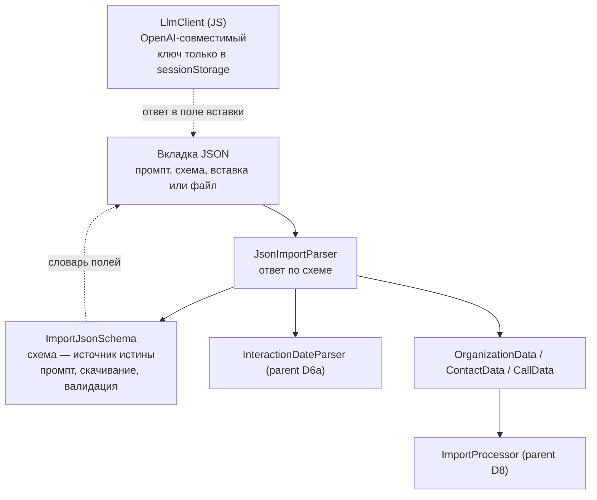
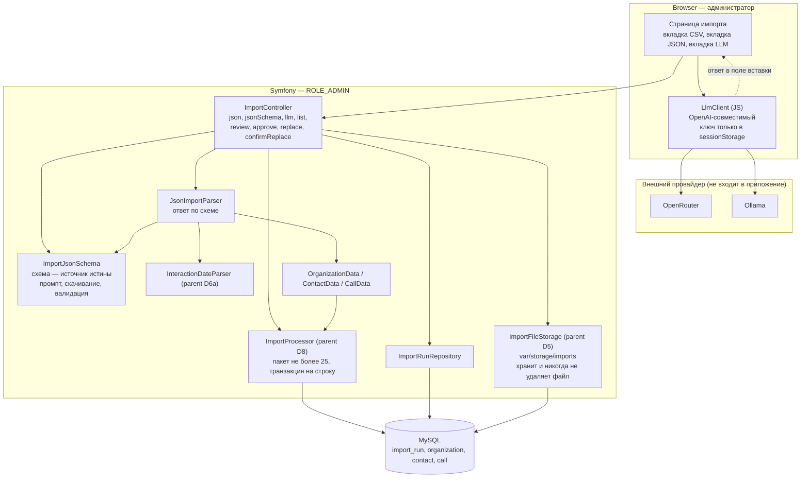
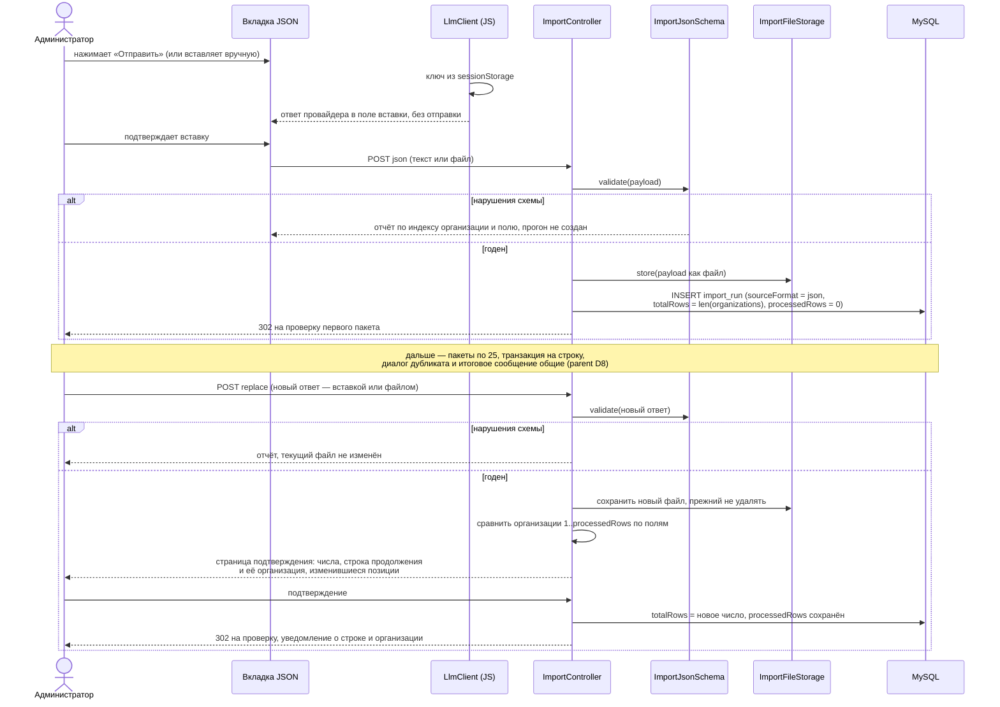

# Design: JSON import path with a browser-side LLM client

## Context

See proposal.md — Why. This change starts from the state the parent change
`add-organizations-csv-import` leaves behind: an import page with a CSV upload
form, an import run record, a file store under `var/storage/imports/`, a
25-organization review table, a per-row transaction, a duplicate choice and a
completion notice. Everything below assumes that machinery exists; the
decisions D1–D11 of the parent design apply unchanged unless a JSON source
forces a difference, and each such difference is called out explicitly.

Two properties of the parent design are load-bearing here. The run's stored
payload is **a file**, whatever produced it, and the run records the format of
its source, so a second format is a new parser and a new value rather than a
new pipeline. And the review package is derived from the run's own progress, so
a second source needs no second notion of a position.

The fragile part of the CSV path is exactly what this change addresses: one
unstructured cell per organization holds names, positions, phones, emails and
a multi-year interaction log, and separating them is heuristic. A language
model returns the same data already separated, and additionally supplies
`industry`, `website` and `city`, which the export does not contain at all.

## Goals / Non-Goals

**Goals:**
- A second source format on the existing import page, sharing every stage after
  parsing
- One published contract driving the prompt, the download and the validation
- Accepting a model answer by paste or by file, treated identically
- Filling `industry`, `website` and `city` from the model, with the key and the
  request never reaching the server
- Keeping the human in the loop: a model answer is reviewed package by package
  like any other

**Non-Goals:**
- Server-side calls to any provider, and any persistence of an API key
- Automatic submission of a model answer
- A second progress model: `totalRows` counts organizations on both paths, so
  the review package, the progress indicator and the completion flash are the
  same code
- Any change to the duplicate dialog, the per-row transaction, the completion
  rule or the derived-chunk rule — these are format-neutral by construction and
  are not re-specified here
- Storing alternative organization names to detect "same company, two rows"
  (ADR-0015 — the merge choice is the mechanism)
- Loading an answer from a URL, or detecting that a replacement answer is older
  than the one already imported

## Decisions

### D1: Two front-ends, one back-end

**Choice:** the import has two front-ends and one back-end, merging at the DTO
layer.



The JSON tab and the LLM tab converge before the server is involved: the LLM
client writes into the JSON tab's textarea and the administrator submits it
like any pasted text. The server therefore has exactly one entry point for this
path.

**Rationale:** the value of the JSON path is not a second import — it is that
contacts, calls and organization fields arrive already split, so the fragile
heuristics of the parent change (its D3) are not on this path at all. Splitting
the two paths after parsing would duplicate the hardest and least stable part of
the flow.

**Consequence:** «Следующий контакт» becomes a *planned* `Call` on this path
too, and the model's own reading of an already-past date is stored unchanged.
`response_format` reduces malformed JSON; it does not make the *content* correct,
so the package review stays the safety net (D5).

### D2: One JSON Schema document is the source of truth for three consumers

**Choice:** a single JSON Schema (draft 2020-12) document is stored in the
repository and drives all three of:

1. the field dictionary rendered inside the prompt shown on the JSON tab;
2. the file served by «Скачать JSON-схему» (`Content-Disposition: attachment`);
3. server-side validation of a pasted response.

**Rationale:** the failure this prevents is the prompt and the importer
disagreeing — the prompt tells the model a field is optional while the validator
rejects it, or the prompt documents a limit the validator does not enforce.
Deriving all three from one document makes that class of bug impossible rather
than merely unlikely. `justinrainbow/json-schema` is already present in
`composer.lock` as a transitive dependency and is promoted to a direct
requirement; no new package is introduced.

**Shape** — one object per organization, nested. The model's natural output
shape and the database's shape coincide, so no assembly step is needed:

```json
{
  "organizations": [
    {
      "name": "АбесТрейд",
      "industry": "ИТ-дистрибьютор",
      "city": "Минск",
      "website": "https://abeslab.by",
      "description": "Сертифицированный дистрибьютор ПО.",
      "coursesAttended": "",
      "contacts": [
        { "name": "Вячеслав", "position": "начальник отдела обучения",
          "phone": "+375339027636", "email": "V.Zakrevsky@naftan.by" }
      ],
      "calls": [
        { "date": "29.05.2026", "notes": "Направила КП по всем лагерям" }
      ],
      "nextContact": { "date": "08.06.2026", "purpose": "созвониться по КП" }
    }
  ]
}
```

`unp` is deliberately absent: a model invents those numbers and a wrong one is
worse than a missing one (ADR-0015). `is_main` is deliberately absent: the
export does not distinguish a primary contact, and
`MailingService::effectiveMainContact()` falls back to the lowest-ID contact.
`annualPlan` is deliberately absent for the same reason the CSV path does not
populate it. Call `date` values are carried **verbatim** — this path reuses
`InteractionDateParser` and does not impose ISO 8601, because the source dates
are not ISO and reformatting them is a lossy guess.

### D3: One payload per run, from a paste or a file, chunked by the application

**Choice:** the JSON tab accepts a response containing any number of
organizations, supplied either as pasted text or as an uploaded file. The two
are the same thing from that point on: the application counts the
`organizations` array, writes the payload to the run's stored file, sets
`totalRows` to the array length, records `sourceFormat = json`, and then
presents the same 25-organization review packages as the CSV tab.
`processedRows` therefore counts organizations, not CSV records, on both paths.

**Rationale:** the user should not have to split a several-hundred-organization
answer into twenty pieces by hand. `totalRows` keeps its meaning —
organizations — so the progress indicator, the "Продолжить" link and the
completion flash behave identically, and `ImportRun` needs no second notion of
row count.

Accepting a file as well as a paste costs one form field and buys three things:
an answer produced earlier can be re-imported without being re-copied through
the clipboard; the payload is a file like any other, so the replacement flow is
available with no extra mechanism; and a large body of text has somewhere to go
other than a textarea.

**Cost:** one bad character invalidates the whole payload, so the validator
reports the offending organization by index and field rather than failing
silently. This is accepted: a per-chunk submission protocol moves the failure
handling burden onto the user for every chunk instead of once.

### D4: The LLM call is made by the browser, the key never reaches the server

**Choice:** a small JavaScript client calls the provider directly from the
page. Both supported providers are OpenAI-compatible, so one client with a
`{ baseUrl, apiKey, model }` configuration serves both:

| | OpenRouter | Ollama |
| --- | --- | --- |
| Endpoint | `POST https://openrouter.ai/api/v1/chat/completions` | `POST http://<host>:11434/v1/chat/completions` |
| Auth | `Authorization: Bearer <key>`, plus `HTTP-Referer` / `X-OpenRouter-Title` for attribution | any value, ignored |
| Model list | `GET /api/v1/models` | `GET /api/tags` |
| Structured output | `response_format: { type: "json_schema", json_schema: { … } }` | supported through the OpenAI-compatible route |

The key is held in a JavaScript variable backed by `sessionStorage`, never
`localStorage`, with an explicit «Забыть ключ» action. The response is written
into the JSON tab's textarea and validated by the same schema as a manual paste.

**Rationale:** keeping the key client-side removes the entire class of concerns
a server-side integration carries — no new entity, no secrets in the vault, no
key in backups, no audit log to leak, and no dependency on
`symfony/http-client`. The loss is a server-side record of what was sent, which
matters little here because the import is still reviewed organization by
organization and recorded through `ImportRun`.

Two consequences the specification must state:

- an Ollama host must set `OLLAMA_ORIGINS` to the CRM's origin, or the browser
  blocks the request; this is a deployment prerequisite, not an application
  setting;
- a browser-held key is exposed to XSS and to anyone with access to the
  workstation. This is why the key is session-scoped rather than persisted and
  why it is never written to a form field the server can read.

**Alternatives considered:**
- Server-side provider calls: would allow audit and rate limiting, but needs
  key storage, a new dependency and a new surface for a secret. Rejected for a
  one-shot migration tool.
- Copy-paste into the user's own chat application: already supported by D3 —
  the tab works with no key at all. The built-in client exists for convenience
  and for `response_format`, which makes a malformed response impossible.

### D5: LLM output that cannot be trusted is still reviewed

**Choice:** this path reuses the package review form unchanged. Every
organization arrives in an editable form where the administrator can correct
fields, add or remove contacts and calls, and remove a row. `response_format`
reduces malformed JSON; it does not make the *content* correct.

**Rationale:** a model filling `industry` and `website` from public sources will
occasionally produce a plausible wrong value, and a several-hundred-row import
is not a thing the user wants to reverse afterwards. The review form is the same
safety net the CSV path already relies on for heuristic mis-parsing, which is
why the two paths were merged at the DTO layer in the first place.

### D6: A JSON run replaces its file with the same report, compared structurally

**Choice:** the replacement flow needs no new mechanism. The parent's D8 is
already written against "the format declared for the run's source" and "a row
compared as the format defines a row", so this change only supplies the second
half of that rule: for a JSON run, two organizations differ when they differ in
any field, independent of key order and of how the payload is written.

**Rationale:** a textual diff of two JSON payloads reports every line as changed
when nothing changed in the data, which would make the report noise. The
parent's rule — trusted state is the row numbers plus the retained previous
file — holds unchanged, and so does the exclusion of timestamps: a browser
supplied payload carries no client timestamp, and a replaced run's organizations
cannot be mapped back to rows.

**Consequence:** a replacement of a JSON run validates against the published
schema, accepts a paste or a file, and renders the same confirmation page with
the counts in organizations, the resume row and its organization, and the
differing positions within the processed prefix. The single-active-run check
still does not apply to a run's own replacement.

## Architecture

### Component Diagram

*Assumptions:* purpose = design for an existing monolith, following the parent
change; format = plain Mermaid `flowchart`; rigor = lightweight C4-inspired
(container + key components only). `totalRows` counts organizations on both
paths. Components inside the browser are shown with the server components they
talk to, because the trust boundary between them is the point of the diagram.



### JSON submission and replacement (Dynamic)

The review, approval and failure paths are the parent's and are not repeated
here; what is new is how a JSON run gets created and how it is replaced.



## Risks / Trade-offs

- **A model fills `industry`, `website` or `city` with a plausible wrong
  value** → Mitigated by the review form (D5), not by validation: the schema
  checks shape, not truth. A wrong value is visible and correctable per row.
- **A browser-held API key is exposed to XSS and to a shared workstation** →
  Mitigated by scope, not removed: the key lives in `sessionStorage` only,
  `localStorage` is not used, it is never written into a field the server can
  read, and «Забыть ключ» clears it. The user is told this in the UI.
- **Ollama may refuse browser requests** → A deployment prerequisite: the Ollama
  host needs `OLLAMA_ORIGINS` set to the CRM origin. Not detectable from
  application code, so it is stated in the requirement and the setup notes.
- **One bad character invalidates a whole JSON paste** → Accepted (D3). The
  validator names the offending organization by index and field, so the user
  fixes one character rather than re-splitting twenty packages.
- **The prompt and the schema can still drift if the prompt is edited by hand**
  → The prompt's field dictionary is rendered from the schema document, and a
  test asserts that every schema property's description appears in the rendered
  prompt, so an edit to the prompt text alone cannot remove a field.
- **`response_format` support differs between providers** → Degraded to
  best-effort: if a provider ignores it, the answer still arrives as text and
  the same server-side schema validation reports any violation, which is the
  path a manual paste takes.
- **A replacement answer is compared positionally** → Accepted and stated in the
  requirement: a reordered answer moves the resume point, and the report lists
  the differing positions within the processed prefix so the admin sees it. The
  report informs, it does not block; content that changed inside the prefix
  stays as originally inserted and correcting it is a manual edit.
- **No rollback on stop** → By design, inherited from the parent: previously
  saved data persists, the stored file is kept, and the import can be resumed.

## Migration Plan

None. `import_run.source_format` is created by the first migration of
`add-organizations-csv-import`, defaulting to `csv`; this change writes
`json` into it and selects the parser by that value. Deploy order is therefore
parent change first, this change second, with no schema work in between.

Rollback: remove the second tab, the LLM client and the two routes. Runs created
from JSON keep their payload and their `source_format` value, so a CSV-only
build would fail to parse them — the run list is unaffected, but such a run
cannot be resumed on a rolled-back build. No data is lost either way, because
payloads are never deleted.

## Open Questions

- Whether a provider that rejects `response_format` should fall back to
  requesting the schema inside the prompt text. It can be answered without
  changing the specs, the approach, or the task breakdown: the current path
  already degrades to the same server-side validation.
