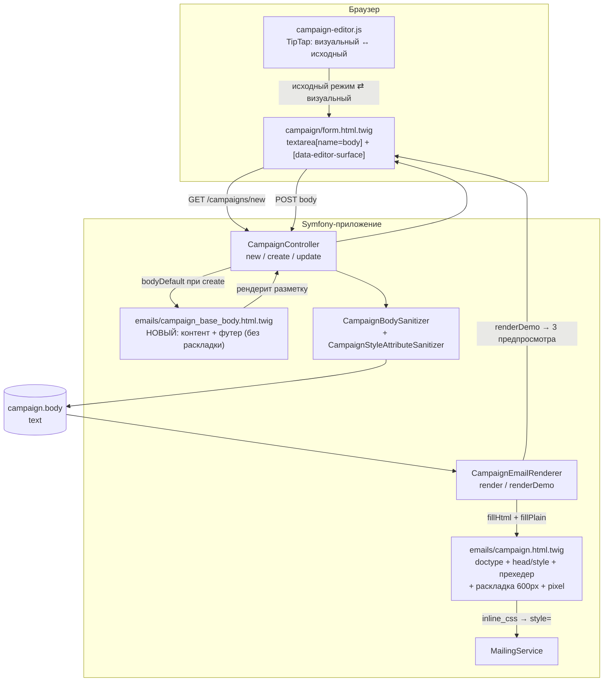

## Context

Текущее состояние (см. proposal.md — Why, истина о поведении — в
`specs/campaigns/spec.md`):

- `templates/emails/campaign.html.twig` — полный email-документ: doctype,
  `<head>` с `<style>`, скрытый прехедер, таблица `email-wrapper` →
  `email-container` (600px) → `td.email-content` (`{{ bodyHtml|raw }}`) и
  `td.email-footer` с подписью, телефонами, ссылкой на каталог, логотипом и
  ссылкой отписки. Файл обёрнут в ``.
- `src/Service/CampaignEmailRenderer.php` — подставляет токены
  (`CampaignTokenFiller`), рендерит этот шаблон, генерирует текстовую часть.
  Используется и отправкой, и всеми тремя предпросмотрами.
- `templates/campaign/form.html.twig:104-109` — `textarea[name="body"]` со
  значением по умолчанию `{{ campaign.body|default('') }}`.
- `assets/js/campaign-editor.js` — TipTap 2, привязан к `[data-editor-surface]`
  и этой textarea, с переключателем визуальный/исходный режим.

Ограничения, которые определили решение:

- `config/packages/html_sanitizer.yaml`: `allowed_link_schemes: [https, mailto,
  tel]`, `allowed_media_schemes: [https]`, allowlist элементов без
  документных (`html`/`head`/`body`/`style`).
- `src/Html/CampaignStyleAttributeSanitizer.php`: allowlist CSS-свойств;
  объявление со значением, содержащим `{{...}}`, отбрасывается.
- `inline_css` инлайнит `<style>` из `<head>` в атрибуты `style` — presentation
  шелла зависит от классов, а не от инлайнов в разметке.
- Тело письма — единственное место, где менеджер может редактировать письмо;
  доступа к шеллу из интерфейса нет.

## Goals / Non-Goals

**Goals:**

- Базовый шаблон письма задаётся по умолчанию и полностью редактируется в форме
  создания рассылки.
- У шелла остаётся ровно то, что менеджеру не нужно редактировать: doctype,
  `<head>` с базовым CSS, прехедер, tracking-pixel.
- Один источник разметки базового тела, из которого берётся и значение формы по
  умолчанию, и то, что менеджерей видит в предпросмотре после сохранения.
- Связка «базовое тело ↔ allowlist санитайзера ↔ CSS шелла» защищена тестом,
  чтобы дефолт не мог молча деградировать при сохранении.

**Non-Goals:**

- Перенос прехедера в тело, новые токены (`{{subject}}`, `{{preview_text}}`,
  `{{tracking_pixel_url}}`).
- Полный HTML-документ в редактируемом поле, read-only рамка вокруг редактора,
  расширение схемы TipTap.
- Миграция данных существующих рассылок и обратная совместимость рендерера для
  тел без футера.
- Кнопка «вставить базовый шаблон» в форме редактирования.

## Component diagram

Mermaid, лёгкий C4-уровень компонентов, существующий код. Предположения: формат
Mermaid и облегчённая строгость выбраны, чтобы не раздувать артефакт;System
Context и Deployment не нарисованы — границы локальны и известны.

Границы и ответственность:

- `BASE` — единственный источник разметки базового тела; читает только форма
  создания, в отправку не попадает. Раскладки письма не содержит (D3).
- `SAN` — единственная точка очистки; базовое тело обязано её пройти без потерь.
- `SHELL` — презентационная оболочка; больше не содержит контента менеджера.
- `EDITOR` не участвует в хранении: он только переключает представление одного и
  того же значения textarea.

## Decisions

### D1. Базовое тело живёт в отдельном Twig-шаблоне

`templates/emails/campaign_base_body.html.twig` содержит разметку тела по
умолчанию и рендерится контроллером только при создании.

- **Почему не константа PHP/сервис:** разметка письма в этом репозитории живёт в
  Twig; PHP-строка означала бы дублирование и потерю Twig-инструментов.
- **Почему не «вырезать футер из шелла»:** в шелле футер обёрнут в условия
  (``) и зависит от данных отправки, поэтому он плохой
  источник значения формы по умолчанию.
- **Почему отдельный файл, а не `{{ campaign is null ? … }}` в Twig:** выбор
  значения — решение контроллера, представление его только отображает.

Инвариант, проверенный тестом, а не предположение: **презентация базового тела
несётся инлайн-стилями, а не классами.** Первая версия этого решения опиралась на
классы `email-wrapper` / `email-container` / `email-content` / `email-footer` и
надеялась, что `inline_css` разрешит по ним presentation из `<style>` шелла.
Тест-защита это опроверг: санитайзер не пропускает `class`, поэтому после первого
сохранения классов в теле не остаётся и правила шелла не применимы. Базовое тело
дублирует презентацию футера инлайном — это заодно делает его корректным на
карточке рассылки, которая рендерится без `inline_css`.

Второй инвариант: **базовое тело не содержит раскладки письма** (см. D3), поэтому
не может оказаться второй вложенной карточкой.

### D2. Предзаполнение — значение по умолчанию, а не принудительное значение

Контроллер передаёт в форму `bodyDefault`: при создании — отрендеренное базовое
тело, при редактировании и после неудачной валидации — тело из запроса.

- Валидация не меняется: поле по-прежнему обязательно, очистка даёт «Текст письма
  обязателен», а санитизация в пустоту — «Текст письма не содержит допустимого
  содержимого». Менеджер может удалить базовый шаблон целиком.
- **Почему не записывать базовое тело в БД при создании сущности:** тогда
  повторное создание после ошибки валидации подставляло бы дефолт поверх
  ввода пользователя, а клонирование и API-пути получили бы неявный побочный
  эффект.

### D3. Раскладку письма держит шелл, тело несёт только контент

Первый вариант реализации убрал футер из шелла, но оставил в нём раскладку
600px — и одновременно положил раскладку в базовое тело. Письмо оказалось
вложенным дважды: карточка 600px внутри карточки 600px, с удвоенным
`padding: 24px 12px` и сдвигом контента. Решение владельца продукта — раскладкой
владеет шелл.

- **Почему шелл, а не тело:** карточка 600px не должна ломаться, когда менеджер
  правит тело, и не должна дублироваться вложенной таблицей. Это то же
  разделение, что и для doctype/`<head>`/pixel: шелл владеет тем, что пользователь
  не редактирует.
- **Цена:** удалив раскладку из тела, менеджер больше не может сделать письмо
  шире 600px. Приемлемо — раскладка была фиксированной и до этого.
- **Следствие для базового тела:** оно больше не «письмо целиком», а редактируемая
  часть — абзац контента и футер. Тесты и e2e-проверки переведены на то, что
  раскладку ищут в письме (`table[style*="width: 600px"]`), а не в теле.

Альтернатива: убрать раскладку из шелла и оставить её в теле. Отклонена — по
решению владельца продукта; она же делала бы письмо зависимым от того, что
менеджер не удалил лишнего.

### D4. Ссылки не ограничены тремя схемами; модель санитизации развёрнута

Первая редакция решения требовала, чтобы все ссылки дефолта были `https`,
`mailto` или `tel`, и запрещала расширять список. Реализация показала, что
ограничение упирается в корень: `href="{{unsubscribe_url}}"` — это не схема, а
токен, и при `allow_relative_links: false` санитайзер вырезал атрибут целиком.
Ссылка отписки в предзаполненном дефолте оказывалась мёртвой, и это же ломало
любой вставленный менеджером URL. По решению владельца продукта модель
развёрнута: пользователю доверяем, схемы не ограничиваем.

- `allowed_link_schemes` — широкий перечень реальных ссылок (`http`, `https`,
  `mailto`, `tel`, `sms`, `callto`, `ftp`, `geo`, `skype`, …) плюс
  `allow_relative_links: true`. «Любая схема» конфигурацией не выражается:
  перечень конечен, новая схема добавляется одной строкой.
- Скриптовые схемы (`javascript`, `vbscript`, `data`) исключены. Это одно
  отклонение от буквального «любые ссылки»: тело рендерится на карточке
  рассылки через `|raw` в обычной странице CRM, поэтому такая ссылка стала бы
  stored XSS. Отклонение — одна строка в перечне схем.
- `script`, `iframe`, `object`, `embed`, `form`, `svg`, `math` не входят в
  безопасный набор W3C и отбрасываются штатно; обработчики `on*` в наборе
  безопасных атрибутов отсутствуют, поэтому не выживают ни при какой
  конфигурации.
- `style` возвращён через `allow_attributes: {style: '*'}` — в безопасном
  наборе W3C его нет, а без него письмо теряет всю презентацию. Значения
  по-прежнему фильтрует `CampaignStyleAttributeSanitizer`.
- `pre`, `thead`, `tfoot` и legacy-presentation-атрибуты выброшены явно, чтобы
  инвариант «allowlist ⊆ схема редактора» из ADR-0014 остался истинным и
  разметка не терялась при переключении в визуальный режим.

Альтернатива: оставить три схемы и чинить токен sentinel-подменой до/после
санитизации. Отклонена — она оставляет менеджеру схему «почти всё запрещено»,
ради которой change и затевался.

### D5. Тест-защита от деградации дефолта

Три теста фиксируют связку, которую иначе легко сломать молча:

1. **Функциональный тест санитайзера:** отрендеренное базовое тело не теряет ни
   одного элемента, `href`, `src`, CSS-свойства и текста, а повторная
   санитизация идемпотентна. Ловит выход за пределы разрешённого набора и потерю
   ссылки — проверено мутациями `position: fixed`, `<script>` и `javascript:`.
2. **Юнит-тест рендерера:** базовое тело, пропущенное через рендерер, даёт письмо
   с подписью, логотипом и подставленным URL отписки; шелл не добавляет футер
   от себя.
3. **e2e:** round-trip редактора на предзаполненном дефолте — раскладка, футер,
   логотип и ссылки переживают `source → visual → source`.

### D6. Существующие рассылки не мигрируются

По решению владельца продукта. Письма существующих рассылок останутся без футера,
пока менеджер не пересохранит рассылку. Fallback в рендерере («нет футера —
добавь дефолт») намеренно не вводится: он воскрешал бы контент, который
менеджер удалил сознательно, и создал бы два несовпадающих пути рендера.

Dev-фикстуры при этом обновлены: тела всех рассылок `AppFixtures` строятся через
`CampaignBaseBody`, поэтому демо-письма показывают футер. Переопределение
контента фикстурой заменяет приветствие, а не добавляет второе, — иначе письмо
начиналось бы с двух «Уважаемый(ая)». Общий источник не даёт фикстурам и форме
разойтись; механизм закрыт `CampaignBaseBodyTest`.

### D7. Пользователь предупреждается о потерянной разметке

`CampaignBodySanitizer::removedElements()` сравнивает множества имён тегов до и
после очистки и возвращает исчезнувшие. Сравнение по именам, а не по строкам,
поэтому нечувствительно к нормализации сериализации (` ` → ` `,
`+` → `&#43;`, порядок атрибутов) и не даёт ложных срабатываний на каждом
сохранении.

Контроллер показывает предупреждение двумя путями, потому что формы работают по-разному: flash после успешного сохранения (редирект на список) и текст под полем при ошибке валидации (форма перерисовывается без редиректа).

- **Почему не «всегда error»:** потеря элемента не отменяет сохранение — письмо
  остаётся рабочим, и блокировать его было бы хуже.
- **Почему сравнение тегов, а не DOM--diff:** регекс с разметкой не нужен, важен
  факт и список потерянного; полный diff дороже и шумнее.

## Risks / Trade-offs

- **[Дефолт молча деградирует при правках]** разметки базового тела, CSS шелла
  или конфигурации санитайзера → тесты-защиты из D5; при их падении правка
  невалидна, а не «тест устарел».
- **[Round-trip TipTap нормализует дефолт]** (канонический `tbody`, порядок
  атрибутов, формат цвета) → контракт канонический, а не побайтовый, как и в
  ADR-0014; e2e из D5 фиксирует инвариант.
- **[Правка раскладки ломает карточку 600px]** — это контент менеджера, он видит
  результат в предпросмотре до запуска. Приемлемо.
- **[Откат даёт двойной футер]**, если за время работы новой версии была
  сохранена рассылка с базовым телом: после отката шелл вернёт свой футер, а в
  теле останется футер из дефолта → в плане миграции.
- **[Разрешённый санитайзером тег может не поддерживаться редактором]** —
  главная цена отказа от узкого allowlist. Такой элемент переживёт сохранение,
  но потеряется при первом переключении в визуальный режим. Явно закрыты
  `pre`, `thead`, `tfoot` и legacy-атрибуты; полное совпадение набора
  санитайзера со схемой TipTap сознательно не достигается — иначе пришлось бы
  вернуться к узкому allowlist. Исходный режим при этом сохраняет всё.
- **[Ссылки не ограничены схемами]** — модель доверия «автор рассылки доверенный
  пользователь». Обработчики `on*`, `script`, `iframe`, `object`, `embed`,
  `form`, `svg`, `math` не выживают ни при какой конфигурации, а скриптовые
  схемы ссылок исключены явно, поскольку тело рендерится на карточке через
  `|raw`. Остаточный риск — ссылка на нежелательный внешний ресурс, что и без
  этой правки было возможно для любого `https`.
- **[Список схем ссылок конечен]** — «любую схему» конфигурация не выражает;
  забытая схема вырежет `href` молча. Частично закрыто предупреждением из D7
  (элемент `a` не исчезает, но атрибут теряется — этот случай предупреждением не
  ловится) и e2e на дефолт.
- **[Линтер/пересборка ассетов]** — SCSS меняется (`.field__warning`), поэтому
  `npm run build` обязателен; JS редактора не менялся.

## Migration Plan

1. Схема БД не меняется, Doctrine-миграция не требуется.
2. Выкатка: код + пересборка ассетов, если затронуты `assets/`.
3. Откат: revert коммита. **Ограничение:** если за время работы новой версии была
   сохранена рассылка, её тело содержит футер из дефолта, и после отката шелл
   добавит футер сверху. Чистый откат возможен, пока не было сохранений; иначе
   понадобится пересохранение рассылки после отката. Обходной путь для данных
   не предусмотрен намеренно (см. D6).
4. Проверка после выкалки: создать рассылку из формы, не трогая тело, и убедиться,
   что предпросмотр и письмо содержат футер, логотип и рабочую ссылку отписки.

## Open Questions

- Нужен ли базовый шаблон в виде отдельной сущности/настройки, чтобы его мог
  менять администратор без выкатки кода. Это меняет модель данных и границы
  требований, поэтому решается отдельным изменением, а не здесь.
