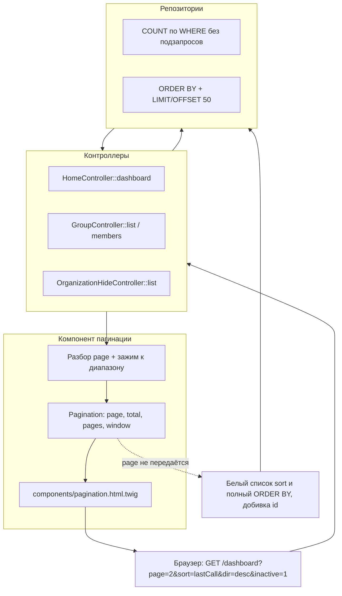
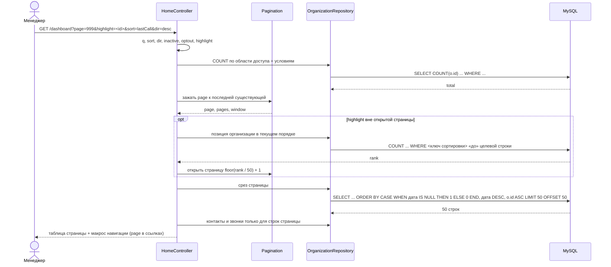

## Context

See proposal.md — Why. Здесь только то текущее состояние, которое определяет
подход.

**Четыре списка, к которым применяется изменение**, и что в них сегодня есть:

| Список | Маршрут | Как грузится | Как сортируется |
| --- | --- | --- | --- |
| Панель организаций | `app_dashboard` | `OrganizationRepository::findForDashboard()` — один DQL с пятью коррелированными подзапросами, вся выборка | `name`/`isActive` в SQL, `lastCall`/`nextCall`/`optedOutAt` — PHP `usort()` в `sortRows()` |
| Список групп | `app_group_list` | `OrganizationGroupRepository::findAllGroups()` / `findForManager()` — вся выборка | PHP `usort()` по `name` / `creator` (email) |
| Состав группы | `app_group_members` | для чтения — `memberships` коллекция, для правки — `findAccessibleOrganizations()` целиком | PHP `usort()` в `GroupController::sortMembers()` |
| Реестр скрытых | `app_organization_hide_list` | `findBy([], ['hiddenAt' => 'DESC'])` — все записи скрытия, группировка по организации в PHP | PHP `usort()` по `name`/`manager`/`createdAt`/`industry`/`hiddenAt` |

**Ограничения, которые нельзя обойти:**

- Пагинации в приложении нет вообще: ни KnpPaginator, ни Pagerfanta в
  `composer.json`, ни макросов, ни SCSS. Всё придётся ввести с нуля, и
  компонент станет первым в своём роде.
- Списки **управляются через GET-параметры**, а не через формы: `q`, `sort`,
  `dir`, `inactive`, `optout`, `highlight`, `filter`. Пагинация должна
  выживать среди них, ничего не теряя и не подменяя.
- URL панели собирается **вручную**: `path('app_dashboard')` + слияние параметров
  в макросах `sort_url()`/`sort_header()` (`templates/home/partials/_organizations_table.html.twig:9-24`),
  причём макрос сортировки продублирован ещё в трёх шаблонах (в группах и
  реестре скрытых — с верхним регистром `ASC`/`DESC`, что несовместимо с
  нижним регистром панели).
- Уникальных ограничений на `organization.name` и на колонки контактов в БД
  **нет** (см. AGENTS.md), одинаковые названия легальны.
- Doctrine ORM 3, MySQL 8. `SQL_CALC_FOUND_ROWS` в MySQL 8 удалён, «строки
  всего» одним запросом не получить.
- `assets/js/dashboard-search.js` — единственный источник автоматического
  submit; Turbo и Stimulus в проекте нет.

**Что должно остаться нетронутым.** `<select>` создания контакта на панели
(`findAccessibleOrganizations()`) и чекбоксы «добавить в группу» — элементы
управления форм, а не таблицы. Их полнота важнее длины списка, и урезание их
до 50 строк сломало бы добавление контакта к далёкой организации. Список групп
тоже остаётся цельным: у компании десятки собственных групп, а не сотни.

## Goals / Non-Goals

**Goals:**

- Страница формируется базой: `LIMIT`/`OFFSET` в DQL, сортировка в том же
  запросе, гидрация только строк текущей страницы.
- Один компонент навигации и один размер страницы (50) на все четыре списка;
  при 50 строках и меньше страница выглядит как раньше.
- Управление URL остаётся на GET-параметрах, и каждый переход сохраняет
  активный поиск, фильтры, сортировку и подсветку организации.
- Порядок строк детерминирован, чтобы страницы не «прыгали».

**Non-Goals:**

- Не добавляем пагинацию в списки, которые не перечислены в proposal:
  кампании, реестр пользователей, адресаты рассылки, лента LLM.
- Не добавляем выбор размера страницы пользователем и не храним его в сессии.
- Не вводим `page` в БД, курсоры и `OFFSET`-навигацию по ключу; страница —
  параметр URL, а не состояние.
- Не переписываем `sort_url()`/`sort_header()` в один общий макрос сортировки —
  это отдельная уборка дублирования, здесь трогаем только сброс `page`.

## Decisions

### 1. Размер страницы — одна константа, 50 строк

Ровно то, что задал пользователь («больше 50 — появляется пагинация»), и одна
константа вместо четырёх. Порог «блок виден только при нескольких страницах»
следует из самого числа: при 50 строках страница одна, блок прячется, и вид
малого списка не меняется.

**Альтернативы:** своё число на список (четыре числа, четыре теста границы,
несогласованный вид); выбор пользователем `?per=` (плюс состояние в сессии,
плюс e2e-риск при фикстурах). Отклонено — список от этого ничего не выигрывает.

### 2. Своя пагинация вместо KnpPaginator / Pagerfanta

Компонент состоит из Twig-макроса `components/pagination.html.twig` и небольшого
DTO (`Pagination`) с готовыми границами: номер страницы, всего строк, всего
страниц, окно номеров.

Причина — формат ссылок. Эти списки живут на GET-параметрах, и рендер
пагинации обязан сохранить `q`, `inactive`, `optout`, `sort`, `dir`,
`highlight` и уметь **не передавать** `page` (это и есть «сброс на первую
страницу»). Шаблоны бандлов рассчитаны на простой `?page=N` и либо потеряют
остальные параметры, либо потребуют кастомизации целиком — то есть работы
больше, чем своя реализация.

**Альтернативы:** KnpPaginator (проверенные слайсы и рендер, но кастомный
query-билдер под DQL-подзапросы + сохранение чужих параметров + собственный
шаблон; фактически та же своя работа плюс зависимость); Pagerfanta (адаптеры под
Doctrine, та же проблема шаблонов).

### 3. Вся сортировка — в DQL; PHP-`usort()` удаляется

Ключевой довод: страницу выбирает база, поэтому порядок должен быть известен
**до** гидрации. Сейчас три из пяти сортировок панели выполняются в PHP, и
`usort()` физически не может упорядочить то, чего ещё нет в памяти. Наивный
`LIMIT` поверх текущего кода отрезал бы произвольные строки, и сортировка по
«Следующий звонок» просто перестала бы существовать.

Пустые значения обязаны оставаться в конце **при любом направлении** (сейчас это
гарантирует `sortRows()`, где `null` всегда последний). В SQL то же выражается
явно: `CASE WHEN <дата> IS NULL THEN 1 ELSE 0 END ASC, <дата> <dir>`.
Равенство `NULL` и `NULL` в MySQL не считается сравнением, поэтому `CASE`
обязателен — одной сортировкой по дате обойтись нельзя.

Триггер переноса ключей на связях: `creator` у групп и составов сравнивает
email/ФИО пользователя, а `manager` и `hiddenAt` в реестре считаются по
**последней** записи скрытия организации (`findBy(['hiddenAt' => 'DESC'])`, в
PHP это `$hides[0]`). Это коррелированные подзапросы в `ORDER BY`; при
равных `hiddenAt` добавляется `id DESC`, иначе «последний скрывающий»
определялся бы произвольно.

**Альтернативы:** PHP-срез после `usort()` (семантика 1:1, но вся выборка
по-прежнему грузится — пагинация не решает задачу, ради которой делается);
две фазы «посчитать + взять ID» (не помогает: даты всё равно сортируются в PHP).

### 4. Последний ключ `ORDER BY` — первичный ключ строки

Одинаковые названия организаций легальны, а страница — это `OFFSET`, то есть
позиция. Без добивки `id` две строки с одинаковым ключом могут попасть на
разные страницы, и перерисовка одного и того же URL покажет разные строки.

**Альтернатива:** добивать только `name` (как сейчас) — детерминизма не даёт.

### 5. Два запроса на страницу: `COUNT` + срез

`COUNT` считает **только** `WHERE` (область доступа + `q` + фильтры) и
намеренно не включает пять коррелированных подзапросов панели: считать даты
звонков для строк, которые не показываются, незачем. Второй запрос — тот же
`WHERE` + `ORDER BY` + `LIMIT 50 OFFSET …`.

**Альтернативы:** `SQL_CALC_FOUND_ROWS` (удалён в MySQL 8); оконные функции
`COUNT(*) OVER ()` в том же запросе (работает, но вычисляет подзапросы для
всей выборки и требует чистки в SQLite-тестах).

### 6. Страница вне диапазона — зажим и канонический URL

`?page=999` открывает последнюю существующую страницу, `?page=abc` и `?page=0` —
первую; в обоих случаях страница в URL приводится к открытой. Пустой
редирект — плохое объяснение: таблица с 137 организациями не должна выглядеть
пустой из-за забытой закладки или удалённых организаций. Канонический URL
нужен ещё и потому, что по нему видно, какая страница открыта, а из `?page=999`
это не следует.

### 7. `highlight` разрешается до страницы, а не игнорируется

Редирект после сохранения организации ведёт на `/dashboard?highlight=<id>`, и при
сортировке по имени Я–А или по датам новая организация часто оказывается не на
первой странице. Чтобы подсветка не исчезала, контроллер считает позицию
организации в текущем порядке (`COUNT` строк, «стоящих перед» целевой по
ключу сортировки) и открывает страницу `floor(rank / 50) + 1`. Позиция считается
в том же `WHERE`, что и список, — иначе подсветка может уехать на страницу, где
организации нет.

Альтернатива «подсветка только на текущей странице» дешевле, но тогда
существующие сценарии создания организации на «дальних» страницах станут
неустойчивыми, а пользователь после сохранения увидит таблицу без следов своей
организации.

### 8. Поиск: кнопка, скрытые `sort`/`dir`, ноль в сбросе страницы

`assets/js/dashboard-search.js` удаляется целиком: автоsubmit на каждый ввод
перезапрашивал тяжёлую выборку, а после пагинации стал бы ещё и сбрасывать
номер страницы на каждой букве. После удаления скрипта `Enter` в поле
отправляет GET-форму нативно — отдельный обработчик не нужен.

Форма получает скрытые `sort` и `dir`: сегодня отправка поиска стирает
выбранную сортировку, хотя обратное — ссылки сортировки сохраняют поиск —
уже нормой требования. Симметрия дешевле, чем объяснять пользователю, что
поиск сбрасывает порядок. Номер страницы в форму **не** переносится: его
отсутствие и означает возврат к первой странице.

### 9. Что не пагинируется

Пагинируются только два списка: панель организаций (`app_dashboard`) и реестр
скрытых организаций (`app_organization_hide_list`). Оба — таблицы данных с
сортировкой по колонкам.

Не пагинируются список групп (`app_group_list`) и состав группы
(`app_group_members`):

- **Список групп** ограничен числом собственных групп компании плюс назначенные
  администратором. Это десятки строк, а не тысячи, и постраничный вывод здесь
  не окупает ни одного своего недостатка.
- **Форма состава** — чекбоксы по всем организациям области доступа. Урезанный
  до 50 строк список сделал бы добавление 137-й организации невозможным, а
  состояние отмеченных чекбоксов пришлось бы переносить между страницами.
  Элементы управления форм не дробятся ни здесь, ни в `<select>` создания
  контакта.

Оба экрана при этом переходят на сортировку в SQL: список групп — целиком по
`ORDER BY`, состав группы — целиком запросом по `org_group_membership` вместо
чтения коллекции `$group->memberships`. Выигрыш здесь не в разбиении на
страницы, а в уходе от PHP-сортировки в памяти.

## Компонентная схема

Границы ответственности: контроллер — разбор `page` и условий, DTO — границы
и окно номеров, макрос — только разметка и ссылки, репозиторий — срез и
счёт. Сортировка не знает о пагинации, пагинация не знает о сортировке; их
связывает только решение «`page` не передаётся в ссылку сортировки».

## Последовательность загрузки страницы панели

## Risks / Trade-offs

- **[DQL не примет `ORDER BY` по алиасу скалярного подзапроса или по `CASE`]**
  → выражение не попадает в спеку: сценарий «Сортировка по дате следующего звонка»
  и «Сортировка по дате отписки» проверяются функциональными тестами на обеих
  БД (SQLite в `.env.test` и MySQL). При неприятии алиаса запасной путь —
  обернуть пару «подзапрос + `CASE`» в подзапрос с явным `ORDER BY` во внешней
  выборке; семантика и требования не меняются.
- **[NULL-сравнение в DQL может дать неожиданный результат]** → прогнать
  функциональный тест: организации без даты отписки идут последними при обоих
  направлениях.
- **[«Последний скрывающий» в реестре определяется не так, как сейчас]** →
  явно зафиксировать в запросе `hiddenAt DESC, id DESC` и покрыть тестом на
  случай двух скрытий одной организации в одну секунду.
- **[Второй запрос на `COUNT` на каждый список]** → `COUNT` делают только панель
  и реестр; это дешёвый `COUNT` по индексированному `organization_id`, новый
  индекс не требуется.
- **[Полный список остаётся в памяти там, где сортируют через коллекцию
  (`$group->memberships->toArray()`)]** → состав группы переводится на запрос
  по `org_group_membership` с `ORDER BY` в SQL. Пагинации здесь нет по
  требованию, но коллекция членств в памяти больше не разбирается: сортировка
  уезжает в базу, а страница перестаёт «работать только на бумаге».
- **[Два естественных порядка в URL панели: `asc`/`desc` и `ASC`/`DESC`]** →
  не смешивать в одной паре макросов; нижний регистр остаётся у панели, верхний
  — у групп и реестра, как сейчас.
- **[Падение точечных e2e-тестов на автоsubmit]** → `dashboard-organizations-search.spec.ts`
  переводится с очистки поля на кнопку «Найти»; это ожидаемое изменение
  ожиданий, а не регрессия.
- **[Покрытие >50 строк в e2e потребовало бы 51 импорта через UI]** →
  постраничный срез проверяется функциональными тестами на данных, созданных
  внутри теста; e2e остаётся на проверке «блока нет при малом списке», «номер
  страницы в URL» и «зажим номера страницы».

## Migration Plan

- Схема БД не меняется, миграция не нужна. Откат = возврат предыдущей версии
  кода; данные не затронуты.
- Порядок выкладки: PHP-код и шаблоны (компонент, контроллеры, репозитории)
  → удаление `dashboard-search.js` и импорта в `assets/app.js` →
  пересборка ассетов `make assets` → e2e-прогон.
- Откат ассетов независим от отката PHP: поиск на старых шаблонах снова станет
  автоsubmit, что не ломает остальной интерфейс.
- Фикстуры перезагружаются перед прогоном e2e (правок фикстур нет, но состав БД
  после прерванного прогона дрейфует).