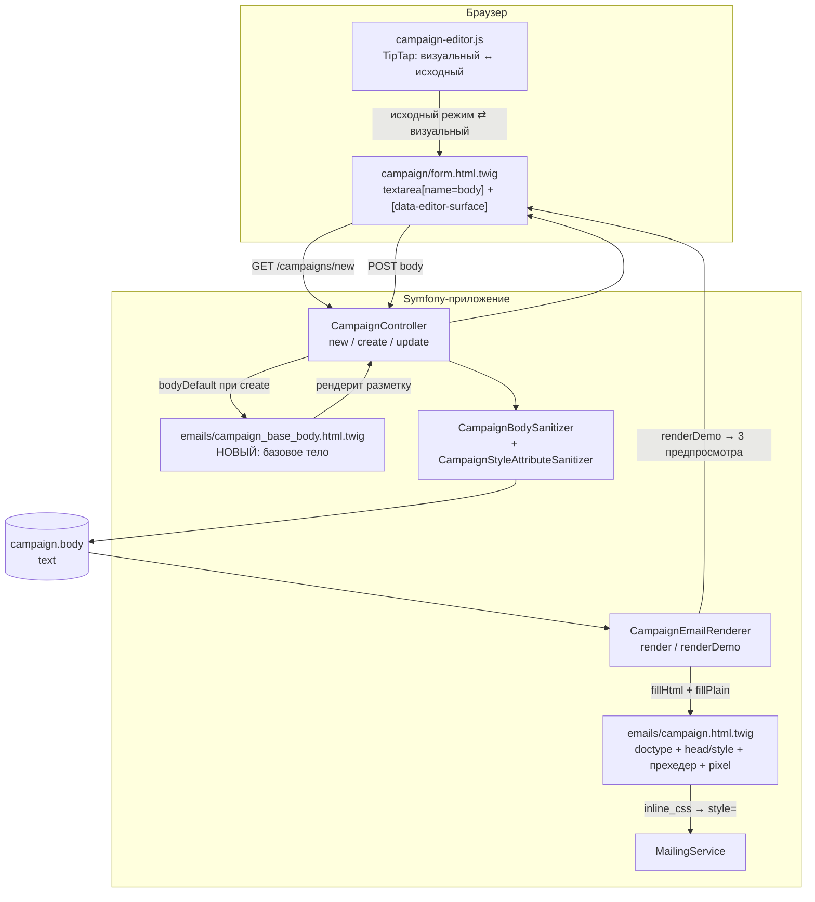

## Context

Текущее состояние (см. proposal.md — Why, истина о поведении — в
`specs/campaigns/spec.md`):

- `templates/emails/campaign.html.twig` — полный email-документ: doctype,
  `<head>` с `<style>`, скрытый прехедер, таблица `email-wrapper` →
  `email-container` (600px) → `td.email-content` (`{{ bodyHtml|raw }}`) и
  `td.email-footer` с подписью, телефонами, ссылкой на каталог, логотипом и
  ссылкой отписки. Файл обёрнут в ``.
- `src/Service/CampaignEmailRenderer.php` — подставляет токены
  (`CampaignTokenFiller`), рендерит этот шаблон, генерирует текстовую часть.
  Используется и отправкой, и всеми тремя предпросмотрами.
- `templates/campaign/form.html.twig:104-109` — `textarea[name="body"]` со
  значением по умолчанию `{{ campaign.body|default('') }}`.
- `assets/js/campaign-editor.js` — TipTap 2, привязан к `[data-editor-surface]`
  и этой textarea, с переключателем визуальный/исходный режим.

Ограничения, которые определили решение:

- `config/packages/html_sanitizer.yaml`: `allowed_link_schemes: [https, mailto,
  tel]`, `allowed_media_schemes: [https]`, allowlist элементов без
  документных (`html`/`head`/`body`/`style`).
- `src/Html/CampaignStyleAttributeSanitizer.php`: allowlist CSS-свойств;
  объявление со значением, содержащим `{{...}}`, отбрасывается.
- `inline_css` инлайнит `<style>` из `<head>` в атрибуты `style` — presentation
  шелла зависит от классов, а не от инлайнов в разметке.
- Тело письма — единственное место, где менеджер может редактировать письмо;
  доступа к шеллу из интерфейса нет.

## Goals / Non-Goals

**Goals:**

- Базовый шаблон письма задаётся по умолчанию и полностью редактируется в форме
  создания рассылки.
- У шелла остаётся ровно то, что менеджеру не нужно редактировать: doctype,
  `<head>` с базовым CSS, прехедер, tracking-pixel.
- Один источник разметки базового тела, из которого берётся и значение формы по
  умолчанию, и то, что менеджерей видит в предпросмотре после сохранения.
- Связка «базовое тело ↔ allowlist санитайзера ↔ CSS шелла» защищена тестом,
  чтобы дефолт не мог молча деградировать при сохранении.

**Non-Goals:**

- Перенос прехедера в тело, новые токены (`{{subject}}`, `{{preview_text}}`,
  `{{tracking_pixel_url}}`).
- Полный HTML-документ в редактируемом поле, read-only рамка вокруг редактора,
  расширение схемы TipTap.
- Миграция данных существующих рассылок и обратная совместимость рендерера для
  тел без футера.
- Кнопка «вставить базовый шаблон» в форме редактирования.

## Component diagram

Mermaid, лёгкий C4-уровень компонентов, существующий код. Предположения: формат
Mermaid и облегчённая строгость выбраны, чтобы не раздувать артефакт;System
Context и Deployment не нарисованы — границы локальны и известны.

Границы и ответственность:

- `BASE` — единственный источник разметки базового тела; читает только форма
  создания, в отправку не попадает.
- `SAN` — единственная точка очистки; базовое тело обязано её пройти без потерь.
- `SHELL` — презентационная оболочка; больше не содержит контента менеджера.
- `EDITOR` не участвует в хранении: он только переключает представление одного и
  того же значения textarea.

## Decisions

### D1. Базовое тело живёт в отдельном Twig-шаблоне

`templates/emails/campaign_base_body.html.twig` содержит разметку тела по
умолчанию и рендерится контроллером только при создании.

- **Почему не константа PHP/сервис:** разметка письма в этом репозитории живёт в
  Twig; PHP-строка означала бы дублирование и потерю Twig-инструментов.
- **Почему не «вырезать футер из шелла»:** в шелле футер обёрнут в условия
  (``) и зависит от данных отправки, поэтому он плохой
  источник значения формы по умолчанию.
- **Почему отдельный файл, а не `{{ campaign is null ? … }}` в Twig:** выбор
  значения — решение контроллера, представление его только отображает.

Инвариант: базовое тело использует те же классы (`email-wrapper`,
`email-container`, `email-content`, `email-footer`), что и сейчас, потому что
`inline_css` разрешает presentation именно по этим классам. Разметка базового
тела — это текущий шелл минус doctype, `<head>`, `<body>`, tracking-pixel.

### D2. Предзаполнение — значение по умолчанию, а не принудительное значение

Контроллер передаёт в форму `bodyDefault`: при создании — отрендеренное базовое
тело, при редактировании и после неудачной валидации — тело из запроса.

- Валидация не меняется: поле по-прежнему обязательно, очистка даёт «Текст письма
  обязателен», а санитизация в пустоту — «Текст письма не содержит допустимого
  содержимого». Менеджер может удалить базовый шаблон целиком.
- **Почему не записывать базовое тело в БД при создании сущности:** тогда
  повторное создание после ошибки валидации подставляло бы дефолт поверх
  ввода пользователя, а клонирование и API-пути получили бы неявный побочный
  эффект.

### D3. `inline_css` и шелл остаются, меняется только содержимое шелла

`CampaignEmailRenderer` сохраняет `render()`/`renderDemo()` и вставку
`{{ bodyHtml|raw }}`; `applyRequest()` и `previewLive()` не меняются. Так как
`<style>` остаётся в `<head>`, инлайновка продолжает работать, а все три
предпросмотра автоматически показывают футер из тела — отдельного кода не
требуется.

Альтернатива: перенести `<style>` в тело. Отклонена — `style`-элемент вне
allowlist санитайзера, тело перестало бы переживать сохранение.

### D4. Ссылки базового тела используют только разрешённые схемы

Санитайзер тела пропускает ровно три схемы ссылок — `https`, `mailto`, `tel` —
и вырезает всё остальное. Этот список остаётся неизменным: расширять его нельзя,
ослабление безопасности писем ради одного устаревшего URL недопустимо.

Следствие для базового тела: все его ссылки обязаны быть `https`, `mailto` или
`tel`. Сегодня футер содержит `http://trainingcenter.by/catalog`, который
санитайзер вырежет, и дефолт потерял бы ссылку при первом сохранении — поэтому
в базовом теле он становится `https://trainingcenter.by/catalog`. Логотип уже на
`https` и выживает. Инвариант проверяется тестом из D5: в базовом теле не должно
остаться ни одной ссылки вне разрешённых схем.

Альтернатива: расширить allowlist до `http`. Отклонена — это ослабление
электронной почты безопасности ради одного устаревшего URL.

### D5. Тест-защита от деградации дефолта

Два теста фиксируют связку, которую иначе легко сломать молча:

1. **Юнит-тест:** отрендеренное базовое тело, пропущенное через
   `CampaignBodySanitizer`, совпадает с исходным и не пусто. Ловит выход нового
   элемента/атрибута/CSS-свойства за пределы allowlist и потерю `https`-ссылки.
2. **e2e:** консолидированный round-trip тест из ADR-0014 дополняется разметкой
   базового тела — `source → visual → source` не теряет раскладку, футер, логотип
   и ссылки. Не дублирует существующий тест, а расширяет его данные.

### D6. Существующие рассылки не мигрируются

По решению владельца продукта. Письма существующих рассылок останутся без футера,
пока менеджер не пересохранит рассылку. Fallback в рендерере («нет футера —
добавь дефолт») намеренно не вводится: он воскрешал бы контент, который
менеджер удалил сознательно, и создал бы два несовпадающих пути рендера.

## Risks / Trade-offs

- **[Дефолт молча деградирует при правках]** разметки базового тела, CSS шелла
  или allowlist → тест-защита из D5; при его падении правка невалидна, а не
  «тест устарел».
- **[Round-trip TipTap нормализует дефолт]** (канонический `tbody`, порядок
  атрибутов, формат цвета) → контракт канонический, а не побайтовый, как и в
  ADR-0014; e2e из D5 фиксирует инвариант.
- **[Правка раскладки ломает карточку 600px]** — это контент менеджера, он видит
  результат в предпросмотре до запуска. Приемлемо.
- **[Откат даёт двойной футер]**, если за время работы новой версии была
  сохранена рассылка с базовым телом: после отката шелл вернёт свой футер, а в
  теле останется футер из дефолта → в плане миграции.
- **[Линтер/пересборка ассетов]** — SCSS/JS этой правкой не меняются, если
  тест-защита не потребует визуальной рамки; сборка `npm run build` выполняется
  только при фактическом изменении ассетов.

## Migration Plan

1. Схема БД не меняется, Doctrine-миграция не требуется.
2. Выкатка: код + пересборка ассетов, если затронуты `assets/`.
3. Откат: revert коммита. **Ограничение:** если за время работы новой версии была
   сохранена рассылка, её тело содержит футер из дефолта, и после отката шелл
   добавит футер сверху. Чистый откат возможен, пока не было сохранений; иначе
   понадобится пересохранение рассылки после отката. Обходной путь для данных
   не предусмотрен намеренно (см. D6).
4. Проверка после выкалки: создать рассылку из формы, не трогая тело, и убедиться,
   что предпросмотр и письмо содержат футер, логотип и рабочую ссылку отписки.

## Open Questions

- Нужен ли базовый шаблон в виде отдельной сущности/настройки, чтобы его мог
  менять администратор без выкатки кода. Это меняет модель данных и границы
  требований, поэтому решается отдельным изменением, а не здесь.
