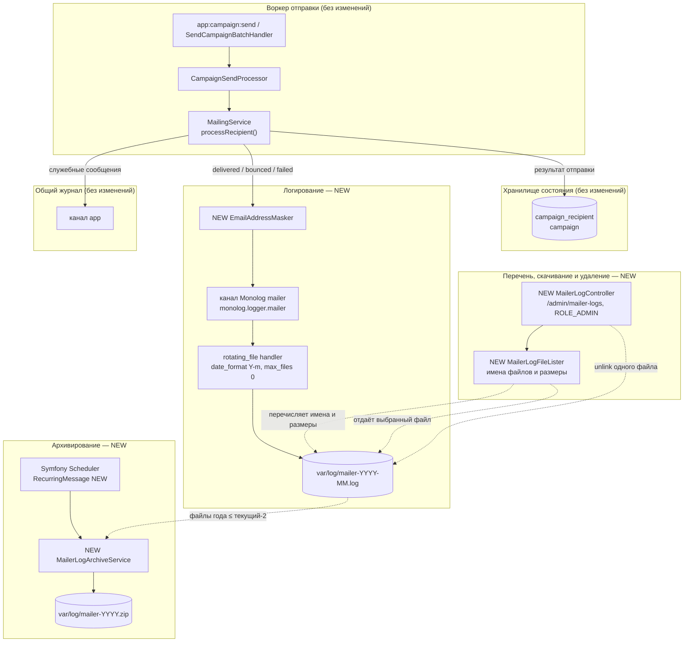

## Context

Текущее состояние (см. proposal.md — Why, истина о поведении — в
`specs/email-send-logs/spec.md`):

- `src/Service/MailingService.php:44` `processRecipient()` — единственный путь
  отправки. Результаты фиксируются в БД и одновременно логируются тремя вызовами:
  `:81-84` (`info`, `delivered`), `:92-96` (`warning`, `bounced`),
  `:107-111` (`warning`, `failed`).
- `LoggerInterface` внедрён в `MailingService:33` и **больше нигде в `src/` не
  используется** — это единственный логгер приложения. Он пишет в дефолтный
  канал `app`.
- `config/packages/monolog.yaml` (47 строк) объявляет единственный канал
  `deprecation`; все четыре обработчика — `type: stream`, без ротации.
  `var/log/dev.log` — 1.17 ГБ, `var/log/test.log` — 506 МБ.
- `CampaignRecipient.retryCount` допускает до трёх повторов с экспоненциальной
  задержкой, поэтому один получатель может дать несколько записей `failed` подряд.
- Молчаливые выходы `processRecipient()`: отписавшаяся организация (`:58-64`) и
  получатель без адреса (`:68-74`) — в журнал не пишутся.
- Конвенция админских разделов: `#[Route('/admin/…')]` +
  `#[IsGranted('ROLE_ADMIN')]` над `AbstractController`; пункт меню — литеральный
  `<a class="header-admin__item">` в `templates/components/header.html.twig:46-49`.
- `src/Schedule.php:29` уже регистрирует `RecurringMessage::every('1 minute',
  new SendCampaignBatch())`; развёртывание — либо systemd
  `messenger:consume scheduler_default`, либо crontab `* * * * *` (README 107-135).
- `Dockerfile` ставит `ext-zip` (`libzip-dev` :16, пакет `zip` :28) и проверяет
  его загрузку при сборке (`:45`); часовой пояс процесса — `Europe/Minsk`
  (`Dockerfile:8,23,35`).
- Админский блок «⚙ Админ ▾» уже продублирован в боковой панели мобильной версии
  (`templates/components/header.html.twig:104-115`, change
  `add-admin-menu-to-mobile-sidebar`); оба списка содержат одинаковые пункты и
  проверяются тестами точным счётчиком (`HeaderTest.php:31,60`,
  `e2e/tests/design-mobile.spec.ts:37`).
- Шаблоны админских страниц лежат плоско по домену, без каталога `admin/`:
  `templates/user/`, `templates/organization_hide/`,
  `templates/organization_import/` при маршрутах под `/admin/…`.
- `composer.json` **не объявляет** `ext-zip` в `require`.
- Пагинации в приложении нет ни на одной странице; единственная консольная
  команда — `app:campaign:send`.

Ограничения, которые определили решение:

- Решение change `mailing-service` «Отдельная таблица записей отправки не
  создаётся» должно остаться в силе: журнал — наблюдательный артефакт, а не
  источник истины о доставке.
- Адреса получателей — персональные данные; открытый журнал на 12+ месяцев не
  приемлем.
- Просмотр журнала — операторский инструмент, а не отчётность: администратор
  открывает страницу, чтобы прочитать, что уходило и с каким результатом.
- `phpstan` уровень 8, `infection` `minMsi: 70` — новая логика обязана быть
  покрыта тестами.

## Goals / Non-Goals

**Goals:**

- Отделить записи об отправке писем от общего журнала так, чтобы их можно было
  отфильтровать по каналу без разбора текста.
- Зафиксировать для каждой фактической отправки адресата, организацию, рассылку и
  результат, не сохраняя локальных частей адресов.
- Хранить журнал по одому файлу на календарный месяц и архивировать его по годам
  без ручного действия.
- Дать администратору страницу-перечень файлов журнала, где у каждого файла
  виден размер, есть кнопка скачивания и кнопка удаления с подтверждением;
  исключение — файл текущего месяца, который удалить нельзя (D17).
- Сохранить текущую модель доставки (ADR-0010) без изменений.

**Non-Goals:**

- Таблица записей отправки, история попыток в БД, снимок отправленного письма
  (тема, тело, вложения).
- Логирование отписок, получателей без адреса, статуса `opened` и служебных
  сообщений системы.
- Отображение содержимого журнала в интерфейсе, разбор строк, фильтры,
  сортировки по содержимому, группировки, пагинация, поиск.
- Разбор или интерпретация строк журнала, экспорт в других форматах.
- Замена или донастройка общего журнала приложения: `var/log/dev.log` продолжает
  расти без ротации, это отдельная задача.
- Отправка каких-либо уведомлений о сбоях отправки (уже есть, ADR-0010).

## Component diagram

Mermaid, лёгкий C4-уровень компонентов, существующий код. Предположения: формат
Mermaid и облегчённая строгость выбраны, чтобы не раздувать артефакт; System
Context и Deployment не нарисованы — границы локальны и известны. Новые
элементы помечены `NEW`.



Ключевое: БД остаётся источником истины о статусе, а журнал — производным
наблюдательным артефактом. Путь записи идёт в обход БД (маскирование → канал →
файл), а веб-часть не читает содержимое файлов вовсе: она перечисляет имена и
отдаёт выбранный файл.

## Decisions

### D1. Отдельный канал через штатный `monolog.logger.mailer`, без своего обработчика

Канал `mailer` объявляется в `monolog.yaml`; MonologBundle сам создаёт сервис
`monolog.logger.mailer`, который автовайрится в `MailingService` как именованный
аргумент `$mailerLogger` типа `LoggerInterface`. Собственный обработчик не
нужен: месячная ротация — штатная возможность Monolog.

**Отклонено:** отдельный `MailingLogger` поверх PSR-3 — лишняя прослойка, её
единственная задача сводится к выбору канала, который MonologBundle и так
умеет. Ещё отклонено — писать в канал `app` с префиксом сообщения: фильтрация
осталась бы текстовой, то есть исходная проблема не решается.

### D2. Сообщение фиксировано по результату, все переменные значения — в контексте

Три вызова логирования получают фиксированные сообщения
(`Campaign send delivered` / `Campaign send bounced` / `Campaign send failed`),
а переменные значения уходят в структурный контекст записи: `campaign_id`,
`campaign_name`, `organization_id`, `organization_name`, `recipient`,
`cc` (список), `result`, а для `failed` — `error`. `LineFormatter` дописывает
контекст в конец строки.

Результат: `mailer.INFO: Campaign send delivered {"campaign_id":22,…} {"recipient":"c***@example.ru"}`.

**Почему так, а не одной склейкой.** Страница ничего не разбирает, поэтому формат
строки — не контракт. Но фиксированное сообщение всё равно полезно: оператор
получает `grep`-абельный текст, а вложенные значения не могут «разъехаться»
внутри сообщения. Это дешёвая страховка, не контракт.

**Отклонено:** JSON-строки (`json`-форматтер). Читалось бы надёжнее, но ломает
`tail`/`grep` для оператора в проде; пользователь сознательно выбрал
человекочитаемый формат.

### D2a. Запись журнала пишется до коммита в БД, а не после

Текущий порядок в `MailingService.php` таков: сначала вызов логгера (`:81`,
`:92`, `:107`), затем `markDelivered()`/`markBounced()`/`markFailed()` и
`em->flush()` (`:86-87`, `:98-99`, `:113-114`). Он и сохраняется — переносить
запись после `flush()` было бы изменением существующего поведения, а не
следствием этого change.

Следствие фиксируется явно, потому что формулировка требования «по одной записи
на каждую завершившуюся фактическую отправку» может быть прочитана как «после
подтверждения в БД». Фактически журнал фиксирует **исход SMTP-обмена**, а не
успешность записи в БД: если `flush()` упадёт, в файле останется `delivered`, а
в `campaign_recipient` — старое состояние. Расхождение разрешается правилом D13 —
правым считается БД, журнал остаётся наблюдательным, — и тем, что страница не
показывает содержимого и потому не может делать выводов о согласованности.

### D3. Адреса маскируются до записи; локальная часть — до первого символа

Маскирование выполняется **до** передачи в логгер, поэтому необработанный адрес
не может попасть в строку даже по ошибке.

Операций здесь две, и они не сводятся одна к другой:

- **Маскирование адреса.** `EmailAddressMasker` оставляет первый символ локальной
  части, добавляет `***` и сохраняет домен: `client@example.ru` → `c***@example.ru`.
  Применяется к `TO` и к каждому адресу в `CC`. Пустая или некорректная локальная
  часть не даёт утечки: маскируется всё, что до `@`; адрес без `@` пишется как
  есть только если не содержит символов адреса — на практике таких адресов в
  `CampaignRecipient` не бывает, а ветка закрыта тестом.
- **Очистка произвольного текста.** Тот же класс умеет заменять адреса внутри
  произвольной строки. Это отдельная операция, потому что её вход — не адрес, а
  текст.

**Почему вторая операция нужна.** Текст ошибки SMTP, который попадает в контекст
под ключом `error`, — это дословный ответ MTA-сервера, который Symfony оборачивает
в исключение без переформулирования
(`SmtpTransport::assertResponseCode()`, `SmtpTransport.php:345`). Реальные серверы
подставляют в этот ответ исходного получателя:

```
550 5.1.1 <client@example.ru>: Recipient address rejected: User unknown
550-5.1.1 The email account that you tried to reach
 550 5.1.1 <client@example.ru> does not exist
```

Поэтому адрес появляется в записи в угловых скобках, в многострочном ответе и в
разных местах строки, и требование «незамаскированных адресов в журнале нет» на
нём сразу нарушается — причём на самом частом пути, где отправка реально
не удалась. Маскирование `$toEmail` и `$cc` этого не покрывает: оно выполняется
для адресов, а не для текста ошибки.

Так как ответ может быть многострочным, очистка выполняется по всей строке, а не
по первой найденной позиции. Форматирование записи остаётся построчным:
`LineFormatter` прогоняет контекст через `convertToString` и `replaceNewlines`
(`LineFormatter.php:200`), поэтому переводы строк попадают в файл как `\n`.

**Границы применимости.** Маскирование адресов — не очистка свободного текста.
Наименования организации и рассылки не затрагиваются, даже если в них встречается
нечто похожее на адрес: это данные, которые оператор читает дословно, и требование
«незамаскированных адресов в журнале нет» к ним не относится. Единственное
свободное значение, которое очищается, — текст ошибки SMTP, потому что там адрес
появляется сам, без участия пользователя.

**Проверяемость.** Перечислить места, где может встретиться адрес, нельзя, —
значит, требование проверяется как свойство: на наборе реальных ответов MTA
утверждается, что локальная часть адреса получателя не встречается **нигде** в
собранной записи, а не только в поле `error`. Это строже, чем перечисление полей:
адрес получателя не может прийти ни из одного пользовательского значения, поэтому
единственный путь утечки — текст ошибки, и свойство ловит именно его.

**Отклонено:** маскировать и домен (`c***@ex***.ru`) — теряется возможность
сгруппировать записи по провайдеру; полностью необратимый хеш — запись
становится нечитаемой для человека, ради которого журнал и делается. Отклонено
также писать в журнал только код SMTP без текста: оператор теряет различие
«пользователя не существует» и «почтовый ящик переполнен», ради которого журнал
и нужен.

### D4. Файлы по месяцам: `rotating_file`, `date_format: 'Y-m'`, `max_files: 0`

```yaml
parameters:
    mailer.log_dir: '%kernel.logs_dir%'

monolog:
    channels: [deprecation, mailer]
when@prod:
    monolog:
        handlers:
            mailer:
                type: rotating_file
                path: '%mailer.log_dir%/mailer.log'
                filename_format: 'mailer-{date}.log'
                date_format: 'Y-m'
                max_files: 0
                level: info
                channels: [mailer]
```

`RotatingFileHandler::FILE_PER_MONTH = 'Y-m'` — штатная константа, ротация
приходится на первое число месяца. `max_files: 0` отключает удаление: файлами
владеет архиватор, и иначе обработчик удалил бы их раньше, чем они были
сжаты.

Каталог журнала задаётся единственным параметром `mailer.log_dir`, и его
значение используют все трое: обработчик (`path`), архиватор (D5) и перечень
файлов (D8). Параметр, а не `%kernel.logs_dir%` напрямую, потому что каталог
журнала задаётся из окружения (`MAILER_LOG_DIR`), а `%kernel.logs_dir%` —
вычисляемый контейнером путь, и развести их в разных окружениях нельзя.

Расхождение между обработчиком и перечнем при этом возможно и конструктивное:
параметры разрешаются на этапе сборки контейнера, поэтому
`setParameter('mailer.log_dir', …)` в функциональном тесте доходит до архиватора
и перечня, читающих параметр при создании, и **не** доходит до уже собранного
обработчика Monolog. Проверять это в тестах не нужно: тест канала `mailer`
опирается на отдельное имя файла в `test` (ниже и в D14), а функциональные тесты
страницы подменяют каталог перечню.

В `test` обработчик канала пишет `%mailer.log_dir%/test-mailer-YYYY-MM.log` — с
префиксом `test-`, по образцу основного обработчика, который пишет
`%kernel.environment%.log`. Отдельное имя нужно, чтобы отправка в тестовом
прогоне не попадала в настоящий месячный файл журнала, и оно же позволяет
проверить обработчик без подмены параметра (D14).

Имена файлов каналов не пересекаются: обработчик `main` пишет
`%kernel.environment%.log`, обработчик `mailer` — `mailer-*.log`. О разделении
*каналов*, а не только имён файлов, — D4a.

### D4a. Разделение каналов — по окружениям

Обработчик `main` объявлен с исключающим списком каналов
(`channels: ["!event"]`), и MonologBundle разворачивает его как «все каналы, кроме
перечисленных»: `LoggerChannelPass::processChannels()` возвращает
`array_diff($createdLoggers, …)`, где `$createdLoggers` содержит **все**
объявленные каналы (`LoggerChannelPass.php:108-119`). Канал `mailer` в этот
список попадает, поэтому без явного исключения записи отправки оказались бы в
обоих файлах — в `mailer-YYYY-MM.log` и в общем журнале приложения.

Исключение добавляется не везде, а по окружениям:

| Окружение | Каналы обработчика `main` | Следствие |
| --- | --- | --- |
| `prod` | `["!event", "!deprecation", "!mailer"]` | результаты отправки живут только в `mailer-*.log`; `prod.log` ими не растёт |
| `dev` | `["!event"]` | `dev.log` сохраняет копию — локальная отладка отправки не зависит от скачивания файла |
| `test` | `["!event", "!mailer"]` | в тестовом прогоне запись отправки попадает ровно в один файл — `test-mailer-YYYY-MM.log` — и проверки содержимого не смешиваются с общим журналом |

Копия в `dev` осознанна. Она не требует отдельного решения по маскированию:
маскирование выполняется до передачи в логгер (D3), а расщепление по каналам —
внутри Monolog, поэтому обе копии содержат **одну и ту же уже замаскированную
запись**. Побочный следствие, принятый: в `dev.log` адреса тоже замаскированы,
и восстановить полный адрес при локальной отладке можно из БД или из Mailpit,
но не из лога.

**Отклонено:** исключить `mailer` везде без разбора — тогда `dev.log` вообще
перестаёт содержать результаты отправки, и локальная отладка письма требует
скачивания файла, что несоразмерно. Отклонено и оставить везде — тогда
продовый общий журнал, который и без того не ротируется, растёт с частотой
отправки.


### D5. Жизненным циклом файлов владеет архиватор, критерий — год ≤ текущий − 2

`MailerLogArchiveService` сканирует `%mailer.log_dir%` по шаблону
`mailer-YYYY-MM.log`, группирует файлы по году и для каждого года не новее
«текущий минус два» дописывает их в `mailer-YYYY.zip` существующим архивом
(дозапись, а не пересоздание — уже сжатые данные не теряются) и удаляет
исходные `.log`. Годы не меняются при повторном запуске.

Ключевая асимметрия: архивирование **не удаляет** то, что не удалось сжать.
Сначала закрытие архива, проверка `true` на `close()`, и только потом `unlink`
исходных файлов. Сбой на середине оставляет `.log` на месте, и следующий
запуск повторяет попытку.

Идемпотентность проверяется **по содержимому архива, а не по файлу**. Сценарий
«повторный запуск» требует, чтобы уже архивированные данные не изменились, но
архиватор дописывает в существующий zip, поэтому байты и время изменения файла
меняются законно. Утверждать надо множество записей **внутри** архива: после
второго запуска оно совпадает с первым, а не создаёт дублей и не теряет
записей.

**Отклонено:** `max_files: 24` на штатном обработчике. Умеет только удалять,
требование «сжать по годам» не выполняет, а файлы нужны администратору для
просмотра, а не только для экономии места.

### D6. Архивирование — ежедневное идемпотентное сообщение планировщика

`src/Schedule.php` регистрирует рядом с существующим `SendCampaignBatch`:

```php
RecurringMessage::cron('5 0 * * *', new ArchiveMailerLogs())
```

Ежедневно в 00:05, а не строго раз в год. Строгий годовой триггер («1 января»)
пропускает весь год молча, если процесс в эту минуту не работал; ежедневный
запуск с идемпотентной операцией самовосстанавливается — в первый же день после
простоя нужный год архивируется.

Развёртывание уже предполагает `messenger:consume scheduler_default` (systemd)
либо crontab; второе придётся дополнить вызовом архиватора, и это отмечено в
`tasks.md`.

**Отклонено:** годовой `cron('0 0 1 1 *')` — те же потерянные окна без
компенсации. Отклонено и `max_files` с удалением по возрасту — не сжимает.

### D7. `ZipArchive`; `ext-zip` объявляется зависимостью

Расширение уже ставится и проверяется при сборке образа
(`Dockerfile:19,26,41`), но в `composer.json` не объявлено. Архиватор обязан
зависеть от него явно, иначе сборка на окружении без `zip` упадёт уже в рантайме.
`composer.json` получает `"ext-zip": "*"`.

### D8. Страница — перечень файлов, содержимое не отображается

`MailerLogController` (`#[Route('/admin/mailer-logs')]`,
`#[IsGranted('ROLE_ADMIN')]`) показывает плоский список: каждая существующая
позиция `mailer-YYYY-MM.log` и каждый существующий `mailer-YYYY.zip` — строка с
периодом и кнопкой скачивания, новые сверху.

Порядок определён явно, потому что месяцы и годы смешаны в одной плоской
таблице: архив года занимает **последнее** место среди позиций своего года, то
есть идёт после всех месяцев этого года. Сортировка по началу года поместила бы
`mailer-2026.zip` между `2026-12` и `2026-11`, и год читался бы как две
независимые группы. Год, в котором есть и архив, и несжатые месяцы (сбой
архиватора посередине года), показывается двумя позициями — обе существуют, и
ни одну из них нельзя скрыть.

Приложение **не читает содержимое файлов журнала**. `MailerLogFileLister`
работает только с именами и признаками файла: сопоставляет их с шаблоном,
вытаскивает период, считывает размер, сортирует по убыванию. Содержимое покидает
систему единственным способом — скачиванием, и дальше его разбирают вне
приложения.

**Размер файла выводится.** Решение пересмотрено по прямому запросу: ранее
признаки файла не выводились вовсе. Теперь у каждой позиции указан размер — это
ответ на вопрос «сколько занимает файл», он помогает администратору выбрать, что
качать, и не требует разбора содержимого. Размер берётся у файла при построении
перечня и не пересчитывается при отрисовке; форматирование человекочитаемое,
пустой файл показывается как `0 Б`.

**Дата изменения не выводится, и это следует из имени файла.** Период уже
закодирован в имени: `mailer-2026-03.log` называет и год, и месяц. Дата изменения
добавила бы второе, производное указание на тот же период, причём другое — «когда
файл последний раз писали», а не «какой период он содержит», — и оператор,
сравнивающий её с именем, получал бы два несовпадающих ответа на один вопрос.
Поэтому дата не выводится: имя файла её уже отражает.

Каталог может отсутствовать (например, `MAILER_LOG_DIR` задан неверно или том не
примонтирован): перечень трактует это как «файлов нет» и отдаёт пустой список
с соответствующим сообщением, а не 500. Поэтому страница не падает из-за
конфигурации окружения — это операторский инструмент, и его поломка должна быть
видна как «нет файлов», а не как стек-трейс.

**Отклонено:** вкладки месяцев с показом содержимого. Как только файл уходит
из приложения, вкладки теряют смысл: переключать нечего, а переход «выбрал
месяц → увидел строки» исчезает вместе с требованием разбирать строки.
Единственное, что давал показ, — экономия одного клика оператора, которая не
стоит ни разбора журнала, ни предела размера страницы. Отклонена и группировка
перечня по годам: см. `## Open Questions` — она не меняет ни спецификации, ни
подхода, и вводится позже, если позиций станет много.

### D9. Период из маршрута валидируется, имя файла выводится, файл отдаётся как текст

Маршрут скачивания принимает период — `month` вида `YYYY-MM` или `year` вида
`YYYY`. Каждый вариант проверяется регулярным выражением, после чего имя файла
**составляется** как `mailer-<период>.log` или `mailer-<год>.zip` внутри
`%mailer.log_dir%`, и существование файла проверяется до отдачи. Любое
несовпадение — 404. Путь из параметра запроса не используется нигде, поэтому
обход каталога невозможен по построению, а не по фильтрации.

Ответ отдаётся как вложение с `Content-Type: text/plain` и
`X-Content-Type-Options: nosniff`. Это обязательная часть решения, а не
гигиена: строки журнала содержат произвольный текст — наименования рассылок и
организаций, сообщения SMTP-сервера, — который контролирует пользователь или
внешняя система. Отдав такой файл без явного типа, рискуем отдать его
браузеру как разметку.

Тип ответа одинаков для обоих видов файлов, включая бинарный архив года: при
`Content-Disposition: attachment` браузер сохраняет байты как есть, а единый тип
избавляет от развилки «`text/plain` для `.log`, `application/zip` для `.zip`»,
не добавляя ничего, кроме единообразия. Тип `application/octet-stream` для архива
рассматривался и отклонён: `text/plain` с `nosniff` уже исключает трактовку
файла как разметки, а расхождение типов потребовало бы отдельного решения при
каждом новом виде файла.

### D10. Ограничения на размер страницы не возникает

Содержимое не рендерится, поэтому лимит строк, усечение и пагинация не нужны:
страница растёт от числа файлов (единицы на два года), а не от числа записей в
 них. Ограничение объёма файла — задача файловой системы и `logrotate` на
уровне хоста, а не этого приложения.

### D10a. Ссылка добавляется в оба списка админского блока

Пункт «Журнал отправки писем» добавляется в выпадающий список «⚙ Админ ▾»
**в верхней строке и в боковой панели мобильной версии** — только для
`ROLE_ADMIN`.

Ранее предполагалось, что пункт надо дублировать «ссылкой в боковой панели»,
и что он станет первой админской записью там. Обе предпосылки устарели: change
`add-admin-menu-to-mobile-sidebar` (архивирован 2026-10-02) уже перенёс в панель
весь блок «⚙ Админ ▾» целиком, а требование «Шапка и подвал» в
`openspec/specs/web-interface/spec.md` теперь предписывает, чтобы панель
повторяла правую часть верхней строки и раскрывала списки в потоке. Поэтому
дублировать ничего не нужно: пункт добавляется в оба списка, и спецификация
описывает это как один и тот же список в двух местах.

Практическое следствие для тестов: оба списка содержат точный набор пунктов, а
`HeaderTest.php` и `e2e/tests/design-mobile.spec.ts` проверяют их количество
точным числом, поэтому увеличение набора пунктов меняет эти утверждения — они
перечислены в `tasks.md` явно.

### D11. Служебные сообщения `MailingService` остаются на канале `app`

Четыре вызова (нет вложения, нет администраторов, администратор без e-mail,
ошибка уведомления администратору) продолжают писаться в дефолтный канал.
`LoggerInterface` в `MailingService` сохраняется, добавляется второй логгер
`$mailerLogger`. Так журнал отправки означает ровно одно: что ушло получателю
рассылки.

### D12. Временная метка — часовой пояс процесса

Метку ставит Monolog в момент записи, то есть в часовом поясе процесса
(`Europe/Minsk` в образе, `Dockerfile:16`). Приложение содержимое файлов не
читает, поэтому пересчёта часового пояса не происходит нигде: в записи журнала
нет метки в часовом поясе читателя, и интерфейс не может её показать. Следствие
зафиксировано осознанно — это цена решения D8.

### D13. Таблицы записей не появляется

Решение change `mailing-service` остаётся в силе. Журнал — производный
наблюдательный слой: при его потере статус письма по-прежнему известен из
`CampaignRecipient`, при расхождении журнала с БД правым считается БД. Следствие,
которое стоит проговорить: восстановить «что именно было отправлено» по журналу
нельзя — адреса замаскированы, тема и тело не пишутся.

### D14. Тесты: канал проверяется через `TestHandler`, страница — на настоящих файлах

- `MailingServiceTest` перестаёт использовать `NullLogger`: логгер канала
  `mailer` заменяется на `TestHandler`, и тесты проверяют маску адреса, состав
  контекста и все три результата, включая последовательность `failed` → `delivered`
  при повторе.
- Проверка отсутствия утечки адреса — **свойством, а не примером**: набор
  реальных ответов MTA (Postfix 550 в угловых скобках, многострочный ответ
  Postfix, Exim 550, Gmail 550, 421, таймаут, отказ соединения, ошибка
  аутентификации 535) и утверждение, что локальная часть адреса не встречается
  **нигде** в собранной записи. Перечисление полей, в которых адрес не должен
  встретиться, проверяло бы только известные места и пропустило бы текст ошибки,
  поэтому такой тест здесь и был нужен.
- Функциональные тесты страницы создают настоящие `mailer-YYYY-MM.log` и
  `mailer-YYYY.zip` во временном каталоге, а `getLogDir()` подменяет
  `%mailer.log_dir%`. Проверяется то, что видит администратор: перечень
  позиций, порядок, архив года после месяцев того же года, скачивание месяца и
  архива, 404 на несуществующий и невалидный период, 403 для менеджера.
- Отдельно проверяется, что страница не содержит ни одной строки записей
  журнала: это защита от возврата к показу содержимого.
- Проверяется, что скачиваемый ответ несёт `text/plain` и `nosniff` — по D9
  это часть контракта, а не деталь реализации.
- В `when@test` для канала `mailer` нужен собственный обработчик. Причина
  уточнена: после D4a канал `mailer` исключён из `main`, поэтому в `test` у него
  не остаётся ни одного обработчика, и запись ушла бы в никуда. Обработчик
  пишет в `%mailer.log_dir%/test-mailer-YYYY-MM.log` — с префиксом `test-`, в
  отличие от `%kernel.environment%.log` основного обработчика. Отдельное имя
  даёт проверку без подмены параметра: вызов в канал `mailer` обязан создать
  `test-mailer-YYYY-MM.log` и **не** должен создавать `mailer-YYYY-MM.log`.
- Перечень файлов и архиватор сопоставляют имена **привязанным** регулярным
  выражением, а не маской `mailer-*.log`: с появлением `test-mailer-*.log` в том
  же каталоге маска захватила бы и тестовые файлы — перечень показал бы
  несуществующий период, а архиватор унёс бы их в архив года. Тест на
  «посторонние файлы» получает реальный объект: `test-mailer-YYYY-MM.log` в
  каталоге перечисляться и архивироваться не должен.
- Удаление файла журнала проверяется отдельно для обоих видов: подтверждение до
  удаления, отсутствие удалённого файла в перечне, сохранение остальных файлов
  (в том числе месяцев года при удалении архива), 404 на несуществующий и
  невалидный период, 404 на период текущего месяца — и на странице подтверждения,
  и на POST, — 403 для менеджера, недействительный CSRF-токен, отсутствие кнопки
  удаления у позиции текущего месяца и запись об удалении в канале `app`
  (D16, D17, D18).

### D15. Запись фиксирует исход попытки и не содержит сведений о повторе

Запись с результатом `failed` содержит текст ошибки SMTP — и всё. Признака того,
будет ли получатель обработан повторно, в записи нет: ни отдельного поля, ни
вывода из текста ошибки.

**Почему прогноз повтора в журнал не пишется.** Вариант с признаком
рассматривался и отклонён по трём причинам, и третья оказалась решающей.

- *Прогноз ненадёжен.* `isTransientError()` (`MailingService.php:289-300`) отвечает
  на вопрос «похожа ли ошибка на временную», но фактический повтор зависит ещё и
  от состояния получателя: `CampaignRecipientRepository.php:64` подбирает
  получателя только при `retryCount < 3 AND retryAt IS NOT NULL`, а
  `markFailed()` на третьей временной ошибке обнуляет `retryAt`
  (`CampaignRecipient.php:125-126`). Запись с признаком «повтор» появилась бы
  ровно тогда, когда повтора уже нет.
- *Второе мнение о повторяемости опасно.* Чтобы признак был точным, его пришлось бы
  считать по `isTransientError() && retryCount < 3`, то есть дублировать в
  журнале правила повторной обработки. Любое их расхождение даст в файле
  утверждение, которое не соответствует БД.
- *Повтор — не свойство попытки, а свойство получателя.* Он живёт в
  `campaign_recipient.retryCount`/`retryAt`, и правым источником о нём остаётся
  БД (D13). Журнал отвечает на вопрос «что произошло при этой отправке», а не
  «что будет дальше»; состояние получателя журнал не дублирует.

Оператору, разбирающему «письмо не пришло», остаётся ровно то, ради чего журнал
заводится: результат попытки и текст ошибки SMTP, по которому различаются
«пользователя не существует», «почтовый ящик переполнен» и таймаут. Число
израсходованных попыток по-прежнему доступно в `campaign_recipient.retryCount`.

**Следствие для требования:** запись SHALL NOT содержать сведений о повторной
обработке — это закреплено и в тексте требования, и отдельным сценарием, чтобы
признак не вернулся «на всякий случай» позже.

**Отклонено:** четвёртое значение результата (`failed_permanent` и подобные) —
размывание перечисления результатов ради одного бита; писать `retryCount` —
счётчик принадлежит получателю, а не попытке, и `markDelivered()` его сбрасывает
(`CampaignRecipient.php:153`).
### D16. Удаление файла — та же схема, что у остальных удалений приложения

`GET` отображает подтверждение, `POST` с `_csrf_token` удаляет файл и возвращает
на перечень с сообщением. Это не изобретение: `app_user_delete`/`app_user_remove`,
`app_campaign_delete`/`app_campaign_remove` и остальные разбивают удаление на две
пары маршрутов именно так, а `base.html.twig:28` уже рендерит `addFlash`. Своя
схема «кнопка плюс модалка» разошлась бы с приложением и не дала бы места для
текста подтверждения.

Поскольку удаляться могут два вида файлов (D17), маршрутов две пары, а не одна с
разбором периода на месте:

```
GET|POST  /admin/mailer-logs/month/{month}/delete   requirements: month => \d{4}-\d{2}
GET|POST  /admin/mailer-logs/year/{year}/delete     requirements: year  => \d{4}
```

Две пары вместо одной `{period}` с `\d{4}(-\d{2})?` — потому что регулярное
выражение должно проверяться **до** того, как из периода составляется имя файла
(D18), а составление из двух разнородных видов периода в одном маршруте заставило
бы разбирать строку вручную там, где проверка решает задачу построением.

Кнопка присутствует **у каждой позиции, кроме файла текущего календарного
месяца**. У года — «Удалить архив <год>», у прошедшего месяца — «Удалить файл
<месяц>», у текущего месяца кнопки нет (обоснование — D17). Текст подтверждения
различается по виду файла: для архива он прямо сообщает, что удаляется
`mailer-<год>.zip` и что файлы `mailer-<год>-*.log` останутся на месте; для
месяца — что удаляется `mailer-<год>-месяц>.log` и что остальные файлы
сохраняются.

**Отклонено:** `GET`-удаление одним маршрутом — необратимая операция не должна
зависеть от того, открыли ли ссылку. Отклонено и удаление с подтверждением в
JavaScript: подтверждение перестало бы работать без JS, а `confirm()` в
`assets/js/organization-modal.js:68` — единственное обращение в приложении, то
есть исключение, а не правило.

### D17. Удаляется ровно один файл — тот, чей период указан; год целиком не удаляется

Год — общий период у архива и у месяцев этого года, поэтому «удалить 2026»
формально неоднозначно. Удаляется **ровно один** файл, названный в запросе:

| Позиция | Удаляемый файл | Остальное |
| --- | --- | --- |
| месяц `2026-03` | `mailer-2026-03.log` | архив года и другие месяцы не тронуты |
| год `2026` | `mailer-2026.zip` | файлы месяцев года сохраняются и остаются в перечне |
| месяц текущий | **ничего: отказ** | файл остаётся, в перечне сохраняется |

Год целиком не удаляется никогда — ни одной командой, ни одним маршрутом. При
удалении месяца года, у которого уже есть архив, сам архив сохраняет в себе
записи этого месяца, потому что они были в него добавлены при архивировании;
удаление месяца не вычищает содержимое архива.

**Файл текущего месяца не удаляется.** Причина техническая и неочевидная, поэтому
фиксируется явно. Обработчик Monolog открывает файл один раз
(`StreamHandler.php:158`) и пишет в уже открытый дескриптор, не проверяя
существование файла (`:135`). Если удалить `mailer-<текущий месяц>.log`, то до
ротации следующего месяца все записи журнала уйдут в удалённый inode: в перечне
файла не будет, место на диске расходуется, а сами записи не видны нигде — то
есть оператор удалил данные тихо и без следа.

Защита двухслойная, потому что скрытая кнопка не является защитой:

1. перечень не показывает элемент удаления у позиции текущего месяца;
2. маршруты удаления месяца отклоняют период текущего месяца, даже если запрос
   сформирован вручную.

Признак «текущий месяц» определяется сравнением периода из маршрута с текущим
календарным месяцем, а не наличием открытого дескриптора: признак детерминирован,
не зависит от того, пишет ли в файл кто-то в данный момент, и одинаков для
веб-воркера и консоли. Проверка касается только файла текущего месяца — файлы
прошедших месяцев того же года закрыты ротацией и удаляются свободно.

Отказ возвращает 404 — тот же код, что и для несуществующего периода. Формально
файл существует, но позиции с таким периодом в перечне удаляемых нет, поэтому
404 выражает «такой удаляемой позиции нет» и не вводит второго кода ошибки в
единственный словарь этой страницы.

Альтернативы рассматривались: разрешить удаление и принять потерю записей до
ротации (тихая потеря данных — отклонено); заставить обработчик переоткрывать файл
после удаления (нужен рычаг, которого у Monolog нет, и это дороже всей задачи —
отклонено); запретить удаление всего текущего года (задевает архив года, который
закрыт и безопасен, — отклонено как избыточное).

Следствие, зафиксированное осознанно: удаление не гарантирует, что архив года не
появится снова. Если в году остались несжатые месяцы, следующий запуск
архиватора (D6) соберёт новый `mailer-YYYY.zip` из них — удаление снимает
конкретный файл, а не запрещает год. Отдельный запрет потребовал бы механизма
пометок, которого в приложении нет и который дороже самой задачи. Оператор,
удаляющий старый архив, увидит результат на следующей открытой странице.

Взаимодействие с архиватором (D5) одностороннее: архиватор читает только файлы
месяцев, поэтому удалённый месяц просто не попадёт в следующий архив, а удалённый
архив будет пересобран из уцелевших месяцев.

Неоднозначность снимается формулировками, а не отказом: кнопка называется «Удалить
архив <год>» либо «Удалить файл <месяц>», а страница подтверждения называет
удаляемый файл явно.

**Отклонено:** удаление архива вместе со всеми месяцами года — соответствует
интуиции, но задевает несжатые данные, которых архиватор не касался, и при
ошибочном годе снесло бы файл текущего года. Отклонено и удаление года целиком
одним действием по той же причине, что и в исходной формулировке решения.

### D18. Период из маршрута валидируется, имя файла выводится, само удаление фиксируется в `app`

Вид периода задаётся маршрутом: месяц проверяется как `^\d{4}-\d{2}$` и даёт
`mailer-<период>.log`, год проверяется как `^\d{4}$` и даёт `mailer-<год>.zip`.
Проверка идёт **до** составления имени, существование файла проверяется до
`unlink()`. Для месяца дополнительно проверяется, что период не совпадает с текущим
календарным месяцем (D17); нарушение даёт тот же 404, что и отсутствие файла, и
проверяется до любых действий с диском. Путь из запроса не используется, поэтому
удалить что-либо, кроме файла журнала отправки выбранного вида, невозможно по
построению — ровно как при скачивании (D9) и по той же причине: год из маршрута
свободен, а `mailer-2026-03.log` разбирается как `mailer-` + год + `-03` + `.log`.
Обратное тоже верно: месяц из маршрута свободен, и `2026-03` не может быть собран
как год.

Само удаление пишется в дефолтный канал `app` (`LoggerInterface` в контроллере)
с указанием вида файла, периода, имени файла, идентификатора и логина
удавшего. Журнал отправки отвечает на вопрос «что уходило» и по определению не
может ответить на вопрос «кто и когда стёр файл», поэтому запись об удалении —
единственный след этого действия во всей системе. По симметрии она принадлежит
общему журналу, а не журналу отправки: служебная запись в `mailer-*.log`
нарушила бы требование «в журнале только результаты фактической отправки» (D11).

## Risks / Trade-offs

- **[В интерфейсе нельзя ничего узнать о содержимом]** страница отвечает на
  вопрос «какие файлы есть», но не «что в них» → это осознанная цена простоты по
  D8; оператор скачивает файл и разбирает его вне приложения, любой будущий
  поиск по журналу будет отдельной задачей, а не доработкой этой страницы.
- **[Скачивание отдаёт пользовательский текст как файл]** строки содержат
  наименования рассылок и организаций и сообщения SMTP-сервера, то есть текст,
  контролируемый пользователем или внешней системой → по D9 ответ отдаётся с
  `text/plain` и `nosniff`, и это проверяется тестом, а не оставлено на
  умолчание фреймворка.
- **[Формат строки не контракт]** ни приложение, ни страница его не разбирают, и
  это осознанно, но смена форматтера или переход на `json` изменят то, что
  получит оператор, без изменения спецификации → фиксированные сообщения и
  структурный контекст из D2 сохраняют файл пригодным для чтения человеком и
  для `grep`.
- **[`delivered` не доказывает доставку]** это «передано на SMTP без ответа 5xx»,
  ровно модель ADR-0010 → формулировки на странице и в файле не обещают больше;
  риск чисто редакционный, закрывается формулировками.
- **[Строк в журнале больше, чем получателей]** повторы дают несколько `failed`
  на одного получателя, поэтому счётчик строк не равен числу писем → в D14
  закреплён тест на последовательность `failed` → `delivered`, а интерфейс не
  показывает счётчиков вовсе.
- **[`max_files: 0` переносит ответственность на планировщик]** если
  `messenger:consume scheduler_default` не запущен, файлы старых лет копятся
  несжатыми → заметно по диску, работу не ломает; в D6 выбран ежедневный
  идемпотентный запуск именно ради самовосстановления после простоя.
- **[Плановое развёртывание по crontab не запускает планировщик]** а значит и
  архиватор → архивирование не произойдёт никогда, и это не заметно; в
  Migration Plan и tasks.md добавлен явный ежедневный вызов команды.
- **[Время в записи — время процесса]** `Europe/Minsk` из `Dockerfile:16`, а
  приложение время нигде не переводит → сравнение с логами веб-воркера в другом
  поясе разойдётся на часы; в D12 это зафиксировано как следствие D8.
- **[Маскирование необратимо для локальной части]** восстановить адрес из журнала
  нельзя, даже имея скачанный файл → для расследования конкретного адреса
  по-прежнему нужен доступ к БД; журнал остаётся инструментом «что и с каким
  результатом», а не «кому именно».
- **[Маскирование действует и на текст ошибки SMTP]** оператор видит
  `550 5.1.1 <c***@example.ru>: Recipient address rejected` вместо полного
  адреса → это цена требования «незамаскированных адресов в журнале нет»
  (D3): оставить текст как есть значило бы положить в файл, который
  скачивается и покидает приложение, полный адрес получателя рядом с его маской.
  Восстановить адрес при этом можно из `campaign_recipient`.
- **[В `dev.log` остаётся копия результатов отправки]** по D4a канал `mailer` в
  `dev` не исключён из `main`, и каждая отправка пишется в общий журнал, который
  не ротируется → локальная разработка получает полную картину, но
  `var/log/dev.log` растёт с частотой отправки. Это осознанный размен: в `prod`
  и `test` канал исключён, и на диск, который никто не чистит, копия не
  попадает.
- **[Правило сопоставления имён стало привязанным]** появление
  `test-mailer-*.log` в том же каталоге означает, что маска `mailer-*.log` больше
  не годится ни перечню, ни архиватору: тестовые файлы попали бы в перечень как
  период и в архив года → сопоставление переносится на привязанные регулярные
  выражения (D14), а «посторонний файл» в тестах становится `test-mailer-*.log`.
- **[Удалённый архив может появиться снова]** если в году остались несжатые
  месяцы, ежедневная задача D6 соберёт новый `mailer-YYYY.zip` из них → оператор
  удалил архив, а через сутки он снова в перечне; в D17 это зафиксировано как
  ожидаемое поведение, но на первом столкновении выглядит как ошибка.
- **[Удаление файла месяца необратимо и не имеет корзины]** таблицы записей
  отправки в БД нет (D13), поэтому удалённый `mailer-YYYY-MM.log` нечем
  восстановить: в журнале нет ни темы, ни тела письма, а адреса замаскированы →
  единственная защита — подтверждение и роль администратора.
- **[Файл текущего месяца удалить нельзя — и это ограничение, а не недоработка]**
  `StreamHandler` открывает файл один раз (`StreamHandler.php:158`) и пишет в
  открытый дескриптор (`:135`), поэтому удаление текущего месяца отправило бы
  записи до ротации в удалённый inode: файла нет, место расходуется, записи
  не видны → по D17 элемент удаления у этой позиции не показывается, а оба
  маршрута удаления месяца отклоняют период текущего месяца с 404. Побочный
  эффект: освободить место в текущем месяце нельзя, и это приходится ждать
  ротации; зато потеря записей исключена по построению.
- **[Запись предшествует коммиту в БД]** по D2a лог пишется до `flush()`, поэтому
  при сбое записи в БД в файле останется `delivered`, а в
  `campaign_recipient` — старое состояние → правым считается БД (D13), а страница
  не показывает содержимого и потому не может делать выводов о согласованности.
- **[В записи нет сведений о повторе]** оператор по журналу не узнает, будет ли
  получатель обработан ещё раз → по D15 это сознательно: прогноз повтора
  принципиально ненадёжен (на третьей временной ошибке он был бы ложным), а сам
  факт повтора и число израсходованных попыток остаются в
  `campaign_recipient.retryCount`/`retryAt`, где им и место.
- **[Запись в журнале не отвечает на вопрос «повторят ли»]** оператор разбирает
  «письмо не пришло» по результату и тексту ошибки, но число уже израсходованных
  попыток и сам факт повтора в журнале нет → по D15 это сознательно: факт повтора
  и счётчик остаются в `campaign_recipient.retryCount`/`retryAt`, а дублирование
  правил повторной обработки в файле дало бы второе мнение о них.
- **[Удаление файла — необратимая операция без корзины]** файла после удаления
  нет нигде, а распечатанный ранее перечень перестанет соответствовать
  содержимому каталога → защита только подтверждением и ролью; автоматического
  восстановления нет, и оно не предусмотрено. Для файла месяца потеря тяжелее,
  чем для архива: месячные файлы суть данные периода, а архив — производная
  копия, но таблицы записей отправки в БД нет ни для того, ни для другого.
- **[Адреса в `dev.log` замаскированы]** локальная отладка отправки больше не
  показывает полный адрес получателя в общем журнале → адрес восстанавливается
  из БД или из Mailpit; обмен «удобство отладки против персональных данных на
  диске» решён в пользу маскирования, и это тот же предлёт, по которому в
  журнале отправки адреса замаскированы.
- **[Журнал может разойтись с БД]** файл переживает откат и правки данных →
  правым считается БД, это зафиксировано в D13; страница подаёт журнал как
  наблюдательный, а не как источник истины.
- **[Новая страница повторяет админский блок в боковой панели]** пункт меню
  добавляется в оба списка, поэтому боковая панель по-прежнему содержит все
  админские пункты, а не один → это соответствует текущему поведению
  (`add-admin-menu-to-mobile-sidebar`), а не расходится с ним; цена — оба
  списка содержат точное число пунктов, и их проверяют тесты с точными
  счётчиками (`HeaderTest.php:31,60`, `e2e/tests/design-mobile.spec.ts:37`),
  которые меняются при каждом добавлении пункта.
- **[Линтер/пересборка ассетов]** SCSS меняется, поэтому `npm run build`
  обязателен; JS не менялся.

## Migration Plan

1. Объявить канал `mailer`, добавить обработчик, добавить параметр
   `mailer.log_dir` и исключить канал из обработчика `main` в `prod` и `test`
   (D4a); добавить `ext-zip` в `composer.json`. Существующие файлы журнала не
   трогаются — новый канал пишет в новые файлы.
2. Перевести три вызова результатов в `MailingService` на `$mailerLogger` с
   маскированием адресов, включая очистку адресов в тексте ошибки SMTP (D3) и
   признак повторной обработки в записи `failed` (D15). Поведение отправки и
   записи в БД не меняется.
3. Архивирование по годам (архиватор, сообщение, регистрация в `Schedule.php`;
   при развёртывании по crontab — ежедневный вызов команды).
4. Добавить перечень файлов с размером каждого файла, маршруты скачивания,
   шаблон, стили и пункт в обоих списках «⚙ Админ ▾»; затем удаление файла
   журнала за месяц или за год (D16–D18).
5. Отдельно (вне change) — ротация общего журнала приложения: `var/log/dev.log`
   продолжает расти без ограничений, и это не входит в объём.

Откат: удаление обработчика канала, вызовов `$mailerLogger` и страницы. Данные в
БД не затронуты ни в одном из шагов; оставшиеся файлы журнала безвредны. Удаление
архива на откате не восстанавливается — как и любое удалённое на диске, что и
составляет его необратимость (D17).

## Open Questions

- Достаточно ли плоского списка, или по мере роста числа файлов понадобится
  группировка по годам — решить, когда период перестанет помещаться в экран.
  Пока это не решено, порядок позиций определён явно (D8), чтобы изменение
  списка не оказалось незамеченным.

Вопросы, закрытые решениями, и потому в списке выше их нет: предел строк на
отрисованном месяце снят вместе с показом содержимого (D8); вывод размера файла
решён выводить, даты изменения не выводить — период уже закодирован в имени
файла (D8); тип ответа оставлен единым `text/plain` с `nosniff` и для `.log`, и
для `.zip` (D9); отдельная ссылка в мобильной боковой панели не нужна, потому
что панель повторяет админский блок целиком (D10a); сведения о повторной
обработке в записи не пишутся (D15); файл текущего месяца не удаляется (D17);
срок хранения файлов решён ручным удалением администратором, и автоматическая
политика хранения в объём не входит.
