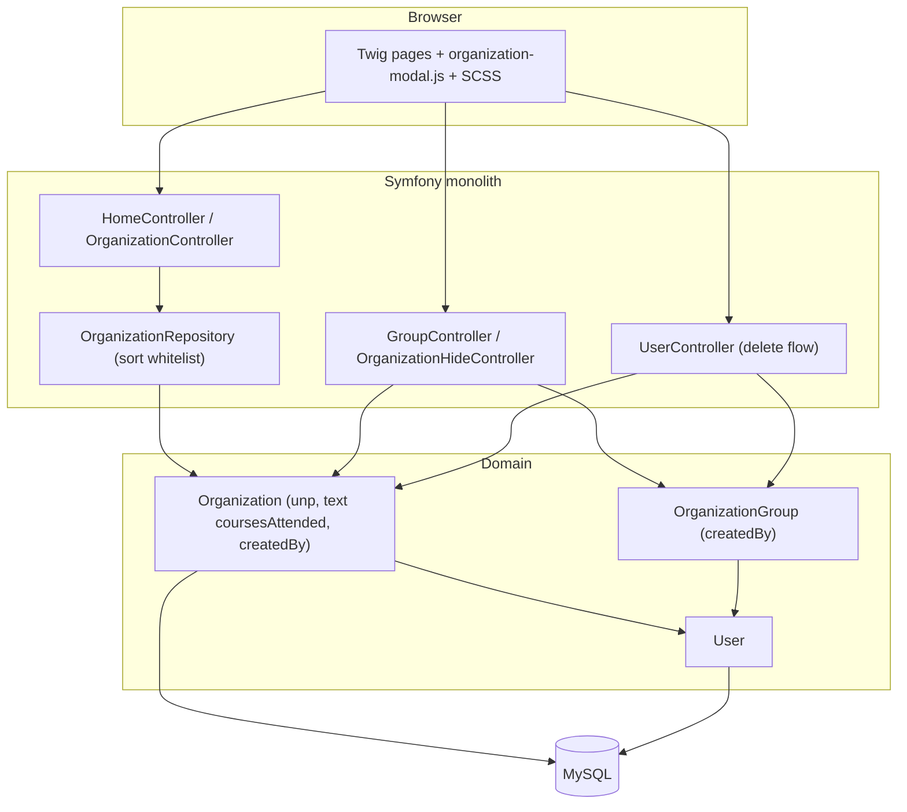

## Context

Motivation and scope: see `proposal.md` (Why / What Changes). Behavior contract: deltas under `specs/`.

Current implementation touchpoints (as of this change):

- `Organization` entity: `hasUsedServices` is `bool` (column `has_used_services`); no `unp`; no `createdBy`; `createdAt`/`updatedAt` at end of field list (`src/Entity/Organization.php`).
- Pattern for creator FK already exists on `OrganizationGroup.createdBy` (`ManyToOne` User, `onDelete: SET NULL`) and migration style in `Version20260906000000.php` / column reorder via `AFTER` in `Version20260919100000.php`.
- Dashboard table + `org_details`: `templates/home/partials/_organizations_table.html.twig` (industry column + sort header; details box order: add-call → calls → add-contact → contacts); row datasets feed `assets/js/organization-modal.js`.
- Hide registry: `organization_hide/list.html.twig` (sort name/manager only). Group members: `group/members.html.twig` (plain `<th>`, no sort); sort pattern: `group/list.html.twig` `sort_header` + `GroupController::list` PHP `usort`.
- User delete fate: `UserController::delete`/`remove` + radios `group_action_<id>` in `templates/user/delete.html.twig`.
- No `table-layout`/`colgroup` rules yet in SCSS.

Constraints: Symfony 7 / Doctrine ORM 3 / MySQL; access model ADR-0006–0008, 0011 unchanged (no new ACL tiers); OpenSpec is source of truth.

### Architecture sketch (lightweight C4 — Mermaid)

*Assumptions (explicit):* purpose = design for an existing monolith change; format = plain Mermaid `flowchart`; rigor = lightweight C4-inspired (container + key components only), not a full multi-level C4 set.



- **Browser** only reorders/extends markup and datasets; no new client framework.
- **Controllers** own sort parameters and user-delete choices; repository keeps SQL sort whitelist for the panel.
- **Domain** gains `Organization.unp`, free-text `coursesAttended`, `createdBy` (mirror of group creator).
- **MySQL** schema altered in-place; no production row backfill for boolean→text or `created_by`.

## Goals / Non-Goals

**Goals:**

- Schema + entity + form/modal support for optional УНП, free-text «Учились у нас» (`coursesAttended`), `Organization.createdBy`.
- Creator set at create time from the authenticated user; field order `created_by` → `created_at` → `updated_at`.
- Dashboard: drop industry column/sort; `org_details` block order + buttons at bottom; shared column-width convention.
- Hide registry and group composition: new columns; composition sortable (default name ASC).
- User delete: per-org choice parallel to per-group choice (reassign creator to admin / clear creator).

**Non-Goals:**

- Production data migration/backfill for `coursesAttended` or `created_by` (fixtures only; DB may be altered freely).
- CSV-import change (`add-organizations-csv-import`) alignment — out of scope by decision.
- New ACL tiers or changes to group M2M ownership (ADR-0011).
- Deleting organizations when a manager is deleted.
- Exact static pixel widths as product copy — computed in CSS from content (design chooses mechanism, not final px table).

## Decisions

### D1. Free-text `coursesAttended` — column rename and type change

**Decision:** Rename column `has_used_services` to `courses_attended` and change type from `TINYINT(1)` to `VARCHAR(255)` (nullable), entity property `?string $coursesAttended`, setter `?string`. Form/modal: text input replacing checkbox; row dataset `data-org-coursesattended` stores the raw string (not `'1'/'0'`). No nulling of legacy boolean values — MySQL will coerce `0`→`'0'`, `1`→`'1'`; legacy text will be visible in UI until manually edited.

**Why:** Cleaner semantic naming (`courses_attended` matches the field purpose); type change from bool to string matches free-text use case; no data cleanup needed — legacy values are harmless strings.

**Alternatives:** Keep column name `has_used_services` (rejected — confusing name for free text); `TEXT` (overkill for course list snippets); keep boolean + separate field (rejected — user asked type change).

**Migration:** `ALTER TABLE organization CHANGE COLUMN has_used_services courses_attended VARCHAR(255) DEFAULT NULL`. Existing `0`/`1` coerce to `'0'`/`'1'` — acceptable because prod data cleanup is out of scope.

### D2. `Organization.createdBy` model

**Decision:** Copy `OrganizationGroup` pattern:

```php
#[ORM\ManyToOne(targetEntity: User::class)]
#[ORM\JoinColumn(name: 'created_by', referencedColumnName: 'id', nullable: true, onDelete: 'SET NULL')]
public private(set) ?User $createdBy = null;
```

Place property after business fields, immediately before `createdAt`/`updatedAt`. Set only in create path (`OrganizationController::create` / form handler) from `$this->getUser()`; never rewritten on update.

**Why:** Precedent, FK safety (`SET NULL` if user row vanishes), matches group semantics without inverse collection on `User` (not needed).

**Alternatives:** Denormalized `created_by` int without FK (weaker integrity); set on every save (wrong — freezes creator); ` OrganizationHide.manager`-style required FK (too strict for legacy rows).

### D3. Schema migration shape

**Decision:** One migration version, raw SQL in existing style:

1. `CHANGE COLUMN has_used_services courses_attended VARCHAR(255) DEFAULT NULL` (rename + type change; legacy `0`/`1` coerce to `'0'`/`'1'`).
2. `ADD unp VARCHAR(32) DEFAULT NULL` (length TBD in impl: 9–11 digits typical; use 32 for safety).
3. `ADD created_by BIGINT DEFAULT NULL` + FK `ON DELETE SET NULL`.
4. Reorder: `MODIFY created_at ... AFTER created_by`, `MODIFY updated_at ... AFTER created_at` (pattern: `Version20260919100000`).

`down()`: drop FK/columns, restore `has_used_services TINYINT(1) DEFAULT 0 NOT NULL` (lossy — documented).

### D4. Dashboard `org_details` — DOM order and metadata row grouping

**Decision:** Reorder Twig blocks inside `.org-details__box` to: description → metadata row (industry + UNP + courses attended grouped together) → last-call → all-calls list → contacts grid → action links (`Добавить звонок`, `Добавить контакт`). The metadata row groups industry, UNP, and courses attended as a single visual block (e.g., a `<div class="org-details__meta">` with inline or stacked layout). Keep existing CSS hooks/classes for other blocks; move buttons markup to end of box. Colspan on details row: update from hardcoded `6` to remaining column count after industry removal (5 data columns + edit? — use dynamic `colspan` or match header count).

Remove industry `<th>`/`<td>` and industry `sort_header` entry. Keep `industry` in repository SQL whitelist optional; **remove from template only** is enough for spec (headers not offered). Prefer also removing `industry` from `SQL_SORT_COLUMNS` only if no other consumer — search still uses industry separately.

Row datasets: set `data-org-description`, `data-org-industry`, `data-org-unp`, `data-org-coursesattended` as **text** for modal prefill; drop boolean `'1'/'0'` encoding for coursesAttended.

**Why:** Spec requires observable order; CSS `order` on table cells is fragile. Reusing existing classes avoids SCSS rewrite beyond widths. Grouping metadata fields reduces vertical space and creates a clean information hierarchy.

**Alternatives:** Grid/flex overlay for details (larger redesign — non-goal); JS reorder after load (unnecessary); separate rows per metadata field (more vertical space).

### D5. Column widths mechanism

**Decision:** For the three org tables, use `table-layout: fixed` **or** explicit `colgroup`/`th` widths in SCSS:

- Name column: `width: 100%` / `max-content` strategy — implement as first column taking remaining space (`width: auto` with others fixed, or `table-layout: fixed` + name col percentage ~40–50% + `min-width`).
- Remaining columns: fixed `px` (or `ch`) from content type: dates `7.5rem`, checkbox `3rem`, industry `8rem`, creator `10rem`, actions `4rem` — tune in CSS, not in specs.
- Apply shared classes under `.table--org` (new) used by dashboard, hide list, group members; zebra/hover rules stay in `table.scss`.

**Why:** Spec asks for fixed max name + static others; CSS-only avoids JS resize observers.

**Alternatives:** JS auto-width (rejected — complexity); pure `auto` layout (rejected — dynamic data reflows).

### D6. Group composition sorting

**Decision:** Follow `GroupController::list` / hide-list pattern: query `sort` + `dir`; default `name`/`ASC`; PHP `usort` match on `name|industry|createdAt|creator` (creator via `createdBy` name/email like group list `creator`). Wire `sort_header` macro into both readonly and edit table headers (non-sortable: checkbox column).

**Why:** No join needed for most keys; consistent with existing controllers; composition lists are small.

**Alternatives:** SQL `ORDER BY` via repository (fine later if volume grows); keep unsortable (violates spec).

### D7. Hide registry columns

**Decision:** Add static (or sortable — **not required by spec**) columns «Дата создания» (`org.createdAt|date`) and «Отрасль» (`org.industry|default('—')`) after existing name column; keep «Создатель» as **hide-record manager** (unchanged meaning — do not rename to org creator). Width rules via D5.

**Why:** Spec only requires columns present; existing «Создатель» label already means hide actor — avoid ambiguity by leaving it.

### D8. User-delete org fate — auto-reassign to admin

**Decision:** Organizations created by the deleted manager are automatically reassigned to the current administrator (`created_by = admin`) without per-org choice. The deletion confirmation page displays an informational note with the count of organizations that will be reassigned. No per-org radios are shown. Groups retain the existing per-group choice (delete or reassign to admin).

- GET: load orgs `created_by = user` (count + list for display in note).
- Template: informational note — "Organizations created by this user (N): [list] will be reassigned to you."
- POST: `UPDATE organization SET created_by = <current_admin_id> WHERE created_by = <deleted_user_id>`. No choice validation needed for orgs. Missing group choice → same style error as before.
- Admin self-delete: skip org note section (parity with groups rule).

**Why:** Simpler UX — no per-org radios to fill; reassign-to-admin is the only safe default (never delete orgs); matches spec requirement that orgs are not deleted.

**Alternatives:** Per-org radios (rejected — over-complex for the common case); clear `created_by` to null (rejected — loses creator info); single global radio for all orgs (rejected — auto-reassign is always correct).

### D9. Quick-edit + full form

**Decision:**

- Form: replace coursesAttended checkbox with text input labeled «Учились у нас»; add optional «УНП» input (after name or industry — place **after «Сфера деятельности», before «Годовой план»** for tax-ID proximity to identity fields; exact order minor).
- Modal: same field types; include `unp` in `data-organization-field` text-field loop; JSON payload includes `unp` and string `coursesAttended`.
- Controller `applyRequest`: `(string)` bind for coursesAttended; optional unp trim/empty→null; create path sets createdBy.

### D10. Diagram placement

Lightweight Mermaid container/component sketch lives in Context (above). No deployment diagram — single monolith unchanged.

## Risks / Trade-offs

- **MySQL boolean→varchar coerces `0`→`'0'`, `1`→`'1'` visible in UI** → no cleanup planned; legacy values accepted as-is; users can edit to free text when needed.
- **Hardcoded e2e column indices / sortable count (6)** break when industry column removed → update `dashboard-organizations.spec.ts` (nth-child, `toHaveCount(6)` → 5); no coursesAttended checkbox e2e exists.
- **`colspan="6"` on details row** wrong after column removal → set from header count or correct constant.
- **Large manager with many created orgs** makes delete page heavy → show count + scrollable list; defer pagination (open).
- **CSV-import change still parses boolean** for «Учились у нас» → known conflict; also affected by column rename (`has_used_services` → `courses_attended`); do not edit that change here; track as follow-up.
- **`organization-modal.js` boolean coercion** (`payload.coursesAttended ? '1':'0'`) silently corrupts free text if missed → task must switch to string dataset (D4/D9).
- **Functional tests** asserting bool create/toggle (`OrganizationControllerTest`) need rewrite to string; column rename requires updating all `has_used_services` references.
- **Field order in Doctrine** is metadata cosmetics unless reflection order matters to forms — forms control UI order explicitly.

## Migration Plan

1. Apply DB migration: `CHANGE COLUMN has_used_services courses_attended VARCHAR(255) DEFAULT NULL`; add `unp VARCHAR(32) DEFAULT NULL`; add `created_by BIGINT DEFAULT NULL` + FK `ON DELETE SET NULL`; reorder `created_at`/`updated_at` after `created_by`.
2. Deploy entity/DTO/controller/templates/JS/SCSS together (single release — schema first in same deploy window).
3. Load fixtures (no prod backfill).
4. Smoke: create/edit org with УНП + text courses; panel expand order; hide/group tables; delete manager with created orgs (verify auto-reassign + note).
5. **Rollback:** reverse migration restores `TINYINT(1) DEFAULT 0 NOT NULL` column `has_used_services` (data loss for free text accepted); redeploy previous app version. No dual-write phase needed (dev/test environments primary).

## Open Questions

None that change specs, approach, or task breakdown. Deferred (safe later):

- Exact `unp` max length / validation regex (9 digits) — can tighten validation without changing capability specs.
- Final static px width table per column — CSS iteration only.
- Whether hide-registry new columns become sortable (spec does not require it).
- CSV-import change (`add-organizations-csv-import`) field mapping for `courses_attended` — out of scope; known follow-up after column rename.
