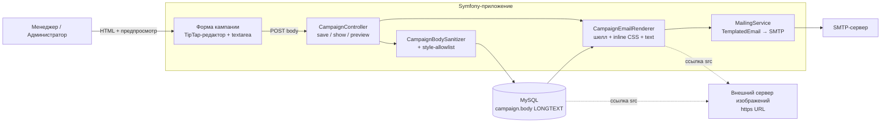
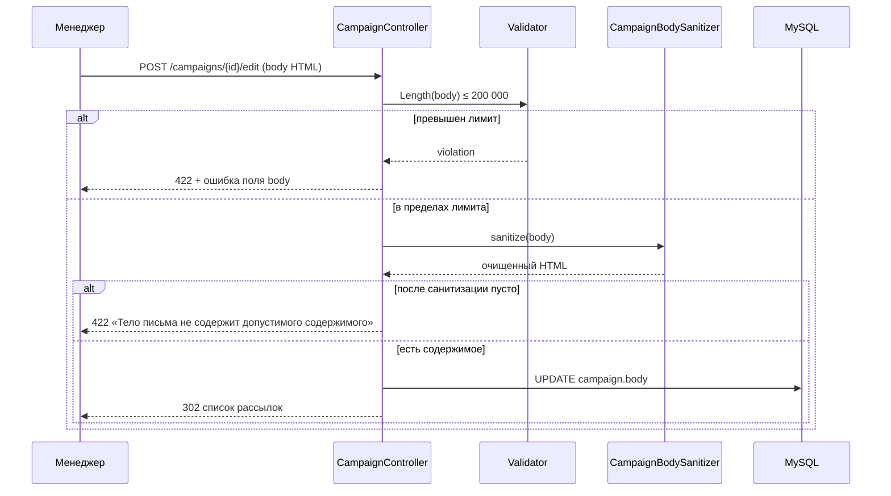
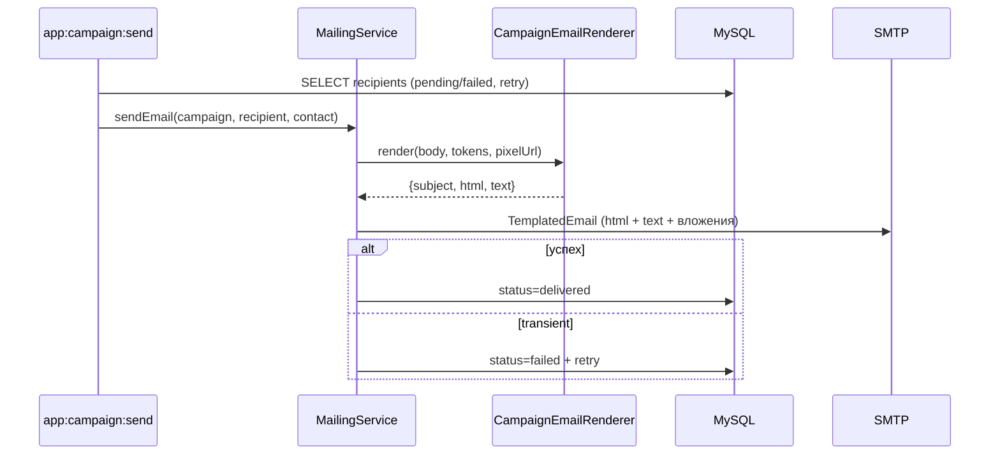
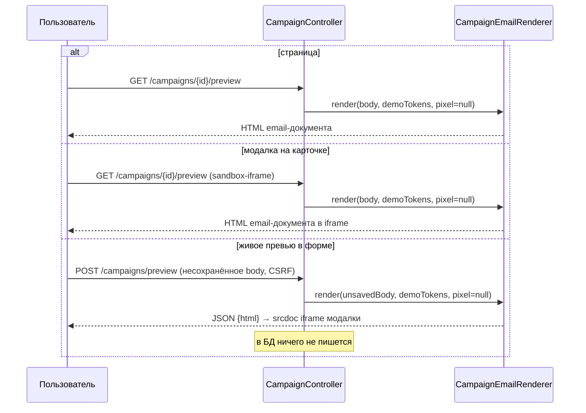

## Context

См. `proposal.md` — Why. Текущее состояние, важное для подхода:

- `templates/campaign/form.html.twig` — plain `<textarea name="body">`; `CampaignController::applyRequest()` (`src/Controller/CampaignController.php:708`) сохраняет тело как есть.
- `Campaign::fillTokens()` (`src/Entity/Campaign.php:210`) — `str_replace` без экранирования; используется для темы, прехедера и тела.
- `MailingService::sendEmail()` (`src/Service/MailingService.php:212`) собирает голый `Email` из фрагментов: скрытый прехедер + тело + tracking-pixel; без doctype, шелла, инлайн-стилей и текстовой части.
- `templates/campaign/show.html.twig:78` рендерит тело в `<pre>`.
- Кампании видны всем аутентифицированным пользователям (`CampaignController::campaign()`, комментарий на строках 746–750) — отдельных правил области доступа у карточки нет.
- Ограничения: Symfony 7.4 / PHP 8.5, Webpack Encore с единственным entry `app`, лицензия проекта proprietary, изображения хранятся вне системы, колонка `campaign.body` — `LONGTEXT` (миграция `Version20260826120000`).
- e2e Playwright: 5 спек заполняют `textarea[name="body"]`.

## Goals / Non-Goals

**Goals:**

- Визуальное редактирование HTML-тела письма + режим исходного HTML с сохранением разметки при переключении.
- Обязательная санитизация тела при сохранении с allowlist элементов, атрибутов и CSS-свойств.
- Единый рендерер письма (`CampaignEmailRenderer`): полный HTML-документ с шеллом 600px, инлайн CSS, прехедер, футер, текстовая часть — используется и отправкой, и предпросмотрами.
- Три предпросмотра (страница, модалка, живое превью в форме) с фиксированными демо-значениями токенов.
- HTML-безопасная подстановка токенов.

**Non-Goals:**

- Загрузка, хранение и раздача изображений; CID-встраивание.
- Табличный UI (вставка/удаление строк и столбцов) в редакторе.
- Выбор реального получателя в предпросмотре.
- Миграция существующих plain-text тел.
- Изменение модели адресатов, статусов и логики outbox (ADR-0010).

## Decisions

### D1. Редактор: TipTap 2 (MIT)

Альтернативы: CKEditor 5 и TinyMCE 7 (GPLv2+/коммерческая — риск для proprietary-продукта), Quill 2 (BSD, слабые таблицы). TipTap даёт контроль над итоговым HTML (email-safe by construction), модульные расширения и MIT-лицензию. Цена — тулбар и диалог вставки изображения пишем сами.

### D2. Настоящее поле формы — `<textarea name="body">`

В визуальном режиме textarea скрыта и синхронизируется из редактора при submit и при переключении режимов; в режиме исходного HTML она видима и редактируется напрямую. Альтернатива (contenteditable + hidden input) отвергнута: она всё равно требует textarea для режима исходника, а так контроллер и e2e-контракт (`body` в POST) не меняются.

### D3. Инвариант «allowlist ⊆ схема редактора»

TipTap по умолчанию выбрасывает `style` и незнакомые узлы. Чтобы режим исходного HTML не терял вёрстку, схема обязана уметь всё, что пропускает санитайзер: глобальный атрибут `style` на всех разрешённых узлах и марках, расширения `table`/`table-row`/`table-cell`/`table-header`, `img` с `src|alt|width|height|style`. Любое расширение allowlist санитайзера обязано сопровождаться поддержкой в схеме; тест round-trip это фиксирует.

### D4. Санитизация: symfony/html-sanitizer + свой `style`-санитайзер

Альтернатива — HTMLPurifier (`mews/purifier`): готовый CSS-allowlist, но свой конфиг-язык, обязательная writable-кеш-директория, агрессивная нормализация и менее удобный per-attribute API. Выбран Symfony-компонент: нативная интеграция с Twig/DI, `AttributeSanitizerInterface` для CSS-allowlist, предсказуемость при контролируемом выводе редактора. Лимиты: форма — 200 000 символов (валидируется до санитизации), `max_input_length` санитайзера — 262 144 (запас на разметку; молчаливое усечение исключено формой). Пустой после санитизации результат — ошибка валидации.

### D5. Единый `CampaignEmailRenderer`

`templates/emails/campaign.html.twig` — полный документ: doctype, шелл-таблица 600px, скрытый прехедер, тело, футер, `<style>`, инлайнится Twig-фильтром `inline_css` (`twig/cssinliner-extra`). Рендерер возвращает `{subject, html, text}` и принимает контекст токенов и nullable tracking-pixel URL (в предпросмотрах — null). `MailingService` собирает `Email` с `html()` и `text()` (текст генерируется из HTML дефолтным конвертером). Альтернатива «отдельный шаблон для предпросмотра» отвергнута: предпросмотр обязан показывать ровно то, что уйдёт получателю.

### D6. Токены: экранирование в HTML-контекстах

`CampaignTokenFiller` подставляет значения с `htmlspecialchars(ENT_QUOTES | ENT_SUBSTITUTE, UTF-8)` для тела и прехедера; тема заполняется без экранирования. Альтернатива «рендерить тело как Twig-шаблон» отвергнута: тело — пользовательский HTML, а не шаблон.

### D7. Предпросмотры: страница + модалка + живое превью

`GET /campaigns/{id}/preview` — страница, отдающая готовый email-документ (без отдельного шаблона страницы); модалка на карточке грузит этот же документ в sandbox-iframe (один и тот же код рендера, CSP `sandbox`, без инъекции HTML через JS). Для несохранённого тела — `POST /campaigns/preview` (без `id`: форма создания не имеет id), CSRF-токен `campaign_preview`, без записи в БД, JSON с HTML; это живое превью в форме. Все поверхности — с фиксированными демо-значениями токенов. Доступ — как к карточке кампании.

### D8. Изображения: только внешний https-URL

Диалог в редакторе: URL, alt, ширина (опционально). Санитайзер: `img` разрешён, `allowed_media_schemes: [https]`, опциональный allowlist хостов через env. Система не принимает и не хранит файлы.

### D9. Данные и тесты

Миграции нет (колонка уже `LONGTEXT`); фикстуры переписываются на HTML-тела. e2e получают хелпер `setCampaignBody()`: переключить режим исходного HTML → заполнить textarea → переключить обратно. Библиотечный выбор (TipTap) и решения D4/D5 фиксируются в ADR-0014.

## Диаграммы

### Контейнеры (C4-inspired)

### Сохранение кампании

### Отправка письма

### Предпросмотр (три поверхности)

## Risks / Trade-offs

- [Round-trip «исходник ↔ визуальный режим» теряет неизвестные атрибуты] → инвариант D3, глобальный `style`, тест round-trip таблицы и изображения; множество допустимого документируется тестами.
- [CSS-инъекция на странице показа CRM (оверлей, clickjacking)] → allowlist CSS-свойств без `position`, `z-index`, `behavior`, `expression()`; при недостаточности allowlist — переход на sandbox-iframe отдельной задачей.
- [Санитайзер молча усекает по `max_input_length`] → валидация длины формой до санитизации, лимит санитайзера с запасом.
- [TipTap вырезает `style` при вставке/`setContent`] → глобальный атрибут `style` + покрытие тестами.
- [Внешние изображения блокируются почтовыми клиентами] → штатное поведение remote-картинок; CID отклонён пользователем, возврат к вопросу — отдельное изменение.
- [Текстовая часть из `strip_tags` неаккуратна для таблиц] → принято; при необходимости замена генератора на markdown-конвертер не меняет контракт рендерера.
- [Токен внутри атрибута (`href`, `alt`) ломает разметку] → экранирование ENT_QUOTES + тест.
- [POST живого превью — точка нагрузки] → CSRF, лимит 200 000 символов, доступ как к карточке.

## Migration Plan

1. `composer require symfony/html-sanitizer twig/cssinliner-extra`; `npm install` + `npm run build`.
2. Добавить конфиг санитайзера, сервисы, шаблон письма, маршруты предпросмотра, редактор; переключить `MailingService` на рендерер.
3. Переписать фикстуры на HTML-тела; данные в среде разработки пересоздаются (миграции нет).
4. Обновить e2e и функциональные тесты; прогнать `composer quality` и Playwright.
5. Откат: реверт деплоя; схема БД не менялась, `body` остаётся `LONGTEXT`, откат данных не требуется.

## Open Questions

1. Точный список разрешённых CSS-свойств — стартовый набор в коде, уточняется тестами без изменения спек.
2. Замена генератора текстовой части на markdown-конвертер — отложено, контракт рендерера не меняется.
3. Возврат к CID-встраиванию изображений — отложено решением пользователя, потребует отдельного изменения.
