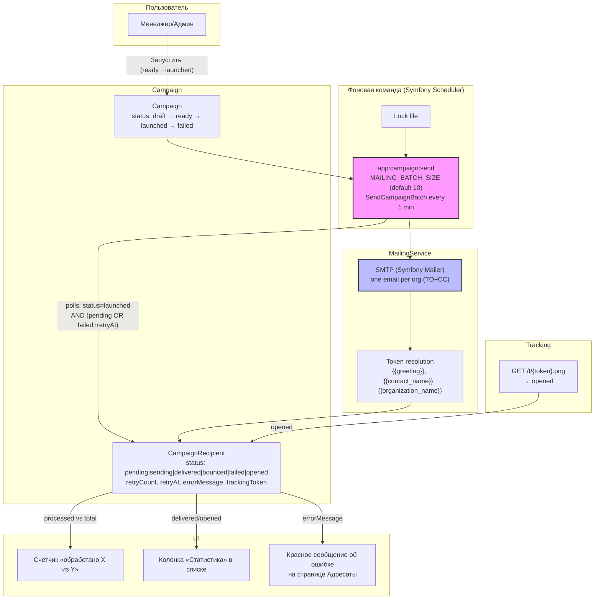
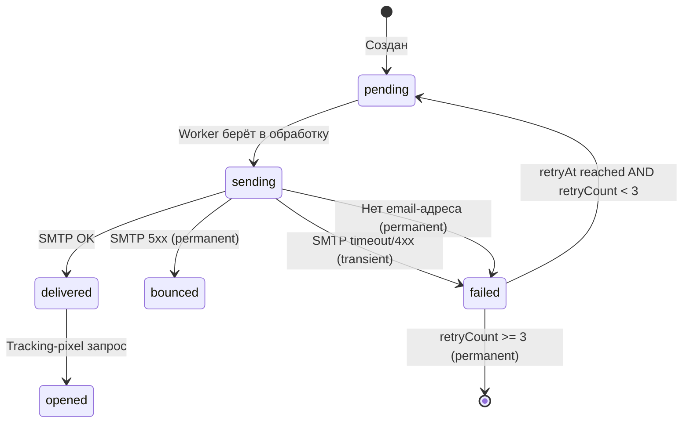
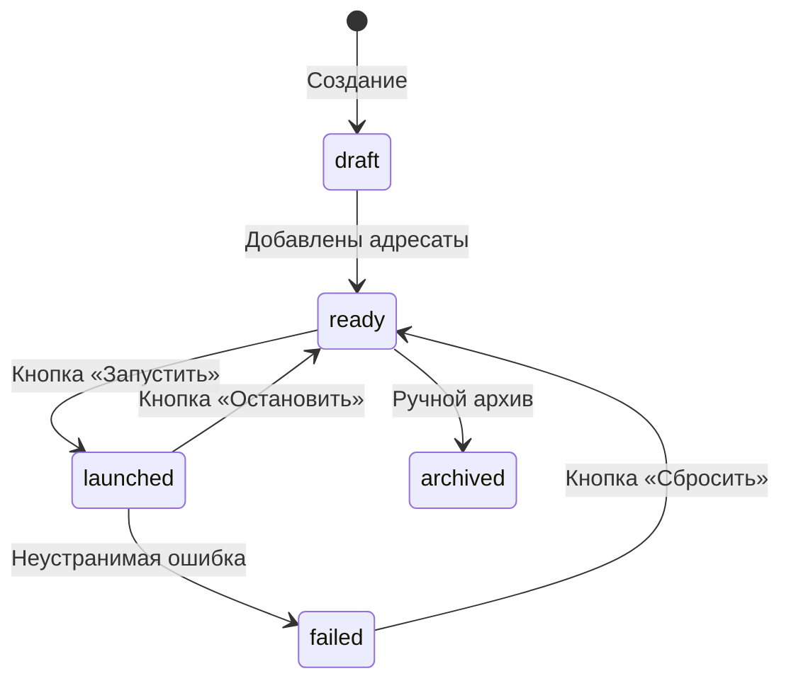

# ER-схема БД (ядро: организации + контакты + модель доступа + обзвон)

Сгенерировано из спецификаций `organizations`, `contacts`, `calls`,
`campaigns`, `organization-groups`, `access-control` (spec-driven,
`openspec/design`).

## Диаграмма

```mermaid
erDiagram
    USER ||--o| ORGANIZATION_GROUP : "владеет user-<id>-group (0..1)"
    USER ||--o{ GROUP_ASSIGNMENT : "назначен на группы"
    ORGANIZATION_GROUP ||--o{ GROUP_ASSIGNMENT : "назначается менеджерам"
    ORGANIZATION_GROUP ||--o{ ORG_GROUP_MEMBERSHIP : "содержит организации"
    ORGANIZATION ||--o{ ORG_GROUP_MEMBERSHIP : "состоит в группах"
    ORGANIZATION ||--o{ CONTACT : "имеет контакты"
    CALL ||--o| CAMPAIGN : "campaign_id (0..1, last mailing)"
    USER ||--o{ CALL : "сделал звонок (made_by)"
    ORGANIZATION ||--o{ CALL : "история звонков"
    CONTACT ||--o{ CALL : "звонки по контакту"
    CALL o|--o| CALL : "next_call_id (self-ref, 0..1)"
    CAMPAIGN ||--o{ CAMPAIGN_ATTACHMENT : "вложения на кампании"
    CAMPAIGN ||--o{ CAMPAIGN_RECIPIENT : "ручные адресаты standalone"
    ORGANIZATION ||--o{ CAMPAIGN_RECIPIENT : "адресат standalone-рассылки"
    CONTACT ||--o{ CAMPAIGN_RECIPIENT : "адресат-контакт (nullable)"
    COMMUNICATION_TEMPLATE o|--o{ COURSE : "embedded courses (0..N)"

    USER {
        bigint id PK
        string email UK
        string password_hash
        enum role "admin|manager"
        datetime created_at
    }

    ORGANIZATION_GROUP {
        bigint id PK
        string name
        text description
        string color "напр. #3b82f6"
        bigint created_by FK → USER.id
        datetime created_at
    }

    GROUP_ASSIGNMENT {
        bigint user_id FK "manager"
        bigint group_id FK
        datetime assigned_at
        PK(user_id, group_id)
    }

    ORG_GROUP_MEMBERSHIP {
        bigint organization_id FK
        bigint group_id FK
        datetime added_at
        PK(organization_id, group_id)
    }

    ORGANIZATION {
        bigint id PK
        string name
        string industry "nullable"
        string annual_plan "nullable, годовой план обучения"
        text description "nullable, описание организации"
        boolean has_used_services "default false"
        datetime created_at
        datetime updated_at
    }

    CONTACT {
        bigint id PK
        bigint organization_id FK
        string name
        string phone
        string email
        string position
        text notes
        datetime created_at
        datetime updated_at
    }

    CALL {
        bigint id PK
        bigint organization_id FK
        bigint contact_id FK
        datetime scheduled_at "будущее -> планирование/напоминание"
        datetime made_at "факт звонка: когда"
        bigint made_by FK "факт звонка: кто"
        text notes
        boolean is_deal "результат: сделка"
        boolean is_no_answer "результат: нет ответа"
        bigint next_call_id FK "self-ref: вновь созданный Call (0..1)"
        bigint campaign_id FK "последняя рассылка с звонка (0..1, ON DELETE SET NULL)"
        datetime created_at
    }

    CAMPAIGN {
        bigint id PK
        string name
        string subject "тема письма"
        string preview_text "nullable, прехедер"
        text body "текст письма (токены {{greeting}}, {{contact_name}}, {{organization_name}})"
        enum status "draft|ready|launched|failed|archived, default draft"
        datetime launched_at "nullable; ручной запуск — кнопка «Запустить»"
        datetime failed_at "nullable; фиксируется при ошибке отправки"
        text failure_reason "nullable; описание ошибки для пользователя"
        datetime created_at
    }

    CAMPAIGN_ATTACHMENT {
        bigint id PK
        bigint campaign_id FK "ON DELETE CASCADE (строки); файлы удаляет storage-слой"
        string filename "оригинальное имя файла"
        string storage_key UK "ключ файла в var/storage/campaign-attachments"
        string mime_type "nullable"
        int size "nullable"
        datetime created_at
    }

    CAMPAIGN_RECIPIENT {
        bigint id PK
        bigint campaign_id FK "ON DELETE CASCADE"
        bigint organization_id FK "ON DELETE CASCADE; менеджеру — только область доступа (ADR-0007), отказ 403"
        bigint contact_id FK "nullable, ON DELETE CASCADE; рассылка на email контакта"
        enum status "pending|sending|delivered|bounced|failed|opened"
        datetime sent_at "nullable"
        text error_message "nullable; описание ошибки для пользователя"
        string tracking_token UK "для opened через pixel"
        int retry_count "default 0; макс 3 для transient ошибек"
        datetime retry_at "nullable; когда повторить (exponential backoff + jitter)"
        datetime created_at
        "unique(campaign_id, organization_id)"
    }

    COMMUNICATION_TEMPLATE {
        bigint id PK
        string subject "с токенами {{contact_name}} {{organization_name}}"
        text body "с токенами и встроенными курсами"
        datetime created_at
    }

    COURSE {
        bigint id PK
        string name
        string category
        decimal base_price
        text description
        string pdf "ссылка на PDF-материал"
        datetime created_at
    }
```

> `COMMUNICATION_TEMPLATE` больше не связана с `Campaign`: с change
> `campaign-entity` тема и шаблон письма хранятся на самой кампании
> (`campaign.subject`, `campaign.template`), вложения — в
> `campaign_attachment`.

## Правила (ADR-0001–0009)

1. **`USER.role`** — фиксированный enum `admin|manager` (ADR-0009); роли не
   создаются/не изменяются через CRUD.
2. **Организация** — главная модель (ADR-0001); контакт принадлежит ровно
   одной организации (ADR-0002).
3. **Пользователи создаются администратором** (ADR-0003). Админ собственной
   группы не имеет; группы для него не проверяются (ADR-0008).
4. **Custom-группы** — имена, создаёт администратор/менеджер, назначаются
   менеджерам через `GROUP_ASSIGNMENT`; членство организации в группах —
   many-to-many (ADR-0006).
5. **Область доступа менеджера** — бинарная: организации собственной группы +
   назначенных custom-групп (ADR-0007); per-org ACL не вводится.
6. **Сущность `Call`** (ADR-0004): результат — комбинация независимых действий
   (`campaign_id` FK на последнюю рассылку, `is_deal`, `is_no_answer`,
   `next_call_id`); факт звонка всегда фиксируется (`made_at`, `made_by`).
   Отдельной таблицы `call_result` нет.
7. **Рассылки** не привязаны к одной организации; формируются из результатов
   звонков и/или вручную (standalone). Отправка — outbox на `CampaignRecipient`,
   статусы per-письмо (`pending`→`sending`→`delivered`/`bounced`/`failed`/`opened`),
   retry для transient ошибек (max 3, exponential backoff + jitter) (ADR-0010).
8. **`Campaign`** (change `campaign-entity`) хранит тему, текст письма и вложения на
   себе; адресаты — в `campaign_recipient` (contact_id nullable).
   запуск — ручной (кнопка «Запустить») —
   проставляет `launched_at` и `status = launched`.
   `failureReason` заполняется при ошибке отправки.

## Скоуп первой реализации

Таблицы **ядра**: `user`, `organization_group`, `group_assignment`,
`org_group_membership`, `organization`, `contact`. Обзвон (`call`) реализован;
рассылки — `campaign`, `campaign_attachment`, `campaign_recipient`
(change `campaign-entity` + `mailing-service`). Per-letter статусы и retry
хранятся на `campaign_recipient`.

## Mailing Service: архитектура и жизненный цикл



### Статусы CampaignRecipient



### Жизненный цикл Campaign

